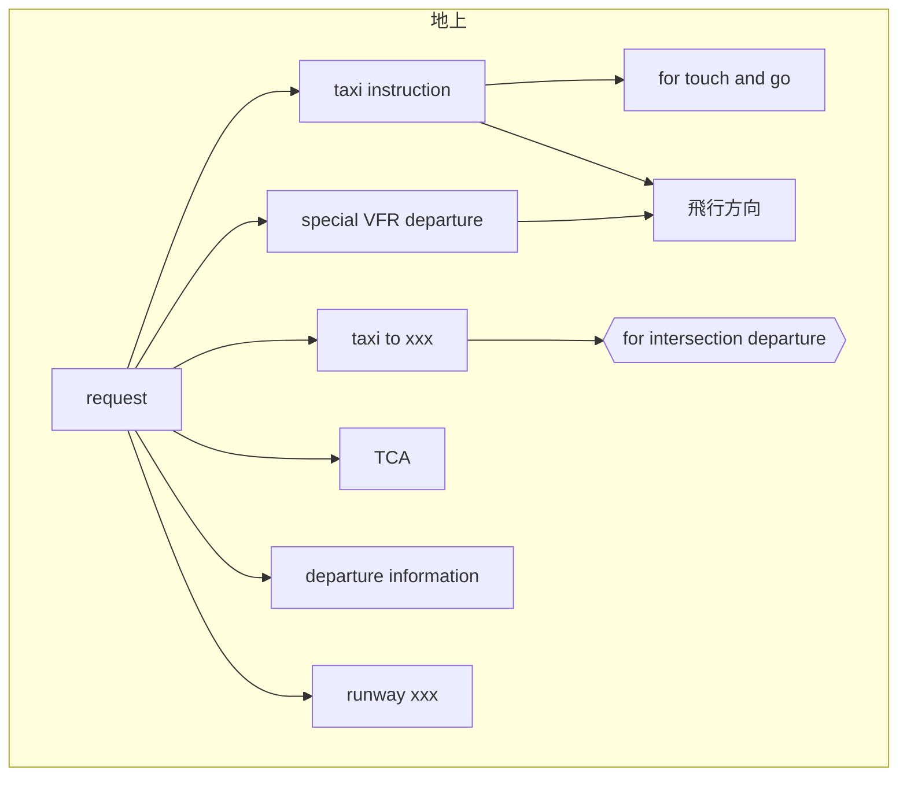
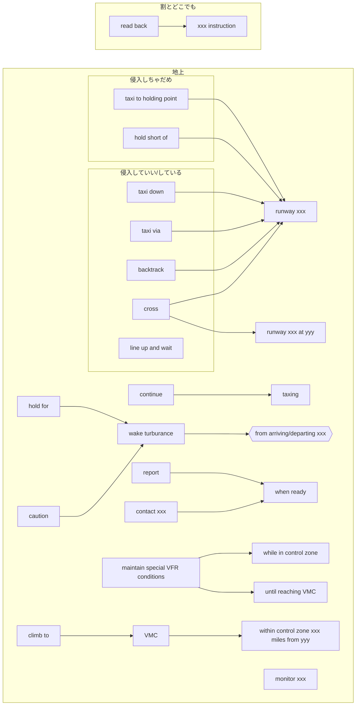
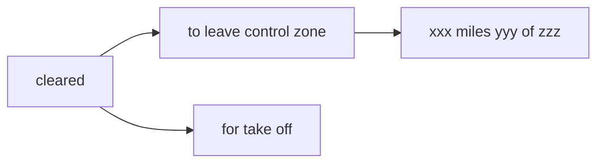
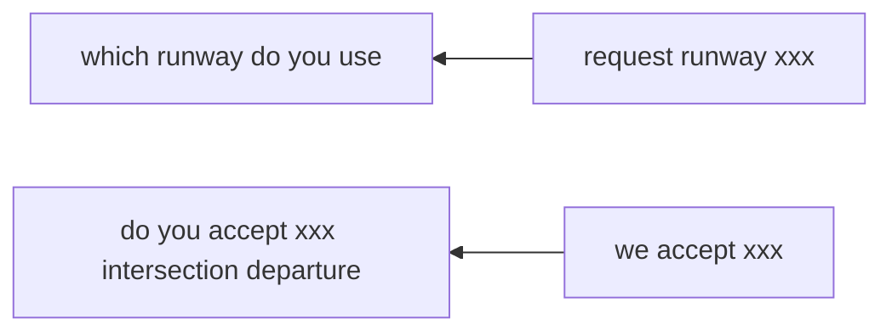

# PIL

[toc]

## 工学

## ATC 
|管制業務|
|-|
||

|機関|
|-|
|管制機関|
|FSC・対空センター|
|国際対空通信局|
|飛行援助用航空局|

|管制空域|英名|エリア|管制有無
|-|-|-|-|
|航空交通管制区|control area|地表または水面から200m以上|IFRのみ|
|航空交通管制圏|control zone|航空機の離陸および着陸が頻繁|すべての航空機|
|航空交通情報圏|information zone|指定された場所|連絡+情報入手のみ|
|洋上管制区|oceanic control area|福岡FIRの洋上区域|?|

|航空交通管制区の内訳|英名|説明|VFR飛行|
|-|-|-|-|
|TCA|terminal control area|VFR機が輻輳する空域|可|
|進入管制区|approarch control area|管制圏内の飛行場からの離着陸に続く上昇・下降がある空域|可|
|特別管制区|positive control area|航空交通が輻輳|許可が必要|
|航空交通情報圏の一部||

### 通信

#### タクシー
|相手|request
|-|-|
|Tower/Ground|"taxi instruction"|
|Radio|"taxi information"|
|AFIS|"departure information"|

##### taxi要求につけるもの例
* "for touch and go"
* 飛行方向("southbound")
* "for intersection departure"

#### 要求する/連絡する

#### 指示される

#### 連絡される

#### 質問される

## 気象学

## [法規](https://hackmd.io/4C3a5gHXQwmZr-xzFdMkSg)

