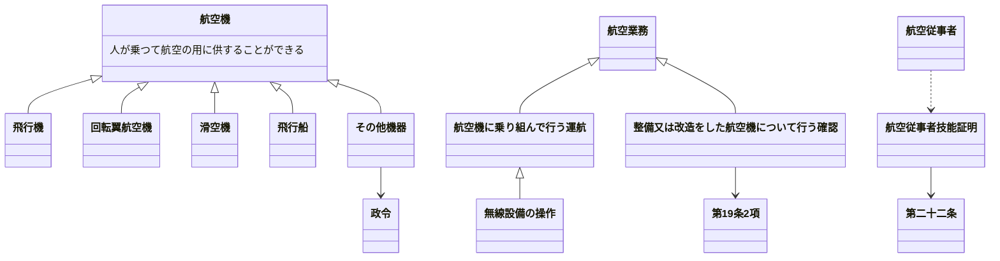
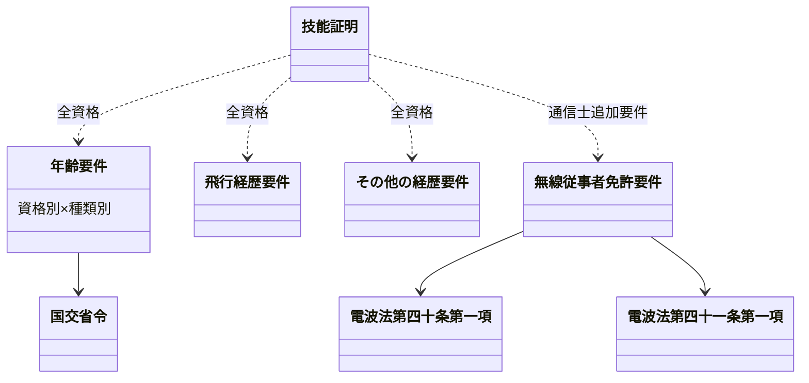

# PIL 法規

[toc]

### 用語
|||
|-|-|
|政令・施行令|内閣|
|省令・施行規則|各省大臣|
|告示|一定の事項|
|通達|行政内部|

* 国際民間航空条約
    * 国際民間航空機構
International Civi Aviation Organization

### 出発前の確認
#### 整備状況
|||
|-|-|
|航空日誌|残時間：次回点検までの飛行時間|
|整備記録|
|航空機の外部点検|
|発動機の試運転|
|作動点検|
#### 重量
|||
|-|-|
|総重量|
|自重|
|零燃料重量|自重＋積載物（人含む）|
|離陸時燃料重量？|
|着陸時燃料重量？|

#### 航空情報
||||
|-|-|-|
|AIP|Aeronautical Information Publication：航空路誌|永続的|
|AIP AMDT|AIP Amendment：航空路誌改訂版|f恒久的変更
|AIP SUP|AIP Supplements：航空路誌補足版|一時的変更
|PIB|飛行前情報ブリテン|空港で見る
|AIC|Aeronautical Information Circular：航空情報サーキュラー|助言など
|チェックリストと 有効ノータムの一覧|Notice to Airmen|ノータム：突発。|
#### 気象情報
|||
|-|-|
|||
|||
#### 燃料および滑油
|||
|-|-|
|||
|||
#### 積載物の安全
|||
|-|-|
|||
|||
#### 備え付けるもの
* 第五十五条

|||
|-|-|
|||
|||

# 航空法

## 原文
* [航空法](https://www.schedule-coordination.jp/archives/arc_aviation_law/2009/Civil%20Aeronautics%20Act%20in%20JPN.pdf)
* [航空法施行規則](https://laws.e-gov.go.jp/law/327M50000800056)

## 第一章
### 第二条 定義

原文

#### 航空機
人が乗つて航空の用に供することができる飛行機、回転翼航空機、滑空機及び飛行船その他政令で定める航空の用に供することができる機器をいう。
#### 航空業務
航空機に乗り組んで行うその運航（航空機に乗り組んで行う無線設備の操作を含む。）及び整備又は改造をした航空機について行う第十九条第二項に規定する確認をいう。
#### 航空従事者
* 第二十二条の航空従事者技能証明を受けた者をいう。

#### 航空保安施設

原文

* 電波、灯光、色彩又は形象により航空機の航行を援助するための施設で、国土交通省令で定めるものをいう。

#### 着陸帯

原文

* 特定の方向に向つて行う航空機の離陸（離水を含む。以下同じ。）又は着陸（着水を含む。以下同じ。）の用に供するため設けられる飛行場内の矩形部分をいう。

#### 進入区域

原文

* 着陸帯の短辺の両端及びこれと同じ側における着陸帯の中心線の延長三千メートル（ヘリポートの着陸帯にあつては、二千メートル以下で国土交通省令で定める長さ）の点において中心線と直角をなす一直線上にお
けるこの点から三百七十五メートル（計器着陸装置を利用して行なう着陸又は精密進入レーダーを用いてする着陸誘導に従つて行なう着陸の用に供する着陸帯にあつては六百メートル、ヘリポートの着陸帯にあつては当該短辺と当該一直線との距離に十五度の角度の正切を乗じた長さに当該短辺の長さの二分の一を加算した長さ）の距離を有する二点を結んで得た平面をいう。

#### 進入表面

原文

* 着陸帯の短辺に接続し、且つ、水平面に対し
上方へ五十分の一以上で国土交通省令で定める勾配を有する平面であつて、その投影面が進入区域と一致するものをいう。

#### 水平表面

原文

* 飛行場の標点の垂直上方四十五メートルの点を含む水平面のうち、この点を中心として四千メートル以下で国土交通省令で定める長さの半径で描いた円周で囲まれた部分をいう。

#### 転移表面

原文

* 進入表面の斜辺を含む平面及び着陸帯の長辺を含む平面であつて、着陸帯の中心線を含む鉛直面に直角な鉛直面との交線の水平面に対する勾配が進入表面又は着陸帯の外側上方へ七分の一（ヘリポートにあつては、四分の一以上で国土交通省令で定める勾配）であるもののうち、進入表面の斜辺を含むものと当該斜辺に接する着陸帯の長辺を含むものとの交線、これらの平面と水平表面を含む平面との交線及び進入表面の斜辺又は着陸帯の長辺により囲まれる部分をいう。

#### 航空灯火

原文

* 灯火により航空機の航行を援助するための航空保安施設で、国土交通省令で定めるものをいう。

#### 航空交通管制区

原文

* 地表又は水面から二百メートル以上の高さの空域であつて、航空交通の安全のために国土交通大臣が告示で指定するものをいう。

#### 航空交通管制圏

原文

* 航空機の離陸及び着陸が頻繁に実施される国土交通大臣が告示で指定する飛行場並びにその付近の上空の空域であつて、飛行場及びその上空における航空交通の安全のために国土交通大臣が告示で指定するものをいう。

#### 航空交通情報圏

原文

* 前項に規定する飛行場以外の国土交通大臣が告示で指定する飛行場及びその付近の上空の空域であつて、飛行場及びその上空における航空交通の安全のために国土交通大臣が告示で指定するものをいう。

#### 計器気象状態

原文

* 視程及び雲の状況を考慮して国土交通省令で定める視界上不良な気象状態をいう。

#### 計器飛行

原文

* 航空機の姿勢、高度、位置及び針路の測定を計器にのみ依存して行う飛行をいう。

#### 計器飛行方式

原文

* 第十二項の国土交通大臣が指定する飛行場からの離陸及びこれに引き続く上昇飛行又は同項の国土交通大臣が指定する飛行場への着陸及びそのための降下飛行を、航空交通管制圏又は航空交通管制区において、国土交通大臣が定める経路又は第九十六条第一項の規定により国土交通大臣が与える指示による経路により、かつ、その他の飛行の方法について同項の規定により国土交通大臣が与える指示に常時従つて行う飛行の方式
* 第十三項の国土交通大臣が指定する飛行場からの離陸及びこれに引き続く上昇飛行又は同項の国土交通大臣が指定する飛行場への着陸及びそのための降下飛行を、航空交通情報圏（航空交通管制区である部分を除く。）において、国土交通大臣が定める経路により、かつ、第九十六条の二第一項の規定により国土交通大臣が提供する情報を常時聴取して行う飛行の方式
* 第一号に規定する飛行以外の航空交通管制区における飛行を第九十六条第一項の規定により国土交通大臣が経路その他の飛行の方法について与える指示に常時従つて行う飛行の方式

#### 航空運送事業

原文

* 他人の需要に応じ、航空機を使用して有償で旅客又は貨物を運送する事業をいう。

#### 国際航空運送事業

原文

* 本邦内の地点と本邦外の地点との間又は本邦外の各地間において行う航空運送事業をいう。

#### 国内定期航空運送事業

原文

* 本邦内の各地間に路線を定めて一定の日時により航行する航空機により行う航空運送事業をいう。

#### 航空機使用事業

原文

* 他人の需要に応じ、航空機を使用して有償で旅客又は貨物の運送以外の行為の請負を行う事業をいう。

## 第四章 航空事業者
### 航空従事者技能証明
#### ==第二十二条==
##### 施行規則第42条
国土交通大臣は、申請により、航空業務を行おうとする者について、航空従事者技能証明（以下「技能証明」という。）を行う。
### 技能証明書
#### 第二十三条
技能証明は、申請者に航空従事者技能証明書（以下「技能証明書」という。）を交付することによつて行う。
### 資格
#### 第二十四条
技能証明は、次に掲げる資格別に行う。

25条で表にした

* 定期運送用操縦士
* 事業用操縦士
* 自家用操縦士
* 一等航空士
* 二等航空士
* 航空機関士
* 航空通信士
* 一等航空整備士
* 二等航空整備士
* 一等航空運航整備士
* 二等航空運航整備士
* 航空工場整備士

##### 規

### 技能証明の限定
#### ==第二十五条==

原文

国土交通大臣は、前条の定期運送用操縦士、事業用操縦士、自家用操縦士、航空機関士、一等航空整備士、二等航空整備士、一等航空運航整備士又は二等航空運航整備士の資格についての技能証明につき、国土交通省令で定めるところにより、航空機の種類についての限定をするものとする。
２　国土交通大臣は、前項の技能証明につき、国土交通省令で定めるところにより、航空機の等級又は型式についての限定をすることができる。
３　国土交通大臣は、前条の航空工場整備士の資格についての技能証明につき、国土交通省令で定めるところにより、従事することができる業務の種類についての限定をすることができる。

| 資格 | 種類限定 | 等級・型式限定 | 業務種類限定 |
|---|---|---|---|
| 定期運送用操縦士 | ◎ | ○ | ― |
| 事業用操縦士 | ◎ | ○ | ― |
| 自家用操縦士 | ◎ | ○ | ― |
| 一等航空士 | ― | ― | ― |
| 二等航空士 | ― | ― | ― |
| 航空機関士 | ◎ | ○ | ― |
| 航空通信士 | ― | ― | ― |
| 一等航空整備士 | ◎ | ○ | ― |
| 二等航空整備士 | ◎ | ○ | ― |
| 一等航空運航整備士 | ◎ | ○ | ― |
| 二等航空運航整備士 | ◎ | ○ | ― |
| 航空工場整備士 | ― | ― | ○ |

◎＝義務（するものとする）　○＝任意（できる）　―＝なし

##### 施行規則第53条
##### 施行規則第54条
##### 施行規則第55条

### 技能証明の要件
#### ==第二十六条==

原文

技能証明は、第二十四条に掲げる資格別及び前条第一項の規定による航空機の種類別に国土交通省令で定める年齢及び飛行経歴その他の経歴を有する者でなければ、受けることができない。
２　航空通信士の資格についての技能証明は、前項の規定によるほか、国土交通省令で定める電波法（昭和二十五年法律第百三十一号）第四十条第一項の無線従事者の資格について同法第四十一条第一項の免許を受けた者でなければ、受けることができない。

##### 施行規則第43条
##### 施行規則第44条

### 欠格事由等
#### 第二十七条

原文

第三十条の規定により技能証明の取消しを受け、その取消しの日から二年を経過しない者は、技能証明の申請をすることができない。
２　国土交通大臣は、第二十九条第一項の試験に関し、不正の行為があつた者について、二年以内の期間に限り技能証明の申請を受理しないことができる。

##### 規

### 業務範囲
#### ==第二十八条==

原文

別表の資格の欄に掲げる資格の技能証明（航空機に乗り組んでその運航を行う者にあつては、同表の資格の欄に掲げる資格の技能証明及び第三十一条第一項の航空身体検査証明）を有する者でなければ、同表の業務範囲の欄に掲げる行為を行つてはならない。ただし、定期運送用操縦士、事業用操縦士、自家用操縦士、一等航空士、二等航空士若しくは航空機関士の資格の技能証明を有する者が受信のみを目的とする無線設備の操作を行う場合又はこれらの技能証明を有する者で電波法第四十条第一項の無線従事者の資格を有するものが、同条第二項の規定に基づき行うことができる無線設備の操作を行う場合は、この限りでない。
２　技能証明につき第二十五条の限定をされた航空従事者は、その限定をされた種類、等級若しくは型式の航空機又は業務の種類についてでなければ、別表の業務範囲の欄に掲げる行為を行つてはならない。
３　前二項の規定は、国土交通省令で定める航空機に乗り組んでその操縦（航空機に乗り組んで行うその機体及び発動機の取扱いを含む。）を行う者及び国土交通大臣の許可を受けて、試験飛行等のため航空機に乗り組んでその運航を行う者については、適用しない。

##### 施行規則第51条
##### 施行規則第51条の2

### 試験の実施
#### 第二十九条

原文

国土交通大臣は、技能証明を行う場合には、申請者が、その申請に係る資格の技能　証明を有する航空従事者として航空業務に従事するのに必要な知識及び能力を有するかどうかを判定するために、試験を行わなければならない。
２　試験は、学科試験及び実地試験とする。
３　学科試験に合格した者でなければ、実地試験を受けることができない。
４　国土交通大臣は、外国政府の授与した航空業務の技能に係る資格証書を有する者について技能証明を行う場合には、前三項の規定にかかわらず、国土交通省令で定めるところにより、試験の全部又は一部を行わないことができる。独立行政法人航空大学校又は国土交通大臣が申請により指定した航空従事者の養成施設の課程を修了した者についても、同様とする。
５　前項の指定の申請の手続、指定の基準その他の指定に関する実施細目は、国土交通省令で定める。
６　国土交通大臣は、第四項の指定を受けた者が前項の国土交通省令の規定に違反したときは、当該指定を受けた者に対し、当該指定に係る業務の運営の改善に必要な措置をとるべきことを命じ、六月以内において期間を定めて当該指定に係る業務の全部若しくは一部の停止を命じ、又は当該指定を取り消すことができる。

##### 施行規則第45条〜第50条の2

### 技能証明の限定の変更
#### ==第二十九条の二==

原文

国土交通大臣は、第二十五条第二項又は第三項の限定に係る技能証明につき、その技能証明に係る航空従事者の申請により、その限定を変更することができる。
２　前条の規定は、前項の限定の変更を行う場合に準用する。

##### 施行規則第57条

### 技能証明の取消等
#### 第三十条

原文

国土交通大臣は、航空従事者が左の各号の一に該当するときは、その技能証明　を取り消し、又は一年以内の期間を定めて航空業務の停止を命ずることができる。
一　この法律又はこの法律に基く処分に違反したとき。
二　航空従事者としての職務を行うに当り、非行又は重大な過失があつたとき。

##### 規

### 航空身体検査証明
#### 第三十一条

原文

国土交通大臣又は指定航空身体検査医（申請により国土交通大臣が指定した国土交通省令で定める要件を備える医師をいう。以下同じ。）は、申請により、技能証明を有する者で航空機に乗り組んでその運航を行なおうとするものについて、航空身体検査証明を行なう。
２　航空身体検査証明は、申請者に航空身体検査証明書を交付することによつて行なう。
３　国土交通大臣又は指定航空身体検査医は、第一項の申請があつた場合において、申請者がその有する技能証明の資格に係る国土交通省令で定める身体検査基準に適合すると認めるときは、航空身体検査証明をしなければならない。

##### 規

#### 第三十二条

原文

航空身体検査証明の有効期間は、定期運送用操縦士の資格を有する者にあつては六月、その他の者にあつては一年とする。

##### 規

### 航空英語能力証明
#### 第三十三条

原文

定期運送用操縦士、事業用操縦士又は自家用操縦士の資格についての技能証明（当該技能証明について限定をされた航空機の種類が国土交通省令で定める航空機の種類であるものに限る。）を有する者は、その航空業務に従事するのに必要な航空に関する英語（以下「航空英語」という。）に関する知識及び能力を有することについて国土交通大臣が行う航空英語能力証明を受けていなければ、本邦内の地点と本邦外の地点との間における航行その他の国土交通省令で定める航行を行つてはならない。
２　航空英語能力証明の有効期間は、当該航空英語能力証明を受ける者の航空英語に関する知識及び能力に応じて、国土交通省令で定める期間とする。
３　第二十七条、第二十九条及び第三十条の規定は、航空英語能力証明について準用する。この場合において、第二十九条第四項中「又は国土交通大臣」とあるのは「若しくは国土交通大臣」と、「修了した者」とあるのは「修了した者又は国土交通大臣が申請により指定した第百二条第一項の本邦航空運送事業者により航空英語に関する知識及び能力を有すると判定された者」と読み替えるものとする。

##### 規

### 計器飛行証明及び操縦教育証明
#### 第三十四条

原文

定期運送用操縦士の資格についての技能証明（当該技能証明について限定をされた航空機の種類が国土交通省令で定める航空機の種類であるものに限る。第三十五条の二第一項において同じ。）又は事業用操縦士若しくは自家用操縦士の資格についての技能証明を有する者は、その使用する航空機の種類に係る次に掲げる飛行（以下「計器飛行等」という。）の技能について国土交通大臣の行う計器飛行証明を受けていなければ、計器飛行等を行つてはならない。
一　計器飛行
二　計器飛行以外の航空機の位置及び針路の測定を計器にのみ依存して行う飛行（以下「計器航法による飛行」という。）で国土交通省令で定める距離又は時間を超えて行うもの三　計器飛行方式による飛行２　次に掲げる操縦の練習を行う者に対しては、その使用する航空機を操縦することができる技能証明及び航空身体検査証明を有し、かつ、当該航空機の種類に係る操縦の教育の技能について国土交通大臣の行う操縦教育証明を受けている者（以下「操縦教員」という。）でなければ、操縦の教育を行つてはならない。
一　定期運送用操縦士、事業用操縦士又は自家用操縦士の資格についての技能証明（以下「操縦技能証明」という。）を受けていない者が航空機（第二十八条第三項の国土交通省令で定める航空機を除く。次号において同じ。）に乗り組んで行う操縦の練習二　操縦技能証明及び航空身体検査証明を有する者が当該技能証明について限定をされた種類以外の種類の航空機に乗り組んで行う操縦の練習３　第二十六条第一項、第二十七条、第二十九条及び第三十条の規定は、前二項の計器飛行証明又は操縦教育証明について準用する。

##### 規

### 航空機の操縦練習
#### 第三十五条

原文

第二十八条第一項及び第二項の規定は、左に掲げる操縦の練習のために行なう操縦については、適用しない。
一　前条第二項第一号に掲げる操縦の練習で、当該練習について国土交通大臣の許可を受け、かつ、操縦教員の監督の下に行なうもの二　前条第二項第二号に掲げる操縦の練習で、操縦教員の監督の下に行なうもの三　操縦技能証明及び航空身体検査証明を有する者が当該技能証明について限定をされた種類の航空機のうち当該技能証明について限定をされた等級又は型式以外の等級又は型式のものに乗り組んで行なう操縦の練習で、当該航空機を操縦することができる技能証明及び航空身体検査証明を有する者の監督（当該航空機を操縦することができる技能証明を有する者の監督を受けることが困難な場合にあつては、当該航空機を操縦することができる知識及び能力を有すると認めて国土交通大臣が指定した者の監督）の下に行なうもの２　前項各号の操縦の練習の監督を行なう者は、当該練習の監督を国土交通省令で定めるところにより行なわなければならない。
３　国土交通大臣は、第一項第一号の許可の申請があつた場合において、申請者が、航空機の操縦の練習を行うのに必要な能力を有すると認めるときは、これを許可しなければならない。
４　第一項第一号の許可は、申請者に航空機操縦練習許可書を交付することによつて行う。
５　第三十条及び第六十七条第一項の規定は、第一項第一号の許可を受けた者に準用する。

##### 規

### 計器飛行等の練習
#### 第三十五条の二

原文

第三十四条第一項の規定は、定期運送用操縦士の資格についての技能証明又は事業用操縦士若しくは自家用操縦士の資格についての技能証明及び航空身体検査証明を有する者でその使用する航空機の種類について計器飛行証明を受けていないものが計器飛行等の練習のために行う飛行で、次に掲げる者の監督の下に行うものについては、適用しない。
一　当該航空機を操縦することができる技能証明及び航空身体検査証明を有し、かつ、当該技能証明が定期運送用操縦士の資格についての技能証明又は事業用操縦士若しくは自家用操縦士の資格についての技能証明である場合は当該航空機の種類について計器飛行証明を有する者二　地上物標を利用して航空機の位置及び針路を知ることができる場合において計器飛行又は計器航法による飛行の練習を行うときは、当該航空機を操縦することができる技能証明及び航空身体検査証明を有する者三　当該航空機を操縦することができる技能証明を有する者の監督を受けることが困難な場合は、当該航空機を使用して計器飛行等を行うことができる知識及び能力を有すると認めて国土交通大臣が指定した者２　前条第二項の規定は、計器飛行等の練習の監督を行なう者について準用する。

##### 規

### 国土交通省令への委任
#### 第三十六条

原文

技能証明書、航空身体検査証明書及び航空機操縦練習許可書の様式、交付、再交付及び返納に関する事項その他技能証明、航空身体検査証明、航空英語能力証明、計器飛行証明、操縦教育証明、第三十五条第一項第一号の許可並びに同項第三号及び前条第一項第三号の指定に関する細目的事項並びに第二十九条第一項（第二十九条の二第二項、第三十三条第三項及び第三十四条第三項において準用する場合を含む。）
の試験の科目、受験手続その他の試験に関する実施細目は、国土交通省令で定める。

##### 規

## 第六章　航空機の運航
### 国籍等の表示
##### 規

#### ==第五十七条==

原文

航空機には、国土交通省令で定めるところに従い、国籍、登録記号及び所有者の氏名又は名称を表示しなければ、これを航空の用に供してはならない。但し、第十一条第一項ただし書の規定による許可を受けた場合は、この限りでない。

##### 規133
##### 規134
##### 規135
##### 規136
##### 規137
##### 規138
##### 規139
##### 規140
##### 規141

### 航空日誌
#### ==第五十八条==

原文

航空機の使用者は、航空日誌を備えなければならない。
２　航空機の使用者は、航空機を航空の用に供した場合又は整備し、若しくは改造した場合には、遅滞なく航空日誌に国土交通省令で定める事項を記載しなければならない。
３　前二項の規定は、第十一条第一項ただし書の規定による許可を受けた場合には、適用しない。

##### 規142

### 航空機に備え付ける書類
#### ==第五十九条==

原文

航空機（国土交通省令で定める航空機を除く。）には、左に掲げる書類を備え付けなければ、これを航空の用に供してはならない。但し、第十一条第一項ただし書の規定による許可を受けた場合は、この限りでない。
一　航空機登録証明書
二　耐空証明書
三　航空日誌
四　その他国土交通省令で定める航空の安全のために必要な書類

##### 規143
##### 規144
##### 規144-2

### 航空機の航行の安全を確保するための装置
#### 第六十条

原文

国土交通省令で定める航空機には、国土交通省令で定めるところにより航空機の姿勢、高度、位置又は針路を測定するための装置、無線電話その他の航空機の航行の安全を確保するために必要な装置を装備しなければ、これを航空の用に供してはならない。ただし、国土交通大臣の許可を受けた場合は、この限りでない。

##### 規

### 航空機の運航の状況を記録するための装置
#### 第六十一条

原文

国土交通省令で定める航空機には、国土交通省令で定めるところにより、飛行記録装置その他の航空機の運航の状況を記録するための装置を装備し、及び作動させなければ、これを航空の用に供してはならない。ただし、国土交通大臣の許可を受けた場合は、この限りでない。
２　前項の航空機の使用者は、国土交通省令で定めるところにより同項の装置による記録を保存しなければならない。

##### 規

### 救急用具
#### ==第六十二条==

原文

国土交通省令で定める航空機には、落下さん、救命胴衣、非常信号灯その他の国土交通省令で定める救急用具を装備しなければ、これを航空の用に供してはならない。

##### 規150
##### 規151
##### 規152

### 航空機の燃料
#### 第六十三条

原文

航空機は、航空運送事業の用に供する場合又は計器飛行方式により飛行しようとする場合においては、国土交通省令で定める量の燃料を携行しなければ、これを出発させてはならない。

##### 規

### 航空機の灯火
#### ==第六十四条==

原文

航空機は、夜間（日没から日出までの間をいう。以下同じ。）において航行し、又は夜間において使用される飛行場に停留する場合には、国土交通省令で定めるところによりこれを灯火で表示しなければならない。但し、水上にある場合については、海上衝突予防法（昭和五十二年法律第六十二号）の定めるところによる。

##### 規154
##### 規157

### 航空機に乗り組ませなければならない者
#### 第六十五条

原文

航空機には、第二十八条の規定によりこれを操縦することができる航空従事者を乗り組ませなければならない。
２　次の表の航空機の欄に掲げる航空機には、前項の航空従事者のほか、第二十八条の規定により同表の業務の欄に掲げる行為を行うことができる航空従事者を乗り組ませなければならない。
航空機 業務
次の各号の一に該当する航空機 航空機の操縦
一　構造上、その操縦のために二人を要する航空機
二　特定の方法又は方式により飛行する場合に限りその操
縦のために二人を要する航空機であつて当該特定の方法又
は方式により飛行するもの
三　旅客の運送の用に供する航空機で計器飛行方式により
飛行するもの
四　旅客の運送の用に供する航空機で飛行時間が五時間を
超えるもの航空機の操縦
構造上、操縦者（航空機の操縦に従事する者をいう。以下同
じ。）だけでは発動機及び機体の完全な取扱いができない航
空機
航空機に乗り組んで行
うその発動機及び機体
の取扱い（操縦装置の
操作を除く。）

##### 規

#### 第六十六条

原文

次の表の航空機の欄に掲げる航空機には、前条の航空従事者のほか、第二十八条の規定により同表の業務の欄に掲げる行為を行うことができる航空従事者を乗り組ませなければならない。
航空機 業務
第六十条の規定により無線設備（受信のみを目的とするものを除く。）を装備して航行する航空機
上欄に掲げる無線設備の操作
無着陸で五百五十キロメートル以上の区間を飛行する航空機（飛行中常時地上物標又は航空保安施設を利用できると認められるもの並びに慣性航法装置その他の国土交通省令で定める航空機の位置及び針路の測定並びに航法上の資料の算出のための装置を装備するものを除く。）
航空機の位置及び針路の測定並びに航法
上の資料の算出
２　前項の規定にかかわらず、同項同表の業務の欄に掲げるそれぞれの業務を他の航空従事者の業務を行う者が行うことによりその業務に支障を生ずることとならない場合は、同項に規定する航空従事者を乗り組ませなくてもよい。

##### 規

### 航空従事者の携帯する書類
#### ==第六十七条==

原文

航空従事者は、その航空業務を行う場合には、技能証明書を携帯しなければならない。
２　航空従事者は、航空機に乗り組んでその航空業務を行う場合には、技能証明書の外、航空身体検査証明書を携帯しなければならない。

### 乗務割の基準
#### 第六十八条

原文

航空運送事業を経営する者は、国土交通省令で定める基準に従つて作成する乗務割によるのでなければ、航空従事者をその使用する航空機に乗り組ませて航空業務に従事させてはならない。

##### 規

### 最近の飛行経験
#### 第六十九条

原文

航空機乗組員（航空機に乗り組んで航空業務を行なう者をいう。以下同じ。）は、国土交通省令で定めるところにより、一定の期間内における一定の飛行経験がないときは、航空運送事業の用に供する航空機の運航に従事し、又は計器飛行、夜間の飛行若しくは第三十四条第二項の操縦の教育を行つてはならない。

##### 規

### 酒精飲料等
#### ==第七十条==

原文

航空機乗組員は、酒精飲料又は麻酔剤その他の薬品の影響により航空機の正常な運航ができないおそれがある間は、その航空業務を行つてはならない。

### 身体障害
#### ==第七十一条==

原文

航空機乗組員は、第三十一条第三項の身体検査基準に適合しなくなつたときは、第三十二条の航空身体検査証明の有効期間内であつても、その航空業務を行つてはならない。

### 操縦者の見張り義務
#### ==第七十一条の二==

原文

航空機の操縦を行なつている者（航空機の操縦の練習をし又は計器飛行等の練習をするためその操縦を行なつている場合で、その練習を監督する者が同乗しているときは、その者）は、航空機の航行中は、第九十六条第一項の規定による国土交通大臣の指示に従つている航行であるとないとにかかわらず、当該航空機外の物件を視認できない気象状態の下にある場合を除き、他の航空機その他の物件と衝突しないように見張りをしなければならない。

### 航空運送事業の用に供する航空機に乗り組む機長の要件
#### 第七十二条

原文

航空運送事業の用に供する国土交通省令で定める航空機には、航空機の機長として必要な国土交通省令で定める知識及び能力を有することについて国土交通大臣の認定を受けた者でなければ、機長として乗り組んではならない。
２　国土交通大臣は、前項の認定を受けた者が同項の知識及び能力を有するかどうかを定期に審査をしなければならない。
３　国土交通大臣は、必要があると認めるときは、第一項の認定を受けた者が同項の知識及び能力を有するかどうかを臨時に審査をしなければならない。
４　第一項の認定を受けた者が、第二項の審査を受けなかつたとき、前項の審査を拒否したとき、又は第二項若しくは前項の審査に合格しなかつたときは、当該認定は、その効力を失うものとする。
５　第一項の規定は、国土交通大臣の指定する範囲内の機長で、第百二条第一項の本邦航空運送事業者で国土交通大臣が申請により指定したもの（以下「指定本邦航空運送事業者」という。）の当該事業の用に供する航空機に乗り組むものが、第一項の知識及び能力を有することについて当該指定本邦航空運送事業者による認定を受けたときは、適用しない。
６　指定本邦航空運送事業者は、前項の認定を受けた者及び当該事業の用に供する航空機に乗り組む機長で第一項の認定を受けたものについて、第二項及び第三項の規定に準じて審査をしなければならない。この場合においては、第二項及び第三項の規定は、適用しない。
７　第四項の規定は、前項の審査について準用する。
８　国土交通大臣は、必要があると認めるときは、第六項の規定により指定本邦航空運送事業者が審査をすべき者についても第二項及び第三項の審査をすることができる。
この場合においては、第四項の規定の適用があるものとする。
９ 指定本邦航空運送事業者は、第五項の認定及び第六項の審査を行うときは、国土交通大臣が当該指定本邦航空運送事業者の申請により指名した国土交通省令で定める要件を備える者に実施させなければならない。
１０ 前各項の規定を実施するために必要な細目的事項については、国土交通省令で定める。
１１　国土交通大臣は、指定本邦航空運送事業者が第六項若しくは第九項の規定又は前項の国土交通省令の規定に違反したときは、当該指定本邦航空運送事業者に対し、第五項の認定若しくは第六項の審査の業務の運営の改善に必要な措置をとるべきことを命じ、六月以内において期間を定めて当該認定若しくは審査の業務の全部若しくは一部の停止を命じ、又はその第五項の規定による指定を取り消すことができる。

##### 規

### 機長の権限
#### 第七十三条

原文

機長（機長に事故があるときは、機長に代わつてその職務を行なうべきものとされている者。以下同じ。）は、当該航空機に乗り組んでその職務を行う者を指揮監督する。

##### 規

### 出発前の確認
#### ==第七十三条の二==

原文

機長は、国土交通省令で定めるところにより、航空機が航行に支障がないことその他運航に必要な準備が整つていることを確認した後でなければ、航空機を出発させてはならない。

##### 規164-15

### 安全阻害行為等の禁止等
#### 第七十三条の三

原文

航空機内にある者は、当該航空機の安全を害し、当該航空機内にあるその者以外の者若しくは財産に危害を及ぼし、当該航空機内の秩序を乱し、又は当該航空機内の規律に違反する行為（以下「安全阻害行為等」という。）をしてはならない。

##### 規

#### 第七十三条の四

原文

機長は、航空機内にある者が、離陸のため当該航空機のすべての乗降口が閉ざされた時から着陸の後降機のためこれらの乗降口のうちいずれかが開かれる時までに、安全阻害行為等をし、又はしようとしていると信ずるに足りる相当な理由があるときは、当該航空機の安全の保持、当該航空機内にあるその者以外の者若しくは財産の保護又は当該航空機内の秩序若しくは規律の維持のために必要な限度で、その者に対し拘束その他安全阻害行為等を抑止するための措置（第五項の規定による命令を除く。）をとり、又はその者を降機させることができる。
２　機長は、前項の規定に基づき拘束している場合において、航空機を着陸させたときは、拘束されている者が拘束されたまま引き続き搭乗することに同意する場合及びその者を降機させないことについてやむを得ない事由がある場合を除き、その者を引き続き拘束したまま当該航空機を離陸させてはならない。
３　航空機内にある者は、機長の要請又は承認に基づき、機長が第一項の措置をとることに対し必要な援助を行うことができる。
４　機長は、航空機を着陸させる場合において、第一項の規定に基づき拘束している者があるとき、又は同項の規定に基づき降機させようとする者があるときは、できる限り着陸前に、拘束又は降機の理由を示してその旨を着陸地の最寄りの航空交通管制機関に連絡しなければならない。
５　機長は、航空機内にある者が、安全阻害行為等のうち、乗降口又は非常口の扉の開閉装置を正当な理由なく操作する行為、便所において喫煙する行為、航空機に乗り組んでその職務を行う者の職務の執行を妨げる行為その他の行為であつて、当該航空機の安全の保持、当該航空機内にあるその者以外の者若しくは財産の保護又は当該航空機内の秩序若しくは規律の維持のために特に禁止すべき行為として国土交通省令で定めるものをしたときは、その者に対し、国土交通省令で定めるところにより、当該行為を反復し、又は継続してはならない旨の命令をすることができる。

##### 規

### 危難の場合の措置
#### ==第七十四条==

原文

機長は、航空機又は旅客の危難が生じた場合又は危難が生ずるおそれがあると認める場合は、航空機内にある旅客に対し、避難の方法その他安全のため必要な事項（機長が前条第一項の措置をとることに対する必要な援助を除く。）について命令をすることができる。

#### ==第七十五条==

原文

機長は、航空機の航行中、その航空機に急迫した危難が生じた場合には、旅客の救助及び地上又は水上の人又は物件に対する危難の防止に必要な手段を尽くさなければならない。

### 報告の義務
#### ==第七十六条==

原文

機長は、次に掲げる事故が発生した場合には、国土交通省令で定めるところにより国土交通大臣にその旨を報告しなければならない。ただし、機長が報告することができないときは、当該航空機の使用者が報告しなければならない。
一　航空機の墜落、衝突又は火災
二　航空機による人の死傷又は物件の損壊
三　航空機内にある者の死亡（国土交通省令で定めるものを除く。）又は行方不明四　他の航空機との接触五　その他国土交通省令で定める航空機に関する事故２　機長は、他の航空機について前項第一号の事故が発生したことを知つたときは、無線電信又は無線電話により知つたときを除いて、国土交通省令で定めるところにより国土交通大臣にその旨を報告しなければならない。
３　機長は、飛行中航空保安施設の機能の障害その他の航空機の航行の安全に影響を及ぼすおそれがあると認められる国土交通省令で定める事態が発生したことを知つたときは、他からの通報により知つたときを除いて、国土交通省令で定めるところにより国土交通大臣にその旨を報告しなければならない。

##### 規165
##### 規165-2
##### 規165-3
##### 規166
##### 規166-2
##### 規166-3

#### 第七十六条の二

原文

機長は、航行中他の航空機との衝突又は接触のおそれがあつたと認めたときその他前条第一項各号に掲げる事故が発生するおそれがあると認められる国土交通省令で定める事態が発生したと認めたときは、国土交通省令で定めるところにより国土交通大臣にその旨を報告しなければならない。

##### 規

### 運航管理者
#### 第七十七条

原文

航空運送事業の用に供する国土交通省令で定める航空機は、その機長が、第百二条第一項の本邦航空運送事業者の置く運航管理者の承認を受けなければ、出発し、又はその飛行計画を変更してはならない。

##### 規

#### 第七十八条

原文

前条の運航管理者は、国土交通大臣の行う運航管理者技能検定に合格した者でなければならない。
２　運航管理者技能検定は、申請者が前条の業務を行うために必要な航空機、航空保安施設、無線通信及び気象に関する知識及び技能を有するかどうかを判定するために行う。
３　運航管理者技能検定は、国土交通省令で定める年齢及び航空機の運航に関する経験を有する者でなければ、受けることができない。
４　第二十七条、第二十九条及び第三十条の規定は、運航管理者技能検定に準用する。
５　運航管理者技能検定の申請手続其の他の実施細目は、国土交通省令で定める。

##### 規

### 離着陸の場所
#### ==第七十九条==

原文

航空機（国土交通省令で定める航空機を除く。）は、陸上にあつては飛行場以外の場所において、水上にあつては国土交通省令で定める場所において、離陸し、又は着陸してはならない。但し、国土交通大臣の許可を受けた場合は、この限りでない。

##### 規172
##### 規172-2

### 飛行の禁止区域
#### ==第八十条==

原文

航空機は、国土交通省令で定める航空機の飛行に関し危険を生ずるおそれがある区域の上空を飛行してはならない。但し、国土交通大臣の許可を受けた場合は、この限りでない。

##### 規173
##### 規173-2

### 最低安全高度
#### ==第八十一条==

原文

航空機は、離陸又は着陸を行う場合を除いて、地上又は水上の人又は物件の安全及び航空機の安全を考慮して国土交通省令で定める高度以下の高度で飛行してはならない。但し、国土交通大臣の許可を受けた場合は、この限りでない。

##### 規174
##### 規175

### 捜索又は救助のための特例
#### 第八十一条の二

原文

前三条の規定は、国土交通省令で定める航空機が航空機の事故、海難その他の事故に際し捜索又は救助のために行なう航行については、適用しない。

##### 規

### 巡航高度
#### ==第八十二条==

原文

航空機は、地表又は水面から九百メートル（計器飛行方式により飛行する場合にあつては、三百メートル）以上の高度で巡航する場合には、国土交通省令で定める高度で飛行しなければならない。
２　航空機は、航空交通管制区内にある航空路の空域（第九十四条の二第一項に規定する特別管制空域を除く。）のうち国土交通大臣が告示で指定する航空交通がふくそうする空域を計器飛行方式によらないで飛行する場合は、高度を変更してはならない。
ただし、左に掲げる場合は、この限りでない。
一　離陸した後引き続き上昇飛行を行なう場合
二　着陸するため降下飛行を行なう場合
三　悪天候を避けるため必要がある場合であつて、当該空域外に出るいとまがないとき、又は航行の安全上当該空域内での飛行を維持する必要があるとき。
四　その他やむを得ない事由がある場合
３　国土交通大臣は、前項の空域（以下「高度変更禁止空域」という。）ごとに、同項の規定による規制が適用される時間を告示で指定することができる。

##### 規177

### 航空交通管制圏等における速度の制限
#### 第八十二条の二

原文

航空機は、左に掲げる空域においては、国土交通省令で定める速度をこえる速度で飛行してはならない。ただし、国土交通大臣の許可を受けた場合は、この限りでない。
一　航空交通管制圏
二　第九十六条第三項第四号に規定する進入管制区のうち航空交通管制圏に接続する部分の国土交通大臣が告示で指定する空域### 衝突予防等#### 第八十三条航空機は、他の航空機又は船舶との衝突を予防し、並びに飛行場における航空機の離陸及び着陸の安全を確保するため、国土交通省令で定める進路、経路、速度その他の航行の方法に従い、航行しなければならない。但し、水上にある場合については、海上衝突予防法の定めるところによる。

##### 規

### 特別な方式による航行
#### ==第八十三条の二==

原文

航空機は、国土交通大臣の許可を受けなければ、他の航空機との垂直方向の間隔を縮小する方式による飛行その他の国土交通省令で定める特別な方式による航行を行つてはならない。

##### 規180
##### 規181
##### 規182
##### 規183
##### 規184
##### 規185
##### 規186
##### 規187
##### 規188
##### 規189
##### 規191

### 編隊飛行
#### ==第八十四条==

原文

航空運送事業の用に供する航空機は、国土交通大臣の許可を受けなければ、編隊で飛行してはならない。
２　航空機は、編隊で飛行する場合には、その機長は、これを行う前に、編隊の方法、航空機相互間の合図の方法その他国土交通省令で定める事項について打合せをしなければならない。

##### 規192
##### 規193

### 粗暴な操縦の禁止
#### ==第八十五条==

原文

航空機は、運航上の必要がないのに低空で飛行を行い、高調音を発し、又は急降下し、その他他人に迷惑を及ぼすような方法で操縦してはならない。

##### 規154

### 爆発物等の輸送禁止
#### ==第八十六条==

原文

爆発性又は易燃性を有する物件その他人に危害を与え、又は他の物件を損傷するおそれのある物件で国土交通省令で定めるものは、航空機で輸送してはならない。
２　何人も、前項の物件を航空機内に持ち込んではならない。

##### 規194

#### ==第八十六条の二==

原文

航空運送事業を経営する者は、貨物若しくは手荷物又は旅客の携行品その他航空機内に持ち込まれ若しくは持ち込まれようとしている物件について、形状、重量その他の事情により前条第一項の物件であることを疑うに足りる相当な理由がある場合は、当該物件の輸送若しくは航空機内への持ち込みを拒絶し、託送人若しくは所持人に対し当該物件の取卸しを要求し、又は自ら当該物件を取り卸すことができる。
但し、自ら物件を取り卸すことができるのは、当該物件の託送人又は所持人がその場に居合わせない場合に限る。
２　国土交通大臣は、航空の安全を確保するため特に必要があると認めるときは、航空運送事業を経営する者に対し、前項の規定による措置を講ずべきことを命ずることができる。

### 無操縦者航空機
#### 第八十七条

原文

第六十五条及び第六十六条の規定にかかわらず、操縦者が乗り組まないで飛行することができる装置を有する航空機は、国土交通大臣の許可を受けた場合には、これらの規定に定める航空従事者を乗り組ませないで飛行させることができる。
２　国土交通大臣は、前項の許可を行う場合において他の航空機に及ぼす危険を予防するため必要があると認めるときは、当該航空機について飛行の方法を限定することができる。

##### 規

### 物件の曳航
#### 第八十八条

原文

航空機による物件の曳航は、国土交通省令で定める安全上の基準に従つて行わなければならない。

##### 規

### 物件の投下
#### ==第八十九条==

原文

何人も、航空機から物件を投下してはならない。但し、地上又は水上の人又は物件に危害を与え、又は損傷を及ぼすおそれのない場合であつて国土交通大臣に届け出たときは、この限りでない。

##### 規196-2

### 落下さん降下
#### ==第九十条==

原文

国土交通大臣の許可を受けた者でなければ、航空機から落下さんで降下してはならない。

##### 規196-3

### 曲技飛行等
#### ==第九十一条==

原文

航空機は、左に掲げる空域以外の空域で国土交通省令で定める高さ以上の空域において行う場合であつて、且つ、飛行視程が国土交通省令で定める距離以上ある場合でなければ、宙返り、横転その他の国土交通省令で定める曲技飛行、航空機の試験をする飛行又は国土交通省令で定める著しい高速の飛行（以下「曲技飛行等」という。）を行つてはならない。但し、国土交通大臣の許可を受けた場合は、この限りでない。
一　人又は家屋の密集している地域の上空
二　航空交通管制区
三　航空交通管制圏
２　航空機が曲技飛行等を行なおうとするときは、当該航空機の操縦を行なつている者（航空機の操縦の練習をするためその操縦を行なつている場合で、その練習を監督する者が同乗しているときは、その者）は、あらかじめ当該飛行により附近にある他の航空機の航行の安全に影響を及ぼすおそれがないことを確認しなければならない。

##### 規197
##### 規197-2
##### 規197-3
##### 規197-4
##### 規198

### 操縦練習飛行等
#### ==第九十二条==

原文

航空機は、航空交通管制区又は航空交通管制圏においては、左に掲げる飛行（曲技飛行等を除く。）を行なつてはならない。ただし、国土交通大臣の許可を受けた場合は、この限りでない。
一　操縦技能証明（自衛隊法（昭和二十九年法律第百六十五号）第百七条第五項の規定に基づき定められた自衛隊の使用する航空機に乗り組んで操縦に従事する者の技能に関する基準による操縦技能証明に相当するものを含む。次号において同じ。）
を受けていない者が航空機に乗り組んで操縦の練習をする飛行
二　操縦技能証明を有する者が当該操縦技能証明について限定をされた範囲の航空機以外の航空機に乗り組んで操縦の練習をする飛行三　航空機の姿勢をひんぱんに変更する飛行その他の航空交通の安全を阻害するおそれのある飛行で国土交通省令で定めるもの２　前条第二項の規定は、航空機が前項第三号に掲げる飛行（これに該当する同項第一号又は第二号に掲げる飛行を含む。）を行なおうとする場合に準用する。

##### 規198-3
##### 規198-2

### 計器飛行及び計器航法による飛行
#### ==第九十三条==

原文

航空機は、地上物標を利用してその位置及び針路を知ることができるときは、計器飛行又は計器航法による飛行を行なつてはならない。

##### 規

### 計器気象状態における飛行
#### ==第九十四条==

原文

航空機は、計器気象状態においては、航空交通管制区、航空交通管制圏又は航空交通情報圏にあつては計器飛行方式により飛行しなければならず、その他の空域にあつては飛行してはならない。ただし、予測することができない急激な天候の悪化その他のやむを得ない事由がある場合又は国土交通大臣の許可を受けた場合は、この限りでない。

##### 規198-4

### 計器飛行方式による飛行
#### ==第九十四条の二==

原文

航空機は、航空交通管制区若しくは航空交通管制圏のうち国土交通大臣が告示で指定する空域（以下「特別管制空域」という。）又は国土交通省令で定める高さ以上の空域においては、計器飛行方式によらなければ飛行してはならない。ただし、国土交通大臣の許可を受けた場合は、この限りでない。
２　国土交通大臣は、特別管制空域ごとに、前項の規定による規制が適用される時間を告示で指定することができる。

##### 規198-5
##### 規198-6
##### 規198-7
##### 規198-8

### 航空交通管制圏における飛行
#### ==第九十五条==

原文

航空機は、航空交通管制圏においては、左に掲げる飛行以外の飛行を行なつてはならない。ただし、国土交通大臣の許可を受けた場合は、この限りでない。
一　当該航空交通管制圏に係る飛行場からの離陸及びこれに引き続く飛行（当該航空交通管制圏外に出た後再び当該航空交通管制圏において行なう飛行を除く。）
二　当該航空交通管制圏に係る飛行場への着陸及びその着陸のための飛行

### 航空交通の管理
#### 第九十五条の二

原文

国土交通大臣は、空域の適正な利用及び安全かつ円滑な航空交通の確保を図るため、第九十六条及び第九十七条に規定するもののほか、空域における航空交通及び気象の状況を考慮した飛行経路の設定並びに交通量の監視及び調整、これらに関する情報の国土交通省令で定める国内定期航空運送事業その他の航空運送事業を経営する者（以下「国内定期航空運送事業者等」という。）への提供その他必要な措置を講ずるものとする。
２　国土交通大臣は、前項の措置を講ずるに際しては、関係行政機関の長及び国内定期航空運送事業者等と相互に緊密に連絡し、及び協力するものとする。
３　第一項の規定により国土交通大臣から情報の提供を受けた国内定期航空運送事業者等は、他の航空機の飛行計画その他の航空機の航行の安全に影響を及ぼすおそれがある国土交通省令で定める情報の内容をみだりに他人に知らせ、又は不当な目的に利用してはならない。
４　国土交通大臣は、国内定期航空運送事業者等が前項の規定に違反し、又は違反するおそれがあると認めるときは、当該国内定期航空運送事業者等に対し、第一項の規定による情報の提供を停止することができる。

##### 規

#### 第九十五条の三

原文

航空機は、国土交通省令で定める航空機が専ら曲技飛行等又は第九十二条第一項各号に掲げる飛行を行う空域として国土交通大臣が告示で指定する空域（以下「民間訓練試験空域」という。）において国土交通省令で定める飛行を行おうとするときは、国土交通省令で定めるところにより国土交通大臣に訓練試験等計画を通報し、その承認を受けなければならない。承認を受けた訓練試験等計画を変更しようとするときも同様とする。

##### 規

### 航空交通の指示
#### 第九十六条

原文

航空機は、航空交通管制区又は航空交通管制圏においては、国土交通大臣が安全かつ円滑な航空交通の確保を考慮して、離陸若しくは着陸の順序、時機若しくは方法又は飛行の方法について与える指示に従つて航行しなければならない。
２　第二条第十二項の国土交通大臣が指定する飛行場の業務に従事する者（国土交通省令で定める飛行場の工事に関する業務に従事する者を含む。）は、その業務に関し、国土交通大臣が当該飛行場における航空交通の安全のために与える指示に従わなければならない。
３　航空機は、次に掲げる航行を行う場合は、第一項の規定による国土交通大臣の指示を受けるため、国土交通省令で定めるところにより国土交通大臣に連絡した上、これらの航行を行わなければならない。
一　航空交通管制圏に係る飛行場からの離陸及び当該航空交通管制圏におけるこれに引き続く上昇飛行二　航空交通管制圏に係る飛行場への着陸及び当該航空交通管制圏におけるその着陸のための降下飛行三　前二号に掲げる航行以外の航空交通管制圏における航行四　第一号に掲げる飛行に引き続く上昇飛行又は第二号に掲げる飛行に先行する降下飛行が行なわれる航空交通管制区のうち国土交通大臣が告示で指定する空域（以下「進入管制区」という。）における計器飛行方式による飛行五　前号に掲げる飛行以外の航空交通管制区における計器飛行方式による飛行六　航空交通管制区内の特別管制空域又は第九十四条の二第一項の国土交通省令で定める高さ以上の空域における同項ただし書の許可を受けてする計器飛行方式によらない飛行（国土交通省令で定める飛行を除く。）
４　航空機は、前項各号に掲げる航行を行つている間は、第一項の規定による指示を聴取しなければならない。
５　国土交通大臣は、航空交通管制圏ごとに、前二項の規定による規制が適用される時間を告示で指定することができる。
６　前項の規定により指定された時間以外の時間のうち国土交通大臣が告示で指定する時間において第三項第一号から第三号までに掲げる航行を行う場合については、次条第一項及び第二項（第一号に係る部分に限る。）の規定を準用する。

##### 規

### 航空交通情報の入手のための連絡
#### 第九十六条の二

原文

航空機は、航空交通情報圏又は民間訓練試験空域において航行を行う場合は、当該空域における他の航空機の航行に関する情報を入手するため、国土交通省令で定めるところにより国土交通大臣に連絡した上、航行を行わなければならない。
ただし、前条第一項の規定による指示に従つている場合又は連絡することが困難な場合として国土交通省令で定める場合は、この限りでない。
２　航空機は、次に掲げる航行を行つている間は、前項の規定による情報を聴取しなければならない。ただし、前条第一項の規定による指示に従つている場合又は聴取することが困難な場合として国土交通省令で定める場合は、この限りでない。
一　航空交通情報圏における計器飛行方式による航行
二　民間訓練試験空域における第九十五条の三の国土交通省令で定める飛行３　国土交通大臣は、航空交通情報圏又は民間訓練試験空域ごとに、前二項の規定による規制が適用される時間を告示で指定することができる。

##### 規

### 飛行計画及びその承認
#### ==第九十七条==

原文

航空機は、計器飛行方式により、航空交通管制圏若しくは航空交通情報圏に係る飛行場から出発し、又は航空交通管制区、航空交通管制圏若しくは航空交通情報圏を飛行しようとするときは、国土交通省令で定めるところにより国土交通大臣に飛行計画を通報し、その承認を受けなければならない。承認を受けた飛行計画を変更しようとするときも同様とする。
２　航空機は、前項の場合を除き、飛行しようとするとき（国土交通省令で定める場合を除く。）は、国土交通省令で定めるところにより国土交通大臣に飛行計画を通報しなければならない。ただし、あらかじめ飛行計画を通報することが困難な場合として国土交通省令で定める場合には、飛行を開始した後でも、国土交通省令で定めるところにより国土交通大臣に飛行計画を通報することができる。
３　第一項又は前項の規定により、飛行計画の承認を受け、又は飛行計画を通報した航空機は、第九十六条第一項の国土交通大臣の指示に従うほか、飛行計画に従つて航行しなければならない。ただし、通信機の故障があつた場合において国土交通省令で定める方法に従つて航行するときは、この限りでない。
４　第一項又は第二項の規定により、飛行計画の承認を受け、又は飛行計画を通報した航空機は、航空交通管制区、航空交通管制圏又は航空交通情報圏において航行している間は、国土交通大臣に当該航空機の位置、飛行状態その他国土交通省令で定める事項を通報しなければならない。

##### 規

### 到着の通知
#### ==第九十八条==

原文

前条の規定により、飛行計画の承認を受け、又は飛行計画を通報した航空機の機長は、当該航空機が飛行計画で定めた飛行を終つたときは、遅滞なく国土交通大臣にその旨を通知しなければならない。

##### 規

### 情報の提供
#### 第九十九条

原文

国土交通大臣は、国土交通省令で定めるところにより、航空機乗組員に対し、航空機の運航のため必要な情報を提供しなければならない。

##### 規

### 飛行に影響を及ぼすおそれのある行為
#### 第九十九条の二

原文

何人も、航空交通管制圏、航空交通情報圏、高度変更禁止空域又は航空交通管制の特別管制空域における航空機の飛行に影響を及ぼすおそれのあるロケットの打上げその他の行為（物件の設置及び植栽を除く。）で国土交通省令で定めるものをしてはならない。ただし、国土交通大臣が、当該行為について、航空機の飛行に影響を及ぼすおそれがないものであると認め、又は公益上必要やむを得ず、かつ、一時的なものであると認めて許可をした場合は、この限りでない。
２　前項の空域以外の空域における航空機の飛行に影響を及ぼすおそれのある行為（物件の設置及び植栽を除く。）で国土交通省令で定めるものをしようとする者は、国土交通省令で定めるところにより、あらかじめ、その旨を国土交通大臣に通報しなければならない。

##### 規

