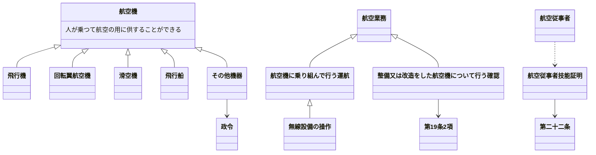

[← 戻る](../PIL法規.md)
## 第一章

[toc]

### 第二条 定義

原文

#### 航空機
人が乗つて航空の用に供することができる飛行機、回転翼航空機、滑空機及び飛行船その他政令で定める航空の用に供することができる機器をいう。
#### 航空業務
航空機に乗り組んで行うその運航（航空機に乗り組んで行う無線設備の操作を含む。）及び整備又は改造をした航空機について行う第十九条第二項に規定する確認をいう。
#### 航空従事者
* 第二十二条の航空従事者技能証明を受けた者をいう。

#### 航空保安施設

原文

* 電波、灯光、色彩又は形象により航空機の航行を援助するための施設で、国土交通省令で定めるものをいう。

#### 着陸帯

原文

* 特定の方向に向つて行う航空機の離陸（離水を含む。以下同じ。）又は着陸（着水を含む。以下同じ。）の用に供するため設けられる飛行場内の矩形部分をいう。

#### 進入区域

原文

* 着陸帯の短辺の両端及びこれと同じ側における着陸帯の中心線の延長三千メートル（ヘリポートの着陸帯にあつては、二千メートル以下で国土交通省令で定める長さ）の点において中心線と直角をなす一直線上におけるこの点から三百七十五メートル（計器着陸装置を利用して行なう着陸又は精密進入レーダーを用いてする着陸誘導に従つて行なう着陸の用に供する着陸帯にあつては六百メートル、ヘリポートの着陸帯にあつては当該短辺と当該一直線との距離に十五度の角度の正切を乗じた長さに当該短辺の長さの二分の一を加算した長さ）の距離を有する二点を結んで得た平面をいう。

#### 進入表面

原文

* 着陸帯の短辺に接続し、且つ、水平面に対し上方へ五十分の一以上で国土交通省令で定める勾配を有する平面であつて、その投影面が進入区域と一致するものをいう。

#### 水平表面

原文

* 飛行場の標点の垂直上方四十五メートルの点を含む水平面のうち、この点を中心として四千メートル以下で国土交通省令で定める長さの半径で描いた円周で囲まれた部分をいう。

#### 転移表面

原文

* 進入表面の斜辺を含む平面及び着陸帯の長辺を含む平面であつて、着陸帯の中心線を含む鉛直面に直角な鉛直面との交線の水平面に対する勾配が進入表面又は着陸帯の外側上方へ七分の一（ヘリポートにあつては、四分の一以上で国土交通省令で定める勾配）であるもののうち、進入表面の斜辺を含むものと当該斜辺に接する着陸帯の長辺を含むものとの交線、これらの平面と水平表面を含む平面との交線及び進入表面の斜辺又は着陸帯の長辺により囲まれる部分をいう。

#### 航空灯火

原文

* 灯火により航空機の航行を援助するための航空保安施設で、国土交通省令で定めるものをいう。

#### 航空交通管制区

原文

* 地表又は水面から二百メートル以上の高さの空域であつて、航空交通の安全のために国土交通大臣が告示で指定するものをいう。

#### 航空交通管制圏

原文

* 航空機の離陸及び着陸が頻繁に実施される国土交通大臣が告示で指定する飛行場並びにその付近の上空の空域であつて、飛行場及びその上空における航空交通の安全のために国土交通大臣が告示で指定するものをいう。

#### 航空交通情報圏

原文

* 前項に規定する飛行場以外の国土交通大臣が告示で指定する飛行場及びその付近の上空の空域であつて、飛行場及びその上空における航空交通の安全のために国土交通大臣が告示で指定するものをいう。

#### 計器気象状態

原文

* 視程及び雲の状況を考慮して国土交通省令で定める視界上不良な気象状態をいう。

#### 計器飛行

原文

* 航空機の姿勢、高度、位置及び針路の測定を計器にのみ依存して行う飛行をいう。

#### 計器飛行方式

原文

* 第十二項の国土交通大臣が指定する飛行場からの離陸及びこれに引き続く上昇飛行又は同項の国土交通大臣が指定する飛行場への着陸及びそのための降下飛行を、航空交通管制圏又は航空交通管制区において、国土交通大臣が定める経路又は第九十六条第一項の規定により国土交通大臣が与える指示による経路により、かつ、その他の飛行の方法について同項の規定により国土交通大臣が与える指示に常時従つて行う飛行の方式
* 第十三項の国土交通大臣が指定する飛行場からの離陸及びこれに引き続く上昇飛行又は同項の国土交通大臣が指定する飛行場への着陸及びそのための降下飛行を、航空交通情報圏（航空交通管制区である部分を除く。）において、国土交通大臣が定める経路により、かつ、第九十六条の二第一項の規定により国土交通大臣が提供する情報を常時聴取して行う飛行の方式
* 第一号に規定する飛行以外の航空交通管制区における飛行を第九十六条第一項の規定により国土交通大臣が経路その他の飛行の方法について与える指示に常時従つて行う飛行の方式

#### 航空運送事業

原文

* 他人の需要に応じ、航空機を使用して有償で旅客又は貨物を運送する事業をいう。

#### 国際航空運送事業

原文

* 本邦内の地点と本邦外の地点との間又は本邦外の各地間において行う航空運送事業をいう。

#### 国内定期航空運送事業

原文

* 本邦内の各地間に路線を定めて一定の日時により航行する航空機により行う航空運送事業をいう。

#### 航空機使用事業

原文

* 他人の需要に応じ、航空機を使用して有償で旅客又は貨物の運送以外の行為の請負を行う事業をいう。

---

[次へ: 第四章](04_第四章.md)
