[← 戻る](../PIL_法規.md)
## 第四章 航空事業者

[toc]


### 航空従事者技能証明
#### ==第二十二条==
<details>
<summary>原文</summary>


国土交通大臣は、申請により、航空業務を行おうとする者について、航空従事者技能証明（以下「技能証明」という。）を行う。

##### 施行規則第42条
第四十二条　法第二十二条の技能証明を申請しようとする者（第五十七条の規定により申請する者を除く。第三項において「技能証明申請者」という。）は、技能証明申請書（第十九号様式（全部の科目に係る学科試験の免除を受けようとする者（以下「学科試験全科目免除申請者」という。）にあつては、第十九号の二様式））を国土交通大臣に提出しなければならない。
２　前項の申請書には、次の各号に掲げる書類を添付しなければならない。
一　学科試験全科目免除申請者にあつては、写真一葉
二　第四十八条又は第四十八条の二の規定により全部又は一部の科目に係る学科試験の免除を受けようとする者にあつては、第四十七条の文書の写し
三　第四十九条の規定により全部又は一部の科目に係る試験の免除を受けようとする者にあつては、技能証明書の写し
四　国際民間航空条約の締約国たる外国の政府が授与した航空業務の技能に係る資格証書を有する者で、試験の免除を受けようとするものにあつては、当該証書の写し
３　技能証明申請者（学科試験全科目免除申請者を除く。）であつて、学科試験に合格したものは、実地試験を受けようとするとき（全部又は一部の科目に係る実地試験の免除を受けようとするときを含む。）は、実地試験申請書（第十九号の二様式）に、写真一葉及び第四十七条の文書の写し（学科試験の合格に係るものに限る。）を添付するとともに、次の各号に掲げる書類を添付し、国土交通大臣に提出しなければならない。
一　第四十九条の規定により全部又は一部の科目に係る実地試験の免除を受けようとする者にあつては、技能証明書の写し
二　国際民間航空条約の締約国たる外国の政府が授与した航空業務の技能に係る資格証書を有する者で、実地試験の免除を受けようとするものにあつては、当該証書の写し
４　第一項の規定により技能証明を申請する者は、当該申請に係る学科試験の合格について第四十七条の通知があつた日（学科試験全科目免除申請者にあつては、技能証明申請書提出の日）から二年以内に戸籍抄本若しくは戸籍記載事項証明書又は本籍の記載のある住民票の写し（外国人にあつては、国籍、氏名、出生の年月日及び性別を証する本国領事官の証明書（本国領事官の証明書を提出できない者にあつては、権限ある機関が発行するこれらの事項を証明する書類）。以下同じ。）及び別表第二に掲げる飛行経歴その他の経歴を有することを証明する書類を国土交通大臣に提出しなければならない。
５　第一項の規定により航空通信士の資格に係る技能証明を申請する者は、技能証明申請書提出の日から二年以内に無線従事者免許証の写しを国土交通大臣に提出しなければならない。
</details>

技能証明申請の手続きと添付書類

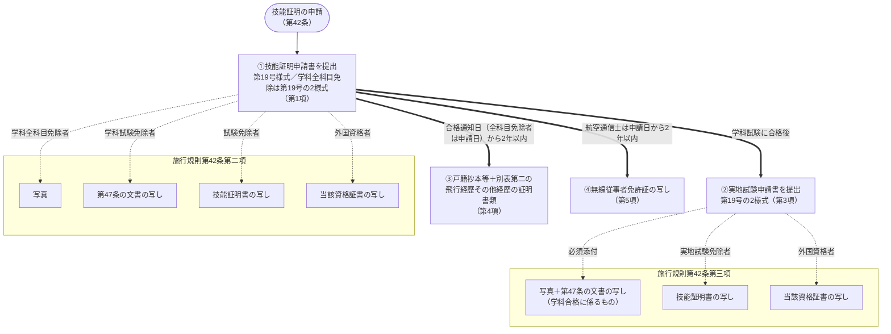


### 技能証明書
#### 第二十三条
技能証明は、申請者に航空従事者技能証明書（以下「技能証明書」という。）を交付することによつて行う。

### 資格
#### 第二十四条
技能証明は、次に掲げる資格別に行う。

<details>
<summary>25条で表にした</summary>


* 定期運送用操縦士
* 事業用操縦士
* 自家用操縦士
* 一等航空士
* 二等航空士
* 航空機関士
* 航空通信士
* 一等航空整備士
* 二等航空整備士
* 一等航空運航整備士
* 二等航空運航整備士
* 航空工場整備士

##### 規
</details>

<details>
<summary>図（未精査）</summary>

技能証明の資格区分の列挙

| 技能証明の資格区分 |
|---|
| 定期運送用操縦士 |
| 事業用操縦士 |
| 自家用操縦士 |
| 一等航空士 |
| 二等航空士 |
| 航空機関士 |
| 航空通信士 |
| 一等航空整備士 |
| 二等航空整備士 |
| 一等航空運航整備士 |
| 二等航空運航整備士 |
| 航空工場整備士 |

</details>


### 技能証明の限定
#### ==第二十五条==

<details>
<summary>原文</summary>

国土交通大臣は、前条の定期運送用操縦士、事業用操縦士、自家用操縦士、航空機関士、一等航空整備士、二等航空整備士、一等航空運航整備士又は二等航空運航整備士の資格についての技能証明につき、国土交通省令で定めるところにより、航空機の種類についての限定をするものとする。
２　国土交通大臣は、前項の技能証明につき、国土交通省令で定めるところにより、航空機の等級又は型式についての限定をすることができる。
３　国土交通大臣は、前条の航空工場整備士の資格についての技能証明につき、国土交通省令で定めるところにより、従事することができる業務の種類についての限定をすることができる。

##### 施行規則第53条
法第二十五条第一項の航空機の種類についての限定及び同条第二項の航空機の等級についての限定は、実地試験に使用される航空機により行う。この場合において、航空機の等級は、次の表の上欄に掲げる航空機の種類に応じ、それぞれ同表の下欄に掲げる等級とする。
<table>
<tbody><tr>
<td>航空機の種類</td>
<td>航空機の等級</td>
</tr>
<tr>
<td>飛行機</td>
<td>
陸上単発ピストン機<br>陸上単発タービン機<br>陸上多発ピストン機<br>陸上多発タービン機<br>水上単発ピストン機<br>水上単発タービン機<br>水上多発ピストン機<br>水上多発タービン機
</td>
</tr>
<tr>
<td>回転翼航空機</td>
<td>飛行機の項の等級に同じ。</td>
</tr>
<tr>
<td>滑空機</td>
<td>
<ruby>曳<rt>えい</rt></ruby>航装置なし動力滑空機<br><ruby>曳<rt>えい</rt></ruby>航装置付き動力滑空機<br>上級滑空機<br>中級滑空機
</td>
</tr>
<tr>
<td>飛行船</td>
<td>飛行機の項の等級に同じ。</td>
</tr>
</tbody></table>
２　前項の場合において、定期運送用操縦士、事業用操縦士及び自家用操縦士の資格並びに航空機関士の資格（限定をする航空機の種類が飛行機又は飛行船であるときに限る。）についての技能証明については、実地試験に使用される航空機の等級が次の表の上欄に掲げる等級であるときは、限定をする航空機の等級を同表の下欄に掲げる等級とする。
<table>
<tbody><tr>
<td>実地試験に使用される航空機の等級</td>
<td>限定をする航空機の等級</td>
</tr>
<tr>
<td>陸上単発ピストン機又は陸上単発タービン機</td>
<td>陸上単発ピストン機及び陸上単発タービン機</td>
</tr>
<tr>
<td>陸上多発ピストン機又は陸上多発タービン機</td>
<td>陸上多発ピストン機及び陸上多発タービン機</td>
</tr>
<tr>
<td>水上単発ピストン機又は水上単発タービン機</td>
<td>水上単発ピストン機及び水上単発タービン機</td>
</tr>
<tr>
<td>水上多発ピストン機又は水上多発タービン機</td>
<td>水上多発ピストン機及び水上多発タービン機</td>
</tr>
</tbody></table>
３　第一項の場合において、一等航空整備士、二等航空整備士、一等航空運航整備士及び二等航空運航整備士の資格についての技能証明については、実地試験に使用される航空機の等級が次の表の上欄に掲げる等級であるときは、限定をする航空機の等級を同表の下欄に掲げる航空機の等級とする。
<table>
<tbody><tr>
<td>実地試験に使用される航空機の等級</td>
<td>限定をする航空機の等級</td>
</tr>
<tr>
<td>陸上単発ピストン機、陸上多発ピストン機、水上単発ピストン機又は水上多発ピストン機</td>
<td>陸上単発ピストン機、陸上多発ピストン機、水上単発ピストン機及び水上多発ピストン機</td>
</tr>
<tr>
<td>陸上単発タービン機、陸上多発タービン機、水上単発タービン機又は水上多発タービン機</td>
<td>陸上単発タービン機、陸上多発タービン機、水上単発タービン機及び水上多発タービン機</td>
</tr>
<tr>
<td><ruby>曳<rt>えい</rt></ruby>航装置なし動力滑空機又は<ruby>曳<rt>えい</rt></ruby>航装置付き動力滑空機</td>
<td><ruby>曳<rt>えい</rt></ruby>航装置なし動力滑空機、<ruby>曳<rt>えい</rt></ruby>航装置付き動力滑空機、上級滑空機及び中級滑空機</td>
</tr>
<tr>
<td>上級滑空機</td>
<td>上級滑空機及び中級滑空機</td>
</tr>
</tbody></table></section>

##### 施行規則第54条
法第二十五条第二項の航空機の型式についての限定は、実地試験に使用される航空機により、次に掲げる区分により行う。
一　操縦者に係る資格にあつては、構造上、その操縦のために二人を要する航空機又は国土交通大臣が指定する型式の航空機については当該航空機の型式
二　航空機関士の資格にあつては当該航空機の型式
三　一等航空整備士の資格にあつては、次に掲げる型式
イ　第五十六条の二に規定する航空機（ロに掲げるものを除く。）については、当該航空機の型式
ロ　国土交通大臣が指定する型式の航空機については、当該航空機の型式
四　二等航空整備士、一等航空運航整備士及び二等航空運航整備士の資格にあつては、前号ロの国土交通大臣が指定する型式の航空機については当該航空機の型式
２　前項（第三号イに係る部分に限る。）の規定は、一等航空整備士が、第五条の六の表に掲げる作業の区分のうちの保守又は軽微な修理をした航空機について法第十九条第二項に規定する確認の行為を行う場合には、適用しない。
##### 施行規則第55条
法第二十五条第三項の業務の種類についての限定は、試験に係る業務の種類により、機体構造関係、機体装備品関係、ピストン発動機関係、タービン発動機関係、プロペラ関係、計器関係、電子装備品関係、電気装備品関係又は無線通信機器関係の別に行なう。
</details>

大臣が省令で行う限定の三類型（第1項＝義務／第2・3項＝任意）

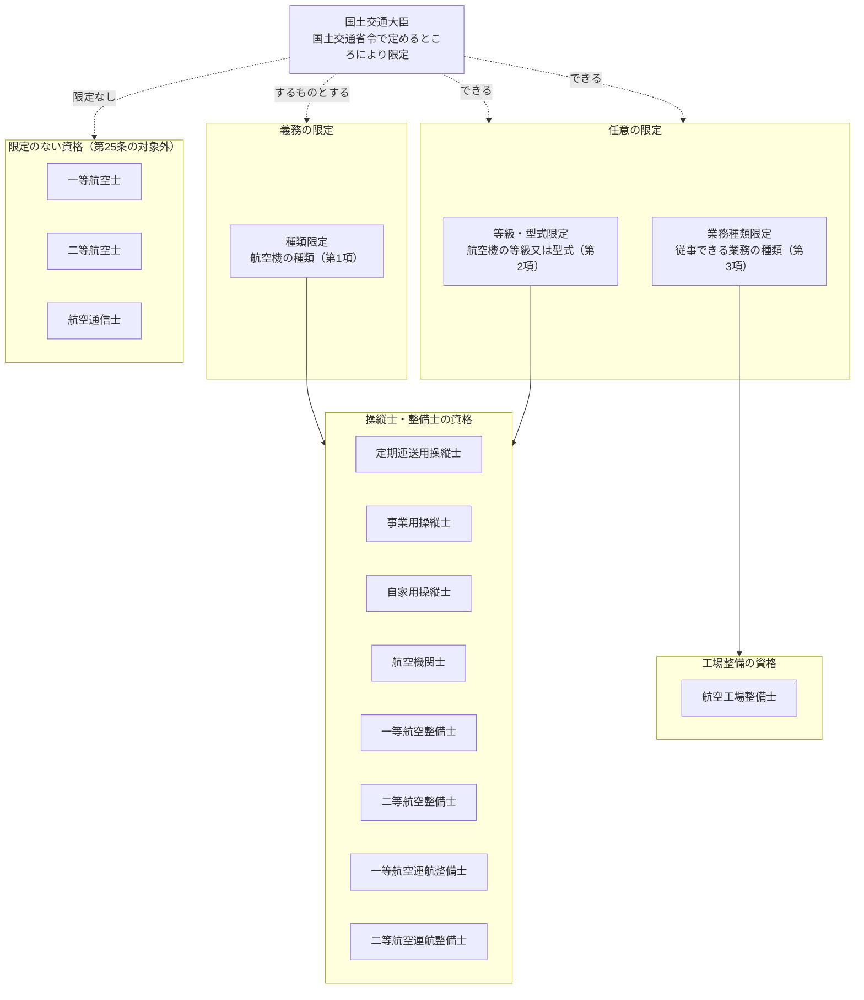

航空機の種類ごとの等級区分（施行規則第53条第1項。種類・等級の限定は実地試験に使用した航空機で決まる）

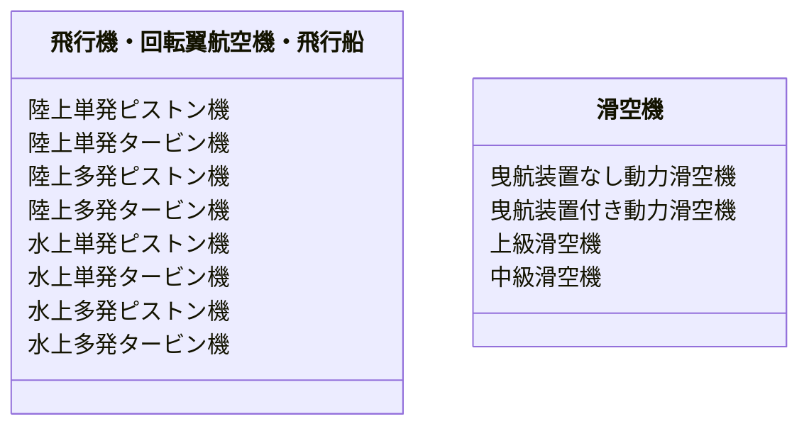

実地試験に使用した等級 → 限定される等級の拡張ルール（施行規則第53条第2・3項）

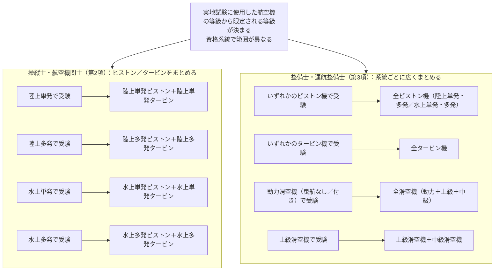

型式についての限定（施行規則第54条。型式の限定は実地試験に使用した航空機により行う）

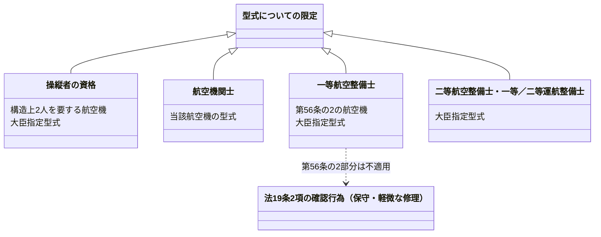

業務の種類についての限定（施行規則第55条・航空工場整備士。試験に係る業務の種類により行う）

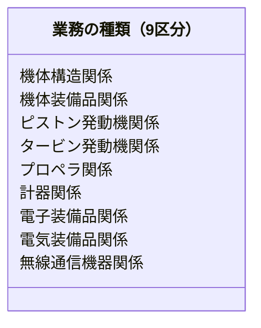


### 技能証明の要件
#### ==第二十六条==

<details>
<summary>原文</summary>

技能証明は、第二十四条に掲げる資格別及び前条第一項の規定による航空機の種類別に国土交通省令で定める年齢及び飛行経歴その他の経歴を有する者でなければ、受けることができない。
２　航空通信士の資格についての技能証明は、前項の規定によるほか、国土交通省令で定める電波法（昭和二十五年法律第百三十一号）第四十条第一項の無線従事者の資格について同法第四十一条第一項の免許を受けた者でなければ、受けることができない。

##### 施行規則第43条
技能証明又は法第三十四条第一項の計器飛行証明若しくは同条第二項の操縦教育証明は、自家用操縦士、二等航空士及び航空通信士の資格に係るものにあつては十七歳（自家用操縦士の資格のうち滑空機に係るものにあつては十六歳）、事業用操縦士、准定期運送用操縦士、一等航空士、航空機関士、一等航空運航整備士、二等航空運航整備士及び航空工場整備士の資格に係るものにあつては十八歳、二等航空整備士の資格に係るものにあつては十九歳、一等航空整備士の資格に係るものにあつては二十歳並びに定期運送用操縦士の資格に係るものにあつては二十一歳以上の者であつて、別表第二に掲げる飛行経歴その他の経歴を有する者でなければ受けることができない。
２　法第二十六条第二項の国土交通省令で定める資格は、第一級総合無線通信士、第二級総合無線通信士又は航空無線通信士とする。
##### 施行規則第44条
第四十二条第四項及び前条第一項の飛行経歴その他の経歴は、次に掲げる方法により証明されたものでなければならない。ただし、法の施行前のものについては、この限りでない。
一　技能証明を有する者のその資格に係る飛行経歴にあつては、一飛行の終了ごとに当該機長が証明をしたもの
二　法第三十五条第一項各号に掲げる操縦の練習のために行う操縦に係る飛行経歴にあつては、そのつどその監督者の証明したもの
三　前二号に掲げるもの以外のものにあつては、そのつどその使用者、指導者その他これに準ずる者の証明したもの
</details>


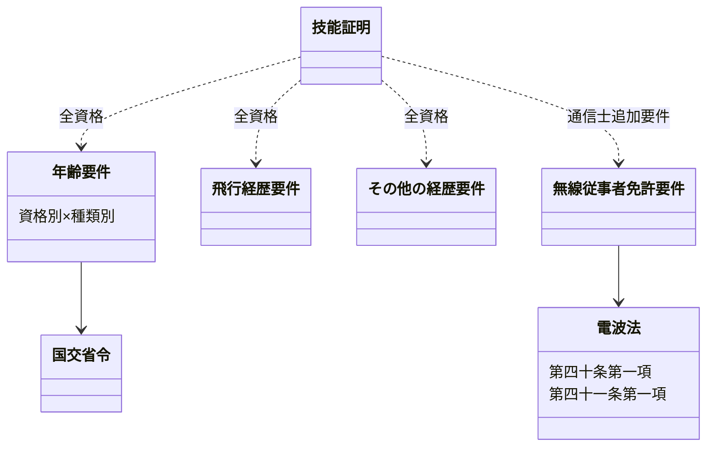

### 欠格事由等
#### 第二十七条

<details>
<summary>原文</summary>

第三十条の規定により技能証明の取消しを受け、その取消しの日から二年を経過しない者は、技能証明の申請をすることができない。
２　国土交通大臣は、第二十九条第一項の試験に関し、不正の行為があつた者について、二年以内の期間に限り技能証明の申請を受理しないことができる。


##### 規
</details>

<details>
<summary>図（未精査）</summary>

技能証明申請ができない欠格事由

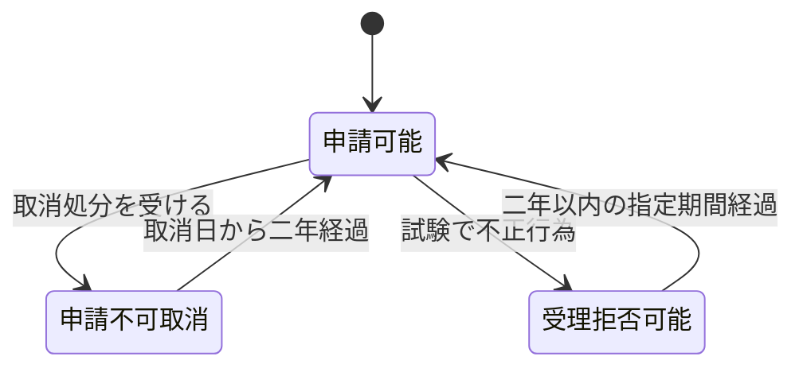

</details>


### 業務範囲
#### ==第二十八条==
<details>
<summary>原文</summary>


* 別表の資格の欄に掲げる資格の技能証明（航空機に乗り組んでその運航を行う者にあつては、同表の資格の欄に掲げる資格の技能証明及び第三十一条第一項の航空身体検査証明）を有する者でなければ、同表の業務範囲の欄に掲げる行為を行つてはならない。
    * ただし、定期運送用操縦士、事業用操縦士、自家用操縦士、一等航空士、二等航空士若しくは航空機関士の資格の技能証明を有する者が受信のみを目的とする無線設備の操作を行う場合又はこれらの技能証明を有する者で電波法第四十条第一項の無線従事者の資格を有するものが、同条第二項の規定に基づき行うことができる無線設備の操作を行う場合は、この限りでない。
* ２　技能証明につき第二十五条の限定をされた航空従事者は、その限定をされた種類、等級若しくは型式の航空機又は業務の種類についてでなければ、別表の業務範囲の欄に掲げる行為を行つてはならない。
* ３　前二項の規定は、国土交通省令で定める航空機に乗り組んでその操縦（航空機に乗り組んで行うその機体及び発動機の取扱いを含む。）を行う者及び国土交通大臣の許可を受けて、試験飛行等のため航空機に乗り組んでその運航を行う者については、適用しない。
##### 施行規則第51条
法第二十八条第三項の国土交通省令で定める航空機は、次に掲げるものとする。
一　初級滑空機及び中級滑空機
二　本邦外の各地間を航行する航空機であつて、当該航空機において航空業務に従事するのに必要な知識及び能力を有する者として国土交通大臣が告示で定める者が乗り組んで操縦（航空機に乗り組んで行うその機体及び発動機の取扱いを含む。）を行うもの
##### 施行規則第51条の2
法第二十八条第三項の許可を受けようとする者は、次に掲げる事項を記載した申請書を国土交通大臣に提出しなければならない。
一　氏名及び住所
二　航空機の種類、等級及び型式並びに航空機の国籍及び登録記号
三　飛行計画の概要（飛行の目的、日時及び径路を明記すること。）
四　操縦者の氏名及び資格
五　同乗者の氏名及び同乗の目的
六　その他参考となる事項
</details>

条件（行為が可能になる成立ロジック）

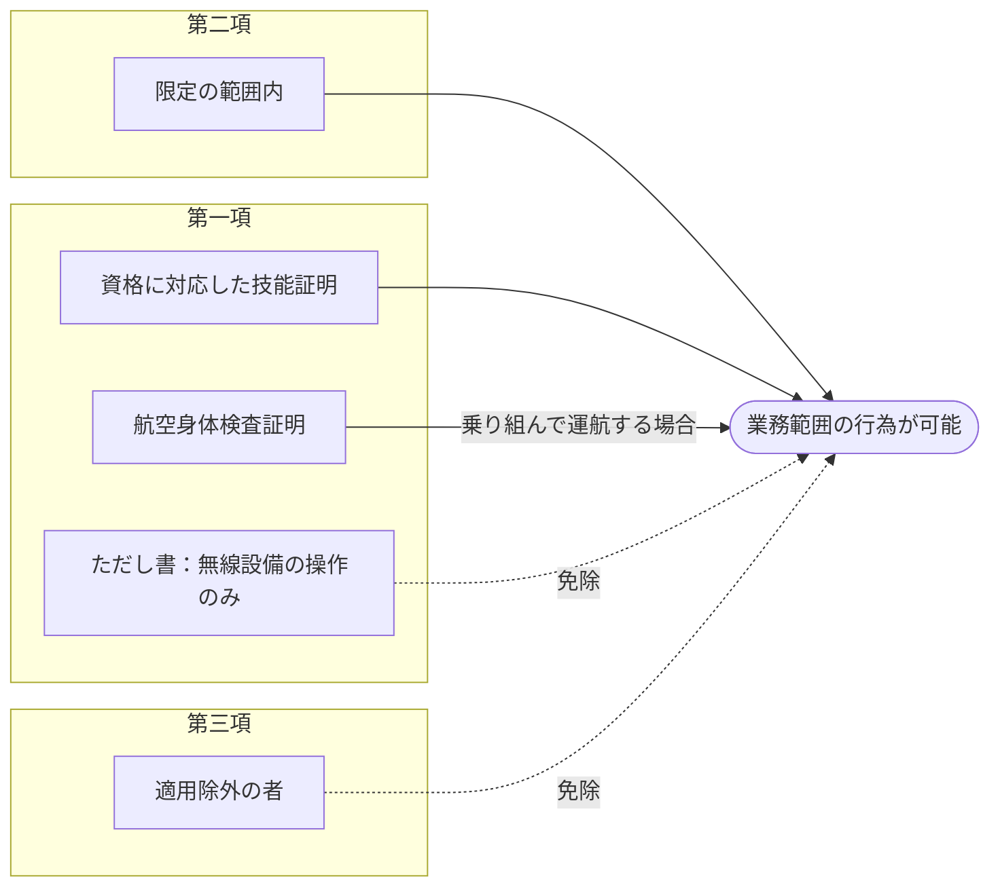

定義（例外の中身）

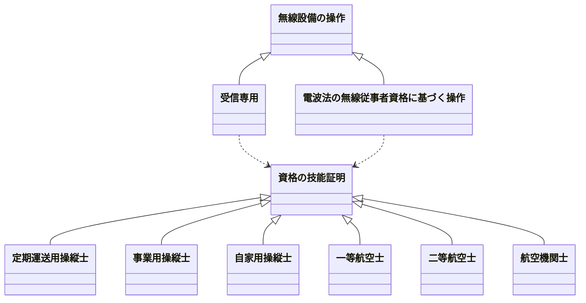
定義（例外の中身）

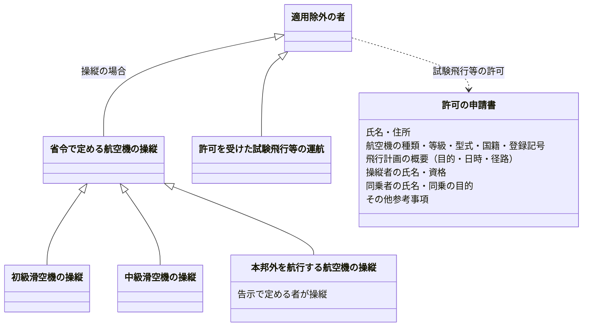

### 試験の実施
#### 第二十九条

<details>
<summary>原文</summary>

国土交通大臣は、技能証明を行う場合には、申請者が、その申請に係る資格の技能　証明を有する航空従事者として航空業務に従事するのに必要な知識及び能力を有するかどうかを判定するために、試験を行わなければならない。
２　試験は、学科試験及び実地試験とする。
３　学科試験に合格した者でなければ、実地試験を受けることができない。
４　国土交通大臣は、外国政府の授与した航空業務の技能に係る資格証書を有する者について技能証明を行う場合には、前三項の規定にかかわらず、国土交通省令で定めるところにより、試験の全部又は一部を行わないことができる。独立行政法人航空大学校又は国土交通大臣が申請により指定した航空従事者の養成施設の課程を修了した者についても、同様とする。
５　前項の指定の申請の手続、指定の基準その他の指定に関する実施細目は、国土交通省令で定める。
６　国土交通大臣は、第四項の指定を受けた者が前項の国土交通省令の規定に違反したときは、当該指定を受けた者に対し、当該指定に係る業務の運営の改善に必要な措置をとるべきことを命じ、六月以内において期間を定めて当該指定に係る業務の全部若しくは一部の停止を命じ、又は当該指定を取り消すことができる。


##### 施行規則第45条〜第50条の2

</details>

<details>
<summary>図（未精査）</summary>

試験の構造と免除

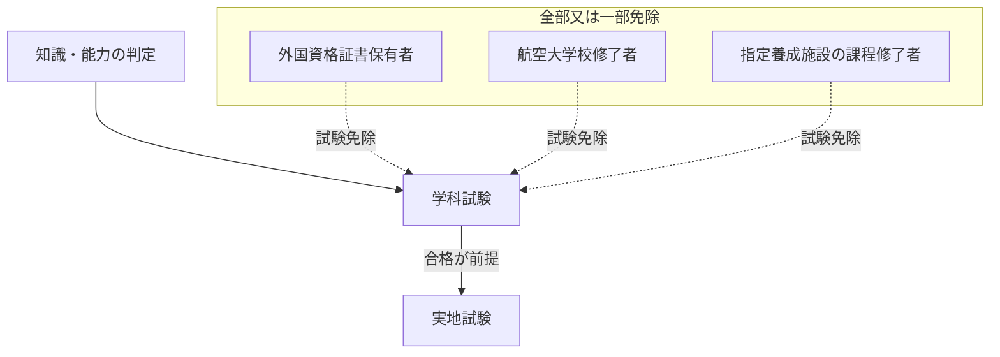

</details>

<details>
<summary>図（未精査）</summary>

指定養成施設に対する監督処分の遷移

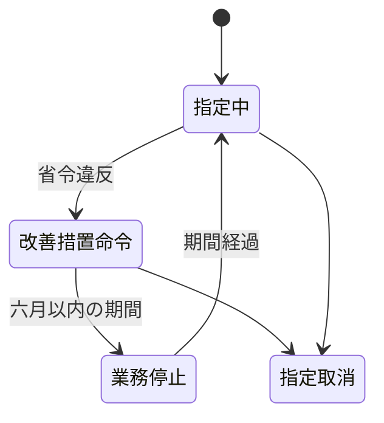

</details>


### 技能証明の限定の変更
#### ==第二十九条の二==

<details>
<summary>原文</summary>

国土交通大臣は、第二十五条第二項又は第三項の限定に係る技能証明につき、その技能証明に係る航空従事者の申請により、その限定を変更することができる。
２　前条の規定は、前項の限定の変更を行う場合に準用する。


##### 施行規則第57条
法第二十九条の二第一項の規定による技能証明の限定の変更を申請しようとする者は、技能証明限定変更申請書（第十九号様式（学科試験全科目免除申請者にあつては、第十九号の二様式））を国土交通大臣に提出しなければならない。
２　第四十二条第二項（第一号を除く。）から第四項までの規定は、前項の申請について準用する。この場合において、同条第三項中「写真一葉及び第四十七条の文書の写し」とあるのは「第四十七条の文書の写し」と、同条第四項中「技能証明を申請する者」とあるのは「技能証明の限定の変更を申請する者（現に有する技能証明を受けるのに必要な飛行経歴その他の経歴と同一でない飛行経歴その他の経歴が必要とされている技能証明の限定の変更を申請する者に限る。）」と、「戸籍抄本若しくは戸籍記載事項証明書又は本籍の記載のある住民票の写し（外国人にあつては、国籍、氏名、出生の年月日及び性別を証する本国領事官の証明書（本国領事官の証明書を提出できない者にあつては、権限ある機関が発行するこれらの事項を証明する書類）。以下同じ。）及び別表第二に掲げる飛行経歴その他の経歴」とあるのは「別表第二に掲げる飛行経歴その他の経歴」と読み替えるものとする。
</details>

限定変更の対象・申請手続（法第29条の2／施行規則第57条＝第42条の準用）

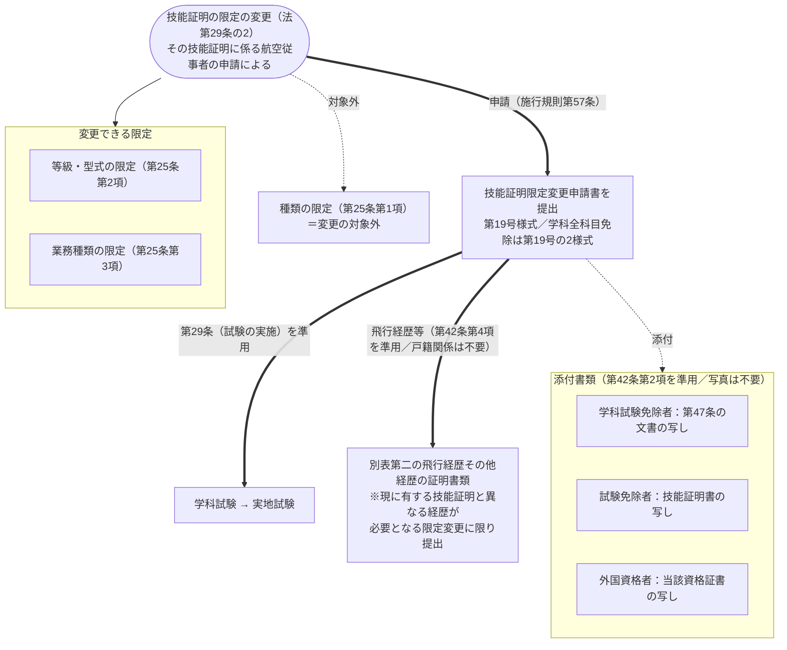

### 技能証明の取消等
#### 第三十条

<details>
<summary>原文</summary>

国土交通大臣は、航空従事者が左の各号の一に該当するときは、その技能証明　を取り消し、又は一年以内の期間を定めて航空業務の停止を命ずることができる。
一　この法律又はこの法律に基く処分に違反したとき。
二　航空従事者としての職務を行うに当り、非行又は重大な過失があつたとき。


##### 規
</details>

<details>
<summary>図（未精査）</summary>

取消・業務停止の事由と処分

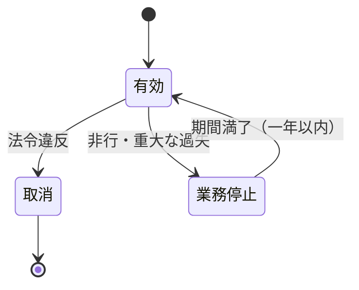

</details>


### 航空身体検査証明
#### 第三十一条

<details>
<summary>原文</summary>

国土交通大臣又は指定航空身体検査医（申請により国土交通大臣が指定した国土交通省令で定める要件を備える医師をいう。以下同じ。）は、申請により、技能証明を有する者で航空機に乗り組んでその運航を行なおうとするものについて、航空身体検査証明を行なう。
２　航空身体検査証明は、申請者に航空身体検査証明書を交付することによつて行なう。
３　国土交通大臣又は指定航空身体検査医は、第一項の申請があつた場合において、申請者がその有する技能証明の資格に係る国土交通省令で定める身体検査基準に適合すると認めるときは、航空身体検査証明をしなければならない。


##### 規
</details>

<details>
<summary>図（未精査）</summary>

航空身体検査証明の主体・対象・成立要件

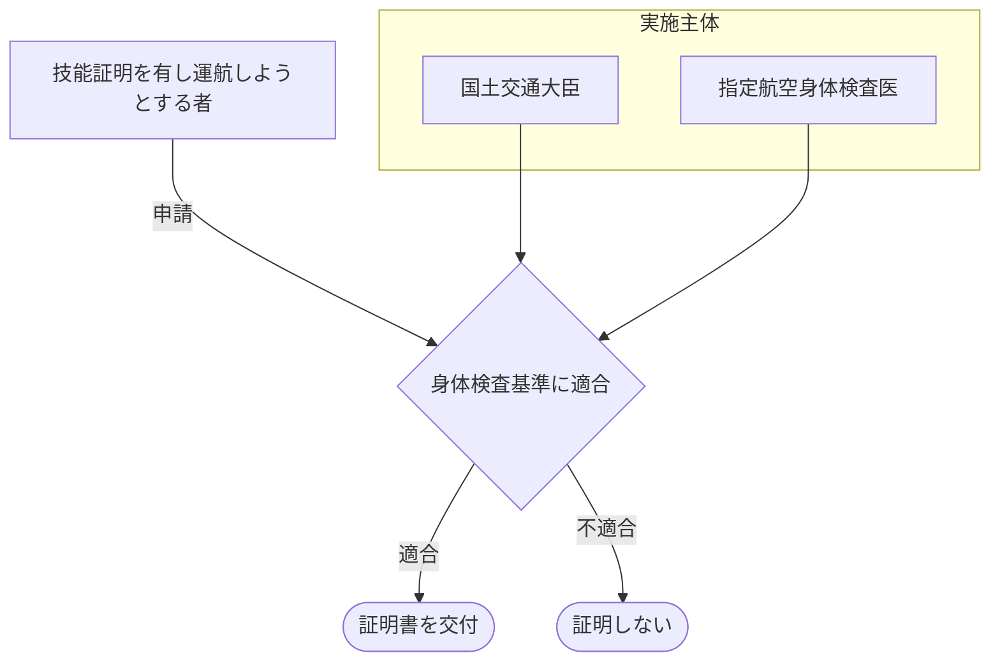

</details>


#### 第三十二条

<details>
<summary>原文</summary>

航空身体検査証明の有効期間は、定期運送用操縦士の資格を有する者にあつては六月、その他の者にあつては一年とする。


##### 規
</details>

### 航空英語能力証明
#### 第三十三条

<details>
<summary>原文</summary>

定期運送用操縦士、事業用操縦士又は自家用操縦士の資格についての技能証明（当該技能証明について限定をされた航空機の種類が国土交通省令で定める航空機の種類であるものに限る。）を有する者は、その航空業務に従事するのに必要な航空に関する英語（以下「航空英語」という。）に関する知識及び能力を有することについて国土交通大臣が行う航空英語能力証明を受けていなければ、本邦内の地点と本邦外の地点との間における航行その他の国土交通省令で定める航行を行つてはならない。
２　航空英語能力証明の有効期間は、当該航空英語能力証明を受ける者の航空英語に関する知識及び能力に応じて、国土交通省令で定める期間とする。
３　第二十七条、第二十九条及び第三十条の規定は、航空英語能力証明について準用する。この場合において、第二十九条第四項中「又は国土交通大臣」とあるのは「若しくは国土交通大臣」と、「修了した者」とあるのは「修了した者又は国土交通大臣が申請により指定した第百二条第一項の本邦航空運送事業者により航空英語に関する知識及び能力を有すると判定された者」と読み替えるものとする。


##### 規
</details>

<details>
<summary>図（未精査）</summary>

航空英語能力証明の要件と効果

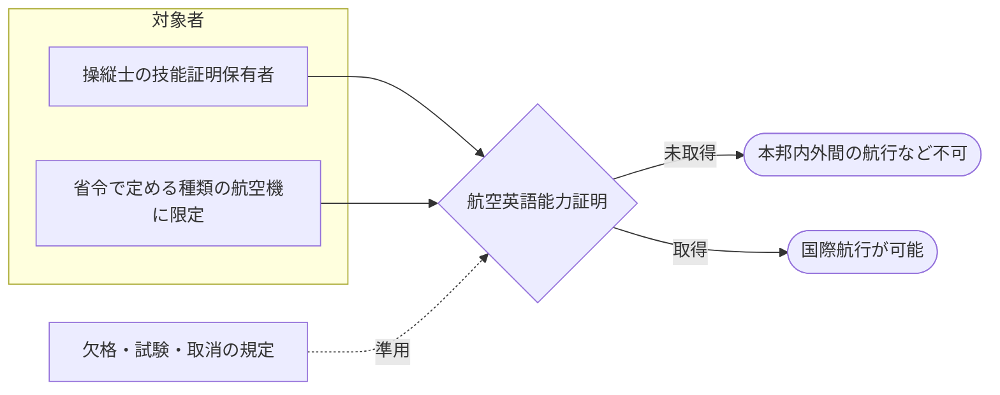

</details>


### 計器飛行証明及び操縦教育証明
#### 第三十四条

<details>
<summary>原文</summary>

定期運送用操縦士の資格についての技能証明（当該技能証明について限定をされた航空機の種類が国土交通省令で定める航空機の種類であるものに限る。第三十五条の二第一項において同じ。）又は事業用操縦士若しくは自家用操縦士の資格についての技能証明を有する者は、その使用する航空機の種類に係る次に掲げる飛行（以下「計器飛行等」という。）の技能について国土交通大臣の行う計器飛行証明を受けていなければ、計器飛行等を行つてはならない。
一　計器飛行
二　計器飛行以外の航空機の位置及び針路の測定を計器にのみ依存して行う飛行（以下「計器航法による飛行」という。）で国土交通省令で定める距離又は時間を超えて行うもの三　計器飛行方式による飛行２　次に掲げる操縦の練習を行う者に対しては、その使用する航空機を操縦することができる技能証明及び航空身体検査証明を有し、かつ、当該航空機の種類に係る操縦の教育の技能について国土交通大臣の行う操縦教育証明を受けている者（以下「操縦教員」という。）でなければ、操縦の教育を行つてはならない。
一　定期運送用操縦士、事業用操縦士又は自家用操縦士の資格についての技能証明（以下「操縦技能証明」という。）を受けていない者が航空機（第二十八条第三項の国土交通省令で定める航空機を除く。次号において同じ。）に乗り組んで行う操縦の練習二　操縦技能証明及び航空身体検査証明を有する者が当該技能証明について限定をされた種類以外の種類の航空機に乗り組んで行う操縦の練習３　第二十六条第一項、第二十七条、第二十九条及び第三十条の規定は、前二項の計器飛行証明又は操縦教育証明について準用する。


##### 規
</details>

<details>
<summary>図（未精査）</summary>

計器飛行証明と操縦教育証明の構造

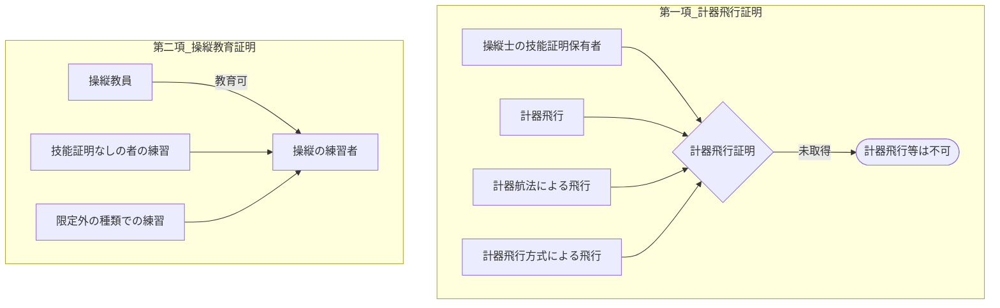

</details>

<details>
<summary>図（未精査）</summary>

操縦教員の要件

| 操縦教員の要件 |
|---|
| 使用航空機を操縦できる技能証明 |
| 航空身体検査証明 |
| 操縦教育証明 |

</details>


### 航空機の操縦練習
#### 第三十五条

<details>
<summary>原文</summary>

第二十八条第一項及び第二項の規定は、左に掲げる操縦の練習のために行なう操縦については、適用しない。
一　前条第二項第一号に掲げる操縦の練習で、当該練習について国土交通大臣の許可を受け、かつ、操縦教員の監督の下に行なうもの二　前条第二項第二号に掲げる操縦の練習で、操縦教員の監督の下に行なうもの三　操縦技能証明及び航空身体検査証明を有する者が当該技能証明について限定をされた種類の航空機のうち当該技能証明について限定をされた等級又は型式以外の等級又は型式のものに乗り組んで行なう操縦の練習で、当該航空機を操縦することができる技能証明及び航空身体検査証明を有する者の監督（当該航空機を操縦することができる技能証明を有する者の監督を受けることが困難な場合にあつては、当該航空機を操縦することができる知識及び能力を有すると認めて国土交通大臣が指定した者の監督）の下に行なうもの２　前項各号の操縦の練習の監督を行なう者は、当該練習の監督を国土交通省令で定めるところにより行なわなければならない。
３　国土交通大臣は、第一項第一号の許可の申請があつた場合において、申請者が、航空機の操縦の練習を行うのに必要な能力を有すると認めるときは、これを許可しなければならない。
４　第一項第一号の許可は、申請者に航空機操縦練習許可書を交付することによつて行う。
５　第三十条及び第六十七条第一項の規定は、第一項第一号の許可を受けた者に準用する。


##### 規
</details>

<details>
<summary>図（未精査）</summary>

操縦練習に対する業務範囲規定の適用除外

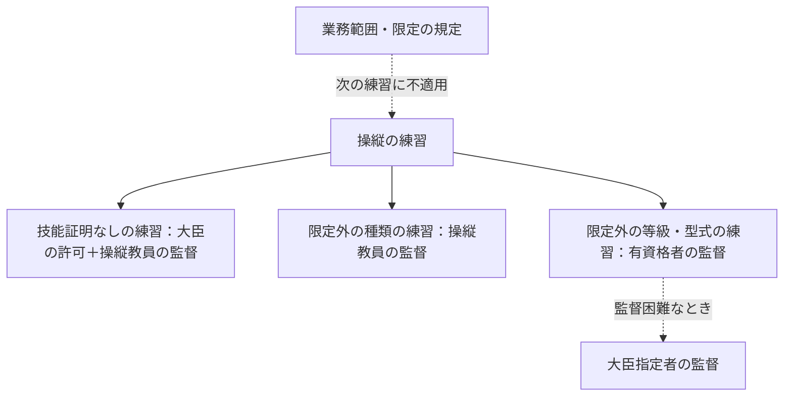

</details>

<details>
<summary>図（未精査）</summary>

操縦練習許可（第一号）の手続と準用

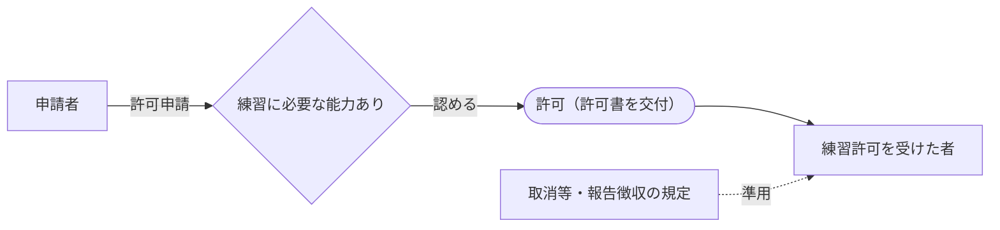

</details>


### 計器飛行等の練習
#### 第三十五条の二

<details>
<summary>原文</summary>

第三十四条第一項の規定は、定期運送用操縦士の資格についての技能証明又は事業用操縦士若しくは自家用操縦士の資格についての技能証明及び航空身体検査証明を有する者でその使用する航空機の種類について計器飛行証明を受けていないものが計器飛行等の練習のために行う飛行で、次に掲げる者の監督の下に行うものについては、適用しない。
一　当該航空機を操縦することができる技能証明及び航空身体検査証明を有し、かつ、当該技能証明が定期運送用操縦士の資格についての技能証明又は事業用操縦士若しくは自家用操縦士の資格についての技能証明である場合は当該航空機の種類について計器飛行証明を有する者二　地上物標を利用して航空機の位置及び針路を知ることができる場合において計器飛行又は計器航法による飛行の練習を行うときは、当該航空機を操縦することができる技能証明及び航空身体検査証明を有する者三　当該航空機を操縦することができる技能証明を有する者の監督を受けることが困難な場合は、当該航空機を使用して計器飛行等を行うことができる知識及び能力を有すると認めて国土交通大臣が指定した者２　前条第二項の規定は、計器飛行等の練習の監督を行なう者について準用する。


##### 規
</details>

<details>
<summary>図（未精査）</summary>

計器飛行等の練習に対する適用除外と監督者

```mermaid
flowchart TD
    A["計器飛行証明の規定"] -.->|練習には不適用| B["計器飛行等の練習"]
    B --> S["次の者の監督下"]
    S --> M1["当該航空機を操縦できる者（計器飛行証明あり）"]
    S --> M2["地上物標利用時：操縦できる技能証明保有者"]
    S --> M3["監督困難時：大臣が指定した者"]
```

</details>


### 国土交通省令への委任
#### 第三十六条

<details>
<summary>原文</summary>

技能証明書、航空身体検査証明書及び航空機操縦練習許可書の様式、交付、再交付及び返納に関する事項その他技能証明、航空身体検査証明、航空英語能力証明、計器飛行証明、操縦教育証明、第三十五条第一項第一号の許可並びに同項第三号及び前条第一項第三号の指定に関する細目的事項並びに第二十九条第一項（第二十九条の二第二項、第三十三条第三項及び第三十四条第三項において準用する場合を含む。）
の試験の科目、受験手続その他の試験に関する実施細目は、国土交通省令で定める。


##### 規

</details>

<details>
<summary>図（未精査）</summary>

国土交通省令への委任事項

```mermaid
classDiagram
    class 委任を受ける証明等 {
        技能証明
        航空身体検査証明
        航空英語能力証明
        計器飛行証明
        操縦教育証明
        操縦練習許可・指定
    }
    class 国土交通省令 {
        様式・交付・再交付・返納
        各種証明の細目
        許可・指定の細目
        試験の科目・受験手続
    }
    委任を受ける証明等 ..> 国土交通省令 : 委任
```

</details>


---

[前へ: 第一章](01_第一章.md)  |  [次へ: 第六章](06_第六章.md)
