[← 戻る](../PIL_法規.md)
## 第六章　航空機の運航

[toc]


### 国籍等の表示
#### ==第五十七条==

<details>
<summary>原文</summary>


航空機には、国土交通省令で定めるところに従い、国籍、登録記号及び所有者の氏名又は名称を表示しなければ、これを航空の用に供してはならない。但し、第十一条第一項ただし書の規定による許可を受けた場合は、この限りでない。


##### 施行規則第133条
航空機の国籍は、装飾体でないローマ字の大文字ＪＡ（以下「国籍記号」という。）で表示しなければならない。
##### 施行規則第134条
法第五条の規定による登録記号（第十章を除き、以下「登録記号」という。）は、装飾体でない四個のアラビア数字又はローマ字の大文字で表示しなければならない。
##### 施行規則第135条
国籍記号及び登録記号は、耐久性のある方法で、鮮明に表示しなければならない。
##### 施行規則第136条
登録記号は、国籍記号の後に連記しなければならない。
##### 施行規則第137条
国籍記号及び登録記号の表示の方法及び場所は、左の通りとする。
一　飛行機及び滑空機の場合には、主翼面と尾翼面又は主翼面と胴体面とに表示するものとする。
イ　主翼面にあつては、右最上面及び左最下面に表示し、主翼の前縁及び後縁より等距離に配置し、国籍記号及び登録記号の頂は、主翼の前縁に向けるものとする。但し、各記号は、補助翼及びフラツプにわたつてはならない。
ロ　尾翼面にあつては、垂直尾翼の両最外側面に、尾翼の各縁から五センチメートル以上離して、水平又は垂直に配置するものとする。
ハ　胴体面にあつては、主翼と尾翼の間にある胴体の両最外側面に表示し、水平安定板の前縁の直前方に、水平又は垂直に配置するものとする。
二　回転翼航空機の場合には、胴体底面及び胴体側面に表示する。
イ　胴体底面にあつては、胴体の最大横断面附近に配置し、各記号の頂は、胴体左側に向けるものとする。
ロ　胴体側面にあつては、主回転翼の軸と補助回転翼の軸との間の胴体両側面又は動力装置のある附近の両側面に、水平又は垂直に配置するものとする。
三　飛行船の場合には、船体面又は水平安定板面及び垂直安定板面に表示するものとする。
イ　船体面にあつては、対称軸と直角に交わる最大横断面附近の上面及び両側面に配置するものとする。
ロ　水平安定板面にあつては、右上面及び左下面に配置し、国籍記号及び登録記号の頂は、水平安定板の前縁に向けるものとする。
ハ　垂直安定板面にあつては、下方の垂直安定板の両側面に水平に配置するものとする。
##### 施行規則第138条
国籍記号及び登録記号に使用する文字及び数字（以下「各記号」という。）の高さは次のとおりとする。
一　飛行機及び滑空機
イ　主翼面に表示する場合は、五十センチメートル以上
ロ　垂直尾翼に表示する場合は、十五センチメートル
ハ　胴体面に表示する場合は、十五センチメートル以上
二　回転翼航空機
イ　胴体底面に表示する場合は、五十センチメートル以上
ロ　胴体側面に表示する場合は、十五センチメートル以上
三　飛行船
イ　船体面に表示する場合は、五十センチメートル以上
ロ　水平安定板及び垂直安定板に表示する場合は、十五センチメートル
##### 施行規則第139条
各記号の幅、線の太さ、間隔及び色は左の通りとする。
一　幅は、各記号の高さの三分の二とする。但し、アラビヤ数字の１はこの限りでない。
二　線の太さは、各記号の高さの六分の一であつて、中実線とする。
三　間隔は、各記号の幅の四分の一以上であつて、二分の一をこえないものとする。
四　色は、各記号を表示する場所の地色と鮮明に判別できるものとする。
##### 施行規則第140条
第百三十七条から前条までの規定にかかわらず、国土交通大臣が支障がないと認めた場合は、この限りでない。
##### 施行規則第141条
航空機の所有者の氏名又は名称及び住所並びにその航空機の国籍記号及び登録記号を打刻した長さ七センチメートル、幅五センチメートルの耐火性材料で作つた識別板を当該航空機の出入口の見やすい場所に取り付けなければならない。
</details>

<details>
<summary>図（未精査）</summary>

国籍等の表示義務と航行可否

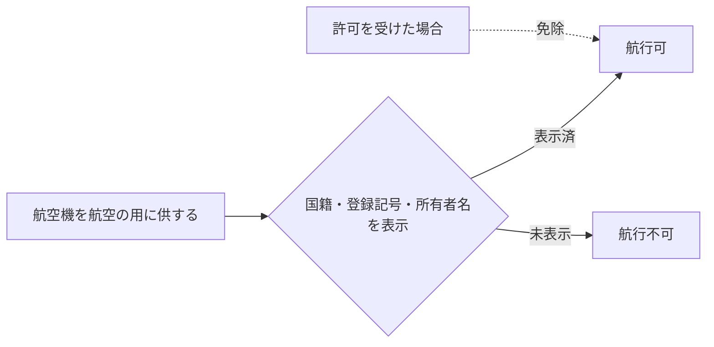

</details>

<details>
<summary>図（未精査）</summary>

国籍記号・登録記号の構成と表示要件

| 表示要素 | 要件 |
|---|---|
| 国籍記号 | ローマ字大文字JA／装飾体でない |
| 登録記号 | 4個のアラビア数字またはローマ字大文字／国籍記号の後に連記 |
| 所有者氏名・名称 | 表示要素のひとつ |
| 表示方法 | 耐久性のある方法／鮮明に表示 |

</details>

<details>
<summary>図（未精査）</summary>

機種別の表示場所

| 機種 | 表示場所 | 文字の高さ |
|------|----------|-----------|
| 飛行機・滑空機 | 主翼面＋尾翼面（または胴体面） | 主翼50cm以上／尾翼15cm／胴体15cm以上 |
| 回転翼航空機 | 胴体底面＋胴体側面 | 底面50cm以上／側面15cm以上 |
| 飛行船 | 船体面（または水平・垂直安定板面） | 船体50cm以上／安定板15cm |

</details>


### 航空日誌
#### ==第五十八条==

<details>
<summary>原文</summary>

航空機の使用者は、航空日誌を備えなければならない。
２　航空機の使用者は、航空機を航空の用に供した場合又は整備し、若しくは改造した場合には、遅滞なく航空日誌に国土交通省令で定める事項を記載しなければならない。
３　前二項の規定は、第十一条第一項ただし書の規定による許可を受けた場合には、適用しない。


##### 施行規則第142条
法第五十八条第一項の規定により航空機の使用者が備えなければならない航空日誌は、法第百三十一条各号に掲げる航空機以外の航空機については搭載用航空日誌又は滑空機用航空日誌とし、法第百三十一条各号に掲げる航空機については搭載用航空日誌とする。
２　法第五十八条第二項の規定により航空日誌に記載すべき事項は、次のとおりとする。
一　搭載用航空日誌
イ　航空機の国籍、登録記号、登録番号及び登録年月日
ロ　航空機の種類、型式及び型式証明書番号
ハ　耐空類別及び耐空証明書番号
ニ　航空機の製造者、製造番号及び製造年月日
ホ　発動機及びプロペラの型式
ヘ　航行に関する次の記録
（一）　航行年月日
（二）　乗組員の氏名及び業務
（三）　航行目的又は便名
（四）　出発地及び出発時刻
（五）　到着地及び到着時刻
（六）　航行時間
（七）　航空機の航行の安全に影響のある事項
（八）　機長の署名
ト　製造後の総航行時間及び最近のオーバーホール後の総航行時間
チ　発動機及びプロペラの装備換えに関する次の記録
（一）　装備換えの年月日及び場所
（二）　発動機及びプロペラの製造者及び製造番号
（三）　装備換えを行つた箇所及び理由
リ　修理、改造又は整備の実施に関する次の記録
（一）　実施の年月日及び場所
（二）　実施の理由、箇所及び交換部品名
（三）　確認年月日及び確認を行つた者の署名又は記名押印
二　滑空機用航空日誌
イ　滑空機の国籍、登録記号、登録番号及び登録年月日
ロ　滑空機の型式及び型式証明書番号
ハ　耐空類別及び耐空証明書番号
ニ　滑空機の製造者、製造番号及び製造年月日
ホ　飛行に関する次の記録
（一）　飛行年月日
（二）　乗組員氏名
（三）　飛行目的
（四）　飛行の区間又は場所
（五）　飛行の時間又は回数
（六）　滑空機の飛行の安全に影響のある事項
（七）　機長の署名
ヘ　修理、改造又は整備の実施に関する次の記録
（一）　実施の年月日及び場所
（二）　実施の理由、箇所及び交換部品名
（三）　確認年月日及び確認を行つた者の署名又は記名押印
３　前項の規定にかかわらず、法第百三十一条各号に掲げる航空機の搭載用航空日誌には、同項第一号イ及びヘに掲げる事項を記載すればよい。
</details>

<details>
<summary>図（未精査）</summary>

航空日誌の備付けと記載義務

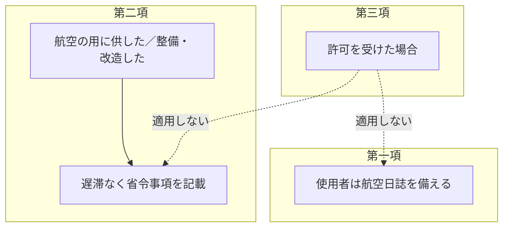

</details>

<details>
<summary>図（未精査）</summary>

航空日誌の種類と記載事項

| 種類 | 記載事項 |
|---|---|
| 搭載用航空日誌 | 国籍・登録記号・登録番号／種類・型式・型式証明番号／耐空類別・耐空証明番号／製造者・製造番号／発動機・プロペラ型式／航行の記録／総航行時間／装備換えの記録／修理改造整備の記録 |
| 滑空機用航空日誌 | 国籍・登録記号・登録番号／型式・型式証明番号／耐空類別・耐空証明番号／製造者・製造番号／飛行の記録／修理改造整備の記録 |

</details>


### 航空機に備え付ける書類
#### ==第五十九条==

<details>
<summary>原文</summary>

航空機（国土交通省令で定める航空機を除く。）には、左に掲げる書類を備え付けなければ、これを航空の用に供してはならない。但し、第十一条第一項ただし書の規定による許可を受けた場合は、この限りでない。
一　航空機登録証明書
二　耐空証明書
三　航空日誌
四　その他国土交通省令で定める航空の安全のために必要な書類


##### 施行規則第143条
法第五十九条の国土交通省令で定める航空機は、次のとおりとする。
一　滑空機
二　製造後最初の航行（本邦外から出発して本邦内に到達するものであつて、回送の場合に限る。）を行う航空機であつて、次に掲げる書類を備え付けたもの
イ　航空機登録証明書の写し
ロ　耐空証明書の写し
ハ　搭載用航空日誌
ニ　運用限界等指定書の写し
ホ　飛行規程（運航規程に飛行規程に相当する事項が記載されている場合を除く。）
ヘ　飛行の区間、飛行の方式その他飛行の特性に応じて適切な航空図
ト　運航規程（航空運送事業の用に供する場合に限る。）
##### 施行規則第144条
　法第五十九条第三号の航空日誌は、搭載用航空日誌とする。
##### 施行規則第144条の2
法第五十九条第四号の国土交通省令で定める航空の安全のために必要な書類は、次に掲げる書類とする。
一　運用限界等指定書
二　飛行規程
三　飛行の区間、飛行の方式その他飛行の特性に応じて適切な航空図
四　運航規程（航空運送事業の用に供する場合に限る。）
２　前項の規定にかかわらず、運航規程に飛行規程に相当する事項が記載されている場合には、飛行規程は法第五十九条第四号の航空の安全のために必要な書類に含まれないものとする。
</details>

<details>
<summary>図（未精査）</summary>

航空機に備え付ける書類

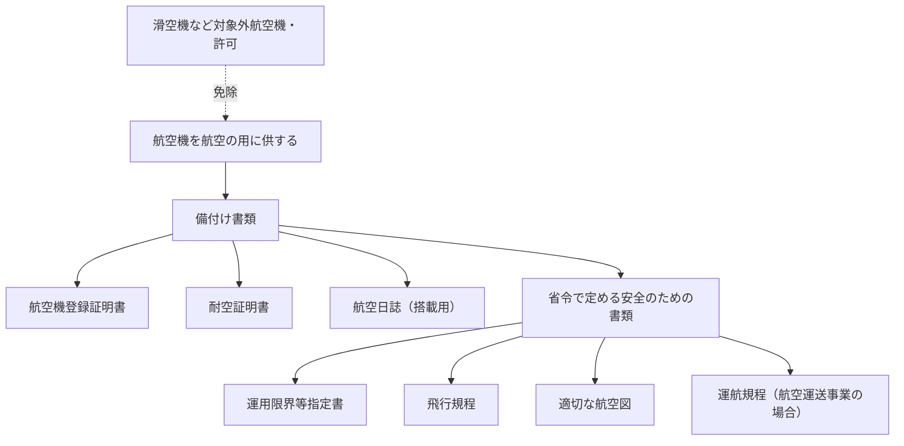

</details>


### 航空機の航行の安全を確保するための装置
#### 第六十条

<details>
<summary>原文</summary>

国土交通省令で定める航空機には、国土交通省令で定めるところにより航空機の姿勢、高度、位置又は針路を測定するための装置、無線電話その他の航空機の航行の安全を確保するために必要な装置を装備しなければ、これを航空の用に供してはならない。ただし、国土交通大臣の許可を受けた場合は、この限りでない。


##### 規
</details>

<details>
<summary>図（未精査）</summary>

航行の安全を確保する装置の装備義務

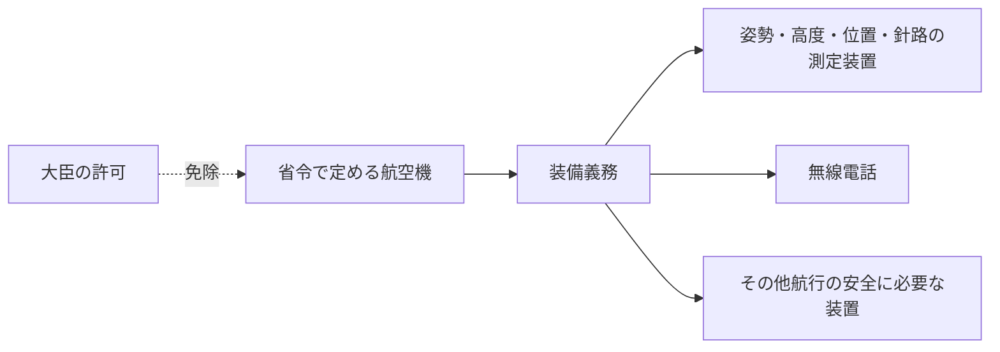

</details>


### 航空機の運航の状況を記録するための装置
#### 第六十一条

<details>
<summary>原文</summary>

国土交通省令で定める航空機には、国土交通省令で定めるところにより、飛行記録装置その他の航空機の運航の状況を記録するための装置を装備し、及び作動させなければ、これを航空の用に供してはならない。ただし、国土交通大臣の許可を受けた場合は、この限りでない。
２　前項の航空機の使用者は、国土交通省令で定めるところにより同項の装置による記録を保存しなければならない。


##### 規
</details>

<details>
<summary>図（未精査）</summary>

運航状況を記録する装置の装備・作動・保存

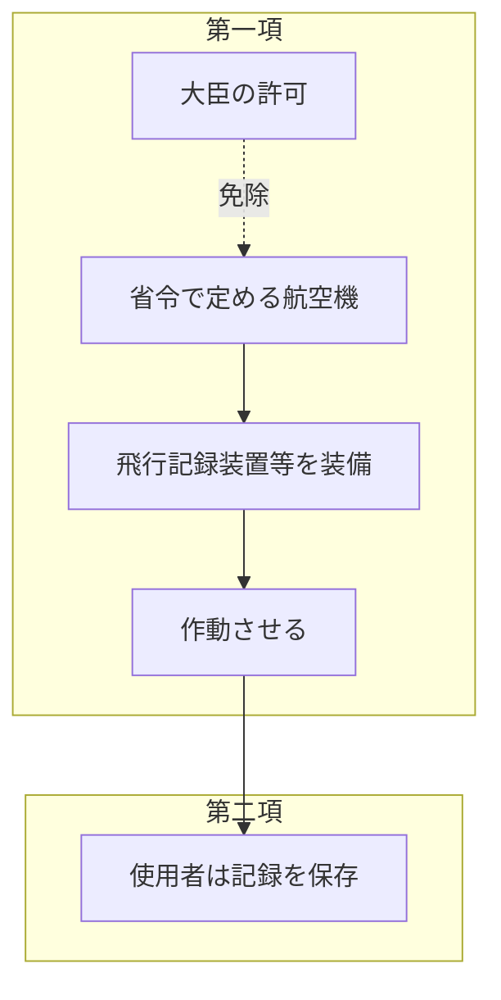

</details>


### 救急用具
#### ==第六十二条==

<details>
<summary>原文</summary>


国土交通省令で定める航空機には、落下さん、救命胴衣、非常信号灯その他の国土交通省令で定める救急用具を装備しなければ、これを航空の用に供してはならない。


##### 施行規則第150条
航空機（搭乗者がいないものを除く。）は、次の表の第一欄に掲げる区分に応じ、それぞれ同表の第二欄に掲げる品目の救急用具を、同表の第三欄に掲げる数量、同表の第四欄に掲げる条件に従つて装備しなければこれを航空の用に供してはならない。
<table class="Table" style="margin-left: 1em;">
<tbody><tr class="TableRow">
<td style="border-top: black solid 1px; border-bottom: black solid 1px; border-left: black solid 1px; border-right: black solid 1px;" class="col-pad" colspan="2"><div><span>区分</span></div></td>
<td style="border-top: black solid 1px; border-bottom: black solid 1px; border-left: black solid 1px; border-right: black solid 1px;" class="col-pad"><div><span>品目</span></div></td>
<td style="border-top: black solid 1px; border-bottom: black solid 1px; border-left: black solid 1px; border-right: black solid 1px;" class="col-pad"><div><span>数量</span></div></td>
<td style="border-top: black solid 1px; border-bottom: black solid 1px; border-left: black solid 1px; border-right: black solid 1px;" class="col-pad"><div><span>条件</span></div></td>
</tr>
<tr class="TableRow">
<td style="border-top: black solid 1px; border-bottom: black solid 1px; border-left: black solid 1px; border-right: black solid 1px;" class="col-pad" rowspan="7"><div><span>一</span></div></td>
<td style="border-top: black solid 1px; border-bottom: black solid 1px; border-left: black solid 1px; border-right: black solid 1px;" class="col-pad" rowspan="7"><div>
<span>イ　多発の飛行機（航空運送事業の用に供するものに限る。）であつて次のいずれかに該当するものが、緊急着陸に適した陸岸から巡航速度で二時間に相当する飛行距離又は七百四十キロメートルのいずれか短い距離以上離れた水上を飛行する場合</span><br><span>（一）　臨界発動機が不作動の場合にも運航規程に定める最低安全飛行高度を維持して飛行し目的の空港等又は代替空港等に着陸できるもの</span><br><span>（二）　二発動機が不作動の場合にも緊急着陸に適した空港等に着陸できるもの</span><br><span>ロ　多発の飛行機（航空運送事業の用に供するものを除く。）であつて一発動機が不作動の場合にも緊急着陸に適した空港等に着陸できるものが、緊急着陸に適した陸岸から三百七十キロメートル以上離れた水上を飛行する場合</span><br><span>ハ　多発の回転翼航空機が緊急着陸に適した陸岸から巡航速度で十分に相当する飛行距離以上離れた水上を飛行する場合</span><br><span>ニ　単発の回転翼航空機がオートロテイションにより陸岸に緊急着陸することが可能な地点を越えて水上を飛行する場合</span><br><span>ホ　イからニまでに掲げる航空機以外の航空機が緊急着陸に適した陸岸から巡航速度で三十分に相当する飛行距離又は百八十五キロメートルのいずれか短い距離以上離れた水上を飛行する場合</span>
</div></td>
<td style="border-top: black solid 1px; border-bottom: black none 1px; border-left: black solid 1px; border-right: black solid 1px;" class="col-pad"><div><span>非常信号灯（ハ又はニに掲げる飛行をする回転翼航空機のうち、旅客を運送する航空運送事業の用に供するもの以外のものであつて、緊急着陸に適した陸岸から巡航速度で三十分に相当する飛行距離又は百八十五キロメートルのいずれか短い距離以上離れた水上を飛行しないものを除く。）</span></div></td>
<td style="border-top: black solid 1px; border-bottom: black none 1px; border-left: black solid 1px; border-right: black solid 1px;" class="col-pad"><div><span>一</span></div></td>
<td style="border-top: black solid 1px; border-bottom: black none 1px; border-left: black solid 1px; border-right: black solid 1px;" class="col-pad" rowspan="7"><div>
<span>一　救命胴衣又はこれに相当する救急用具は、各座席から取りやすい場所に置き、その所在及び使用方法を旅客に明らかにしておかなければならない。</span><br><span>二　救命ボートは、搭乗者全員を収容できるものでなければならない。</span><br><span>三　救急箱には、医療品一式を入れておかなければならない。</span><br><span>四　緊急用フロートは、安全に着水できるものでなければならない。</span>
</div></td>
</tr>
<tr class="TableRow">
<td style="border-top: black none 1px; border-bottom: black none 1px; border-left: black solid 1px; border-right: black solid 1px;" class="col-pad"><div><span>防水携帯灯</span></div></td>
<td style="border-top: black none 1px; border-bottom: black none 1px; border-left: black solid 1px; border-right: black solid 1px;" class="col-pad"><div><span>一</span></div></td>
</tr>
<tr class="TableRow">
<td style="border-top: black none 1px; border-bottom: black none 1px; border-left: black solid 1px; border-right: black solid 1px;" class="col-pad"><div><span>救命胴衣又はこれに相当する救急用具</span></div></td>
<td style="border-top: black none 1px; border-bottom: black none 1px; border-left: black solid 1px; border-right: black solid 1px;" class="col-pad"><div><span>搭乗者全員の数</span></div></td>
</tr>
<tr class="TableRow">
<td style="border-top: black none 1px; border-bottom: black none 1px; border-left: black solid 1px; border-right: black solid 1px;" class="col-pad"><div><span>救命ボート（ハ又はニに掲げる飛行をする回転翼航空機のうち、旅客を運送する航空運送事業の用に供するもの以外のものであつて、緊急着陸に適した陸岸から巡航速度で三十分に相当する飛行距離又は百八十五キロメートルのいずれか短い距離以上離れた水上を飛行しないものを除く。）</span></div></td>
<td style="border-top: black none 1px; border-bottom: black none 1px; border-left: black solid 1px; border-right: black solid 1px;" class="col-pad"><div><span>　</span></div></td>
</tr>
<tr class="TableRow">
<td style="border-top: black none 1px; border-bottom: black none 1px; border-left: black solid 1px; border-right: black solid 1px;" class="col-pad"><div><span>救急箱</span></div></td>
<td style="border-top: black none 1px; border-bottom: black none 1px; border-left: black solid 1px; border-right: black solid 1px;" class="col-pad"><div><span>一（旅客を運送する航空運送事業の用に供する飛行機、最大離陸重量が五千七百キログラムを超える飛行機又はターボジェット発動機を装備する飛行機であつて、百を超える客席数を有するものにあつては、その超える数が百までを増すごとに一を加えた数（その数が六を超える場合には、六）。）</span></div></td>
</tr>
<tr class="TableRow">
<td style="border-top: black none 1px; border-bottom: black none 1px; border-left: black solid 1px; border-right: black solid 1px;" class="col-pad"><div><span>非常食糧</span></div></td>
<td style="border-top: black none 1px; border-bottom: black none 1px; border-left: black solid 1px; border-right: black solid 1px;" class="col-pad"><div><span>搭乗者全員の三食分</span></div></td>
</tr>
<tr class="TableRow">
<td style="border-top: black none 1px; border-bottom: black solid 1px; border-left: black solid 1px; border-right: black solid 1px;" class="col-pad"><div><span>緊急用フロート（ハ又はニに掲げる飛行をする回転翼航空機のうち、旅客を運送する航空運送事業の用に供するもの及び緊急着陸に適した陸岸から巡航速度で三十分に相当する飛行距離又は百八十五キロメートルのいずれか短い距離以上離れた水上を飛行するもの（いずれも緊急用フロートを用いることなく安全に着水できる機能を有するものを除く。）に限る。）</span></div></td>
<td style="border-top: black none 1px; border-bottom: black solid 1px; border-left: black solid 1px; border-right: black solid 1px;" class="col-pad"><div><span>　</span></div></td>
</tr>
<tr class="TableRow">
<td style="border-top: black solid 1px; border-bottom: black solid 1px; border-left: black solid 1px; border-right: black solid 1px;" class="col-pad" rowspan="4"><div><span>二</span></div></td>
<td style="border-top: black solid 1px; border-bottom: black solid 1px; border-left: black solid 1px; border-right: black solid 1px;" class="col-pad" rowspan="4"><div>
<span>イ　多発の飛行機（航空運送事業の用に供するものに限る。）であつて次のいずれかに該当するものが、緊急着陸に適した陸岸から九十三キロメートル以上離れた水上を飛行する場合</span><br><span>（一）　臨界発動機が不作動の場合にも運航規程に定める最低安全飛行高度を維持して飛行し目的の空港等又は代替空港等に着陸できるもの</span><br><span>（二）　二発動機が不作動の場合にも緊急着陸に適した空港等に着陸できるもの</span><br><span>ロ　多発の航空機（回転翼航空機及び航空運送事業の用に供する飛行機を除く。）が、緊急着陸に適した陸岸から九十三キロメートル以上離れた水上を飛行する場合</span><br><span>ハ　イに掲げる飛行機以外の多発の飛行機（航空運送事業の用に供するものに限る。）及び単発の航空機（回転翼航空機を除く。）が、滑空により陸岸に緊急着陸することが可能な地点を越えて水上を飛行する場合</span><br><span>ニ　電気を動力源とする垂直離着陸飛行機（滑走をせずに離陸し、又は着陸することができる飛行機をいう。以下同じ。）又はマルチローターが、水上を三分以上飛行する場合</span><br><span>ホ　離陸又は着陸の経路が水上に及ぶ場合</span>
</div></td>
<td style="border-top: black solid 1px; border-bottom: black none 1px; border-left: black solid 1px; border-right: black solid 1px;" class="col-pad"><div><span>非常信号灯（<a href="/law/327M50000800056#Mp-At_150-Pr_5">第五項</a>の規定により航空機用救命無線機を装備する航空機を除く。）</span></div></td>
<td style="border-top: black solid 1px; border-bottom: black none 1px; border-left: black solid 1px; border-right: black solid 1px;" class="col-pad"><div><span>一</span></div></td>
<td style="border-top: black none 1px; border-bottom: black solid 1px; border-left: black solid 1px; border-right: black solid 1px;" class="col-pad" rowspan="8"><div><span>　</span></div></td>
</tr>
<tr class="TableRow">
<td style="border-top: black none 1px; border-bottom: black none 1px; border-left: black solid 1px; border-right: black solid 1px;" class="col-pad"><div><span>防水携帯灯</span></div></td>
<td style="border-top: black none 1px; border-bottom: black none 1px; border-left: black solid 1px; border-right: black solid 1px;" class="col-pad"><div><span>一</span></div></td>
</tr>
<tr class="TableRow">
<td style="border-top: black none 1px; border-bottom: black none 1px; border-left: black solid 1px; border-right: black solid 1px;" class="col-pad"><div><span>救命胴衣又はこれに相当する救急用具</span></div></td>
<td style="border-top: black none 1px; border-bottom: black none 1px; border-left: black solid 1px; border-right: black solid 1px;" class="col-pad"><div><span>搭乗者全員の数</span></div></td>
</tr>
<tr class="TableRow">
<td style="border-top: black none 1px; border-bottom: black solid 1px; border-left: black solid 1px; border-right: black solid 1px;" class="col-pad"><div><span>救急箱</span></div></td>
<td style="border-top: black none 1px; border-bottom: black solid 1px; border-left: black solid 1px; border-right: black solid 1px;" class="col-pad"><div><span>一（旅客を運送する航空運送事業の用に供する飛行機、最大離陸重量が五千七百キログラムを超える飛行機又はターボジェット発動機を装備する飛行機であつて、百を超える客席数を有するものにあつては、その超える数が百までを増すごとに一を加えた数（その数が六を超える場合には、六）。）</span></div></td>
</tr>
<tr class="TableRow">
<td style="border-top: black solid 1px; border-bottom: black solid 1px; border-left: black solid 1px; border-right: black solid 1px;" class="col-pad" rowspan="4"><div><span>三</span></div></td>
<td style="border-top: black solid 1px; border-bottom: black solid 1px; border-left: black solid 1px; border-right: black solid 1px;" class="col-pad" rowspan="4"><div><span>一及び二に掲げる飛行以外の飛行をする場合（搭乗者の安全を確保するために必要なものとして国土交通大臣が定める基準に従つて飛行する場合を除く。）</span></div></td>
<td style="border-top: black solid 1px; border-bottom: black none 1px; border-left: black solid 1px; border-right: black solid 1px;" class="col-pad"><div><span>非常信号灯（<a href="/law/327M50000800056#Mp-At_150-Pr_5">第五項</a>の規定により航空機用救命無線機を装備する航空機を除く。）</span></div></td>
<td style="border-top: black solid 1px; border-bottom: black none 1px; border-left: black solid 1px; border-right: black solid 1px;" class="col-pad"><div><span>一</span></div></td>
</tr>
<tr class="TableRow">
<td style="border-top: black none 1px; border-bottom: black none 1px; border-left: black solid 1px; border-right: black solid 1px;" class="col-pad"><div><span>携帯灯</span></div></td>
<td style="border-top: black none 1px; border-bottom: black none 1px; border-left: black solid 1px; border-right: black solid 1px;" class="col-pad"><div><span>一</span></div></td>
</tr>
<tr class="TableRow">
<td style="border-top: black none 1px; border-bottom: black none 1px; border-left: black solid 1px; border-right: black solid 1px;" class="col-pad"><div><span>救命胴衣又はこれに相当する救急用具（水上機に限る。）</span></div></td>
<td style="border-top: black none 1px; border-bottom: black none 1px; border-left: black solid 1px; border-right: black solid 1px;" class="col-pad"><div><span>搭乗者全員の数</span></div></td>
</tr>
<tr class="TableRow">
<td style="border-top: black none 1px; border-bottom: black solid 1px; border-left: black solid 1px; border-right: black solid 1px;" class="col-pad"><div><span>救急箱</span></div></td>
<td style="border-top: black none 1px; border-bottom: black solid 1px; border-left: black solid 1px; border-right: black solid 1px;" class="col-pad"><div><span>一（旅客を運送する航空運送事業の用に供する飛行機、最大離陸重量が五千七百キログラムを超える飛行機又はターボジェット発動機を装備する飛行機であつて、百を超える客席数を有するものにあつては、その超える数が百までを増すごとに一を加えた数（その数が六を超える場合には、六）。）</span></div></td>
</tr>
</tbody></table>

２　旅客を運送する航空運送事業の用に供する航空機（法第四条第一項各号に掲げる者が経営する航空運送事業の用に供するものを除く。）であつて客席数が六十を超えるものには、救急の用に供する医薬品及び医療用具を装備しなければならない。
３　次に掲げる航空機には、搭乗者全員が使用することのできる数の落下傘を装備しなければならない。
一　法第十一条第一項ただし書（同条第三項、法第十七条第三項及び法第十九条第三項において準用する場合を含む。）の許可を受けて飛行する航空機であつて国土交通大臣が指定したもの
二　第百九十七条の三に規定する曲技飛行を行う航空機
４　航空運送事業の用に供する最大離陸重量が二万七千キログラムを超える飛行機（搭乗者がいないものを除く。）であつて、最初の耐空証明等が令和六年一月一日以後になされたものは、国際民間航空条約の附属書六第一部第四十八改訂版に規定する飛行機が遭難するおそれがある場合に自機の位置情報を毎分一回以上自動的に送信する機能を有する装置（次項において「遭難追跡装置」という。）又はこれと同等以上の機能を有し、かつ、衝撃により自動的に作動する航空機用救命無線機を装備しなければならない。
５　航空機（搭乗者がいないもの又は目視により当該航空機の位置を特定できるものとして国土交通大臣が定める基準に従つて飛行するものを除く。）は、次の表の上欄に掲げる区分に応じ、それぞれ同表の中欄に掲げる数量の航空機用救命無線機を同表の下欄に掲げる条件に従つて装備しなければならない。
<table class="Table" style="margin-left: 1em;">
<tbody><tr class="TableRow">
<td style="border-top: black solid 1px; border-bottom: black solid 1px; border-left: black solid 1px; border-right: black solid 1px;" class="col-pad" colspan="4"><div><span>区分</span></div></td>
<td style="border-top: black solid 1px; border-bottom: black solid 1px; border-left: black solid 1px; border-right: black solid 1px;" class="col-pad"><div><span>数量</span></div></td>
<td style="border-top: black solid 1px; border-bottom: black solid 1px; border-left: black solid 1px; border-right: black solid 1px;" class="col-pad"><div><span>条件</span></div></td>
</tr>
<tr class="TableRow">
<td style="border-top: black solid 1px; border-bottom: black none 1px; border-left: black solid 1px; border-right: black solid 1px;" class="col-pad"><div><span>一</span></div></td>
<td style="border-top: black solid 1px; border-bottom: black none 1px; border-left: black solid 1px; border-right: black solid 1px;" class="col-pad"><div><span>イ　航空運送事業の用に供する飛行機</span></div></td>
<td style="border-top: black solid 1px; border-bottom: black none 1px; border-left: black solid 1px; border-right: black solid 1px;" class="col-pad"><div><span>客席数が十九を超えるもの</span></div></td>
<td style="border-top: black solid 1px; border-bottom: black solid 1px; border-left: black solid 1px; border-right: black solid 1px;" class="col-pad"><div><span>最初の耐空証明等が平成二十年六月三十日以前になされたもの（衝撃により自動的に作動する航空機用救命無線機を装備するものに限る。）及び最初の耐空証明等が平成二十年七月一日以後になされたもの（遭難追跡装置を装備するものに限る。）</span></div></td>
<td style="border-top: black solid 1px; border-bottom: black solid 1px; border-left: black solid 1px; border-right: black solid 1px;" class="col-pad"><div><span>一</span></div></td>
<td style="border-top: black solid 1px; border-bottom: black solid 1px; border-left: black solid 1px; border-right: black solid 1px;" class="col-pad" rowspan="8"><div>
<span>一　航空機用救命無線機は、百二十一・五メガヘルツの周波数の電波及び四百六メガヘルツの周波数の電波を同時に送ることができるものでなければならない。</span><br><span>二　飛行機（最初の耐空証明等が平成二十年七月一日以後になされたものに限る。）及び回転翼航空機に装備する航空機用救命無線機の一は、衝撃により自動的に作動するものでなければならない。</span><br><span>三　二の項イ又はロに掲げる飛行をする回転翼航空機に装備する航空機用救命無線機（<a href="/law/327M50000800056#Mp-At_149_2-Pr_1-It_2">前号</a>に掲げるものを除く。）の一は、手動によりこれを作動させることができるものであり、かつ、救命胴衣若しくはこれに相当する救急用具又は救命ボートに装備しなければならない。</span>
</div></td>
</tr>
<tr class="TableRow">
<td style="border-top: black none 1px; border-bottom: black none 1px; border-left: black solid 1px; border-right: black solid 1px;" class="col-pad"><div><span>　</span></div></td>
<td style="border-top: black none 1px; border-bottom: black none 1px; border-left: black solid 1px; border-right: black solid 1px;" class="col-pad"><div><span>　</span></div></td>
<td style="border-top: black none 1px; border-bottom: black solid 1px; border-left: black solid 1px; border-right: black solid 1px;" class="col-pad"><div><span>　</span></div></td>
<td style="border-top: black solid 1px; border-bottom: black solid 1px; border-left: black solid 1px; border-right: black solid 1px;" class="col-pad"><div><span>最初の耐空証明等が平成二十年六月三十日以前になされたもの（衝撃により自動的に作動する航空機用救命無線機を装備するものを除く。）及び最初の耐空証明等が平成二十年七月一日以後になされたもの（遭難追跡装置を装備するものを除く。）</span></div></td>
<td style="border-top: black solid 1px; border-bottom: black solid 1px; border-left: black solid 1px; border-right: black solid 1px;" class="col-pad"><div><span>二</span></div></td>
</tr>
<tr class="TableRow">
<td style="border-top: black none 1px; border-bottom: black none 1px; border-left: black solid 1px; border-right: black solid 1px;" class="col-pad"><div><span>　</span></div></td>
<td style="border-top: black none 1px; border-bottom: black solid 1px; border-left: black solid 1px; border-right: black solid 1px;" class="col-pad"><div><span>　</span></div></td>
<td style="border-top: black solid 1px; border-bottom: black solid 1px; border-left: black solid 1px; border-right: black solid 1px;" class="col-pad" colspan="2"><div><span>客席数が十九を超えないもの</span></div></td>
<td style="border-top: black solid 1px; border-bottom: black solid 1px; border-left: black solid 1px; border-right: black solid 1px;" class="col-pad"><div><span>一</span></div></td>
</tr>
<tr class="TableRow">
<td style="border-top: black none 1px; border-bottom: black solid 1px; border-left: black solid 1px; border-right: black solid 1px;" class="col-pad"><div><span>　</span></div></td>
<td style="border-top: black solid 1px; border-bottom: black solid 1px; border-left: black solid 1px; border-right: black solid 1px;" class="col-pad" colspan="3"><div><span>ロ　イに掲げる飛行機以外の飛行機</span></div></td>
<td style="border-top: black solid 1px; border-bottom: black solid 1px; border-left: black solid 1px; border-right: black solid 1px;" class="col-pad"><div><span>一</span></div></td>
</tr>
<tr class="TableRow">
<td style="border-top: black solid 1px; border-bottom: black none 1px; border-left: black solid 1px; border-right: black solid 1px;" class="col-pad"><div><span>二</span></div></td>
<td style="border-top: black solid 1px; border-bottom: black solid 1px; border-left: black solid 1px; border-right: black solid 1px;" class="col-pad" colspan="3"><div><span>イ　多発の回転翼航空機が緊急着陸に適した陸岸から巡航速度で十分に相当する飛行距離以上離れた水上を飛行する場合</span></div></td>
<td style="border-top: black solid 1px; border-bottom: black solid 1px; border-left: black solid 1px; border-right: black solid 1px;" class="col-pad"><div><span>二</span></div></td>
</tr>
<tr class="TableRow">
<td style="border-top: black none 1px; border-bottom: black none 1px; border-left: black solid 1px; border-right: black solid 1px;" class="col-pad"><div><span>　</span></div></td>
<td style="border-top: black solid 1px; border-bottom: black solid 1px; border-left: black solid 1px; border-right: black solid 1px;" class="col-pad" colspan="3"><div><span>ロ　単発の回転翼航空機がオートロテイションにより陸岸に緊急着陸することが可能な地点を越えて水上を飛行する場合</span></div></td>
<td style="border-top: black solid 1px; border-bottom: black solid 1px; border-left: black solid 1px; border-right: black solid 1px;" class="col-pad"><div><span>二</span></div></td>
</tr>
<tr class="TableRow">
<td style="border-top: black none 1px; border-bottom: black solid 1px; border-left: black solid 1px; border-right: black solid 1px;" class="col-pad"><div><span>　</span></div></td>
<td style="border-top: black solid 1px; border-bottom: black solid 1px; border-left: black solid 1px; border-right: black solid 1px;" class="col-pad" colspan="3"><div><span>ハ　回転翼航空機がイ又はロに掲げる飛行以外の飛行をする場合</span></div></td>
<td style="border-top: black solid 1px; border-bottom: black solid 1px; border-left: black solid 1px; border-right: black solid 1px;" class="col-pad"><div><span>一</span></div></td>
</tr>
<tr class="TableRow">
<td style="border-top: black solid 1px; border-bottom: black solid 1px; border-left: black solid 1px; border-right: black solid 1px;" class="col-pad"><div><span>三</span></div></td>
<td style="border-top: black solid 1px; border-bottom: black solid 1px; border-left: black solid 1px; border-right: black solid 1px;" class="col-pad" colspan="3"><div><span>一及び二に掲げる航空機以外の航空機が緊急着陸に適した陸岸から巡航速度で三十分に相当する飛行距離又は百八十五キロメートルのいずれか短い距離以上離れた水上を飛行する場合</span></div></td>
<td style="border-top: black solid 1px; border-bottom: black solid 1px; border-left: black solid 1px; border-right: black solid 1px;" class="col-pad"><div><span>一</span></div></td>
</tr>
</tbody></table>

６　航空運送事業の用に供する航空機（客室乗務員を乗り組ませて事業を行うものに限る。）には、感染症の予防に必要な用具を装備しなければならない。

##### 施行規則第151条
前条各項の規定により航空機に装備しなければならない救急用具は、点検の内容、方法その他の事項に関し国土交通大臣が定める技術的基準により点検しなければならない。

##### 施行規則第152条
削除

</details>

<details>
<summary>図（未精査）</summary>

救急用具の装備義務の全体構造

| 項 | 装備義務の対象 |
|---|---|
| 第一項・別表 | 救急用具 |
| 第二項 | 医薬品・医療用具 |
| 第三項 | 落下傘 |
| 第四項 | 遭難追跡装置等 |
| 第五項 | 航空機用救命無線機 |
| 第六項 | 感染症予防用具 |

</details>

<details>
<summary>図（未精査）</summary>

第一項 水上飛行の区分

| 区分 | 内容 |
|---|---|
| 区分一 | 陸岸から長距離（2時間/740km等）の水上飛行 |
| 区分二 | 陸岸から93km以上・滑空緊急着陸不能・離着陸経路が水上等 |
| 区分三 | 一・二以外の飛行 |

</details>

<details>
<summary>図（未精査）</summary>

第一項 区分別の救急用具品目

| 区分 | 装備品目 |
|------|----------|
| 一（遠距離水上） | 非常信号灯／防水携帯灯／救命胴衣（全員分）／救命ボート／救急箱／非常食糧（全員3食分）／緊急用フロート |
| 二（93km以上等） | 非常信号灯／防水携帯灯／救命胴衣（全員分）／救急箱 |
| 三（その他） | 非常信号灯／携帯灯／救命胴衣（水上機・全員分）／救急箱 |

</details>

<details>
<summary>図（未精査）</summary>

第二〜六項 区分別の追加装備義務

| 項 | 対象航空機 | 装備義務 |
|----|-----------|----------|
| 二 | 旅客運送航空運送事業・客席数60超 | 救急用医薬品・医療用具 |
| 三 | 大臣指定の許可飛行機・曲技飛行機 | 搭乗者全員分の落下傘 |
| 四 | 航空運送事業・最大離陸重量27,000kg超 | 遭難追跡装置または救命無線機 |
| 五 | 航空機（一部除く） | 航空機用救命無線機（区分別数量） |
| 六 | 航空運送事業・客室乗務員乗組 | 感染症予防用具 |

</details>

<details>
<summary>図（未精査）</summary>

第五項 航空機用救命無線機の数量区分

| 区分 | 対象 | 数量 |
|------|------|------|
| 一イ | 航空運送事業の飛行機・客席19超 | 1または2 |
| 一ロ | イ以外の飛行機 | 1 |
| 二イ・ロ | 多発・単発回転翼が水上飛行 | 2 |
| 二ハ | 回転翼のその他飛行 | 1 |
| 三 | 一・二以外で陸岸から30分/185km以上の水上飛行 | 1 |

</details>


### 航空機の燃料
#### 第六十三条

<details>
<summary>原文</summary>

航空機は、航空運送事業の用に供する場合又は計器飛行方式により飛行しようとする場合においては、国土交通省令で定める量の燃料を携行しなければ、これを出発させてはならない。


##### 規
</details>

<details>
<summary>図（未精査）</summary>

燃料携行義務の成立条件

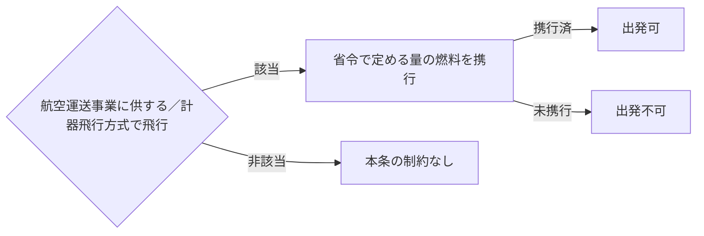

</details>


### 航空機の灯火
#### ==第六十四条==

<details>
<summary>原文</summary>

航空機は、夜間（日没から日出までの間をいう。以下同じ。）において航行し、又は夜間において使用される飛行場に停留する場合には、国土交通省令で定めるところによりこれを灯火で表示しなければならない。但し、水上にある場合については、海上衝突予防法（昭和五十二年法律第六十二号）の定めるところによる。


##### 施行規則第154条
法第六十四条の規定により、航空機が、夜間において空中及び地上を航行する場合には、衝突防止灯、右舷灯、左舷灯及び尾灯で当該航空機を表示しなければならない。ただし、航空機が牽けん引されて地上を航行する場合において牽けん引車に備え付けられた灯火で当該航空機を表示するとき又は自機若しくは他の航空機の航行に悪影響を及ぼすおそれがある場合において右舷灯、左舷灯及び尾灯で当該航空機を表示するときは、この限りでない。
##### 施行規則第157条
法第六十四条の規定により、航空機が、夜間において使用される空港等に停留する場合には、次に掲げる区分に従つて、当該航空機を表示しなければならない。
一　空港等に航空機を照明する施設のあるときは、当該施設
二　前号の施設のないときは、当該航空機の右舷灯、左舷灯及び尾灯
</details>

<details>
<summary>図（未精査）</summary>

灯火による表示義務（夜間）

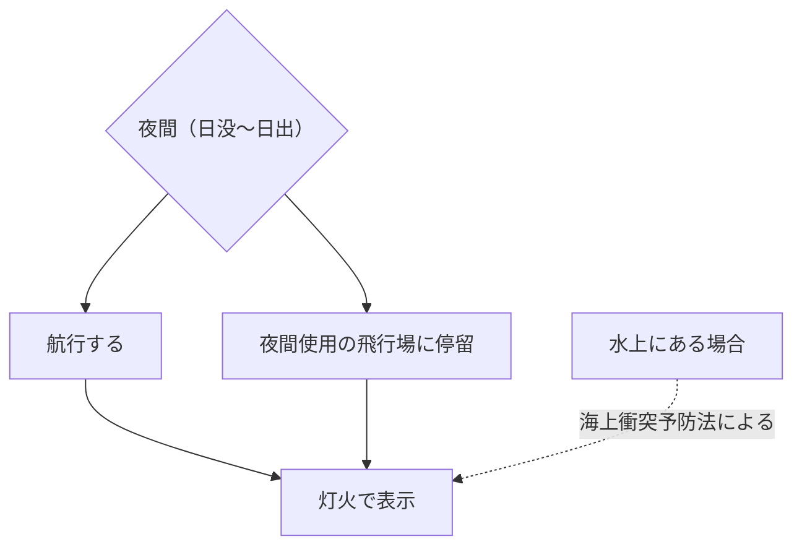

</details>

<details>
<summary>図（未精査）</summary>

場面別の表示する灯火

| 場面 | 表示する灯火 |
|------|-------------|
| 夜間の空中・地上航行 | 衝突防止灯・右舷灯・左舷灯・尾灯 |
| 牽引車の灯火で表示時等 | 右舷灯・左舷灯・尾灯（衝突防止灯省略可）等の例外 |
| 夜間使用空港等に停留（照明施設あり） | 当該照明施設 |
| 同（照明施設なし） | 右舷灯・左舷灯・尾灯 |

</details>


### 航空機に乗り組ませなければならない者
#### 第六十五条

<details>
<summary>原文</summary>

航空機には、第二十八条の規定によりこれを操縦することができる航空従事者を乗り組ませなければならない。
２　次の表の航空機の欄に掲げる航空機には、前項の航空従事者のほか、第二十八条の規定により同表の業務の欄に掲げる行為を行うことができる航空従事者を乗り組ませなければならない。
航空機 業務
次の各号の一に該当する航空機 航空機の操縦
一　構造上、その操縦のために二人を要する航空機
二　特定の方法又は方式により飛行する場合に限りその操縦のために二人を要する航空機であつて当該特定の方法又は方式により飛行するもの
三　旅客の運送の用に供する航空機で計器飛行方式により飛行するもの
四　旅客の運送の用に供する航空機で飛行時間が五時間を超えるもの航空機の操縦
構造上、操縦者（航空機の操縦に従事する者をいう。以下同じ。）だけでは発動機及び機体の完全な取扱いができない航空機
航空機に乗り組んで行うその発動機及び機体の取扱い（操縦装置の操作を除く。）


##### 規
</details>

<details>
<summary>図（未精査）</summary>

乗り組ませなければならない航空従事者（基本＋追加）

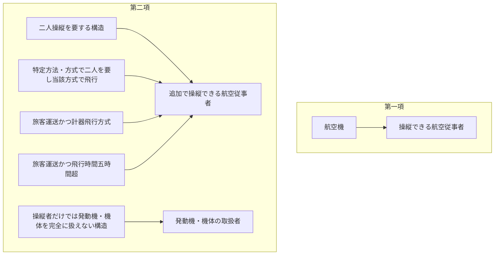

</details>


#### 第六十六条

<details>
<summary>原文</summary>

次の表の航空機の欄に掲げる航空機には、前条の航空従事者のほか、第二十八条の規定により同表の業務の欄に掲げる行為を行うことができる航空従事者を乗り組ませなければならない。
航空機 業務
第六十条の規定により無線設備（受信のみを目的とするものを除く。）を装備して航行する航空機
上欄に掲げる無線設備の操作
無着陸で五百五十キロメートル以上の区間を飛行する航空機（飛行中常時地上物標又は航空保安施設を利用できると認められるもの並びに慣性航法装置その他の国土交通省令で定める航空機の位置及び針路の測定並びに航法上の資料の算出のための装置を装備するものを除く。）
航空機の位置及び針路の測定並びに航法上の資料の算出
２　前項の規定にかかわらず、同項同表の業務の欄に掲げるそれぞれの業務を他の航空従事者の業務を行う者が行うことによりその業務に支障を生ずることとならない場合は、同項に規定する航空従事者を乗り組ませなくてもよい。


##### 規
</details>

<details>
<summary>図（未精査）</summary>

無線・航法のため追加で乗り組ませる航空従事者

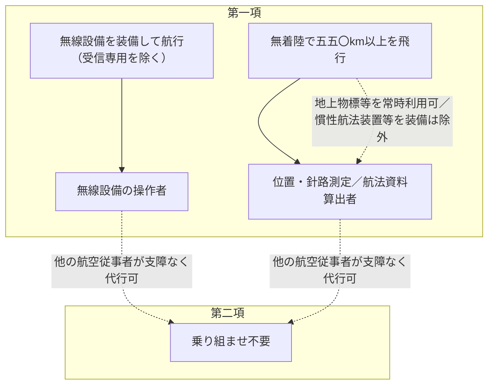

</details>


### 航空従事者の携帯する書類
#### ==第六十七条==

<details>
<summary>原文</summary>

航空従事者は、その航空業務を行う場合には、技能証明書を携帯しなければならない。
２　航空従事者は、航空機に乗り組んでその航空業務を行う場合には、技能証明書の外、航空身体検査証明書を携帯しなければならない。

</details>

<details>
<summary>図（未精査）</summary>

航空従事者が携帯すべき書類

| 場合 | 携帯すべき書類 |
|---|---|
| 航空業務を行う場合 | 技能証明書 |
| 航空機に乗り組んで行う場合 | 技能証明書／航空身体検査証明書 |

</details>


### 乗務割の基準
#### 第六十八条

<details>
<summary>原文</summary>

航空運送事業を経営する者は、国土交通省令で定める基準に従つて作成する乗務割によるのでなければ、航空従事者をその使用する航空機に乗り組ませて航空業務に従事させてはならない。


##### 規
</details>

### 最近の飛行経験
#### 第六十九条

<details>
<summary>原文</summary>

航空機乗組員（航空機に乗り組んで航空業務を行なう者をいう。以下同じ。）は、国土交通省令で定めるところにより、一定の期間内における一定の飛行経験がないときは、航空運送事業の用に供する航空機の運航に従事し、又は計器飛行、夜間の飛行若しくは第三十四条第二項の操縦の教育を行つてはならない。


##### 規
</details>

<details>
<summary>図（未精査）</summary>

最近の飛行経験を欠く場合に従事できない業務

| 従事できない業務 |
|---|
| 航空運送事業用航空機の運航 |
| 計器飛行 |
| 夜間の飛行 |
| 操縦の教育 |

</details>


### 酒精飲料等
#### ==第七十条==

<details>
<summary>原文</summary>

航空機乗組員は、酒精飲料又は麻酔剤その他の薬品の影響により航空機の正常な運航ができないおそれがある間は、その航空業務を行つてはならない。

</details>

<details>
<summary>図（未精査）</summary>

酒精飲料等による航空業務の禁止


</details>


### 身体障害
#### ==第七十一条==

<details>
<summary>原文</summary>

航空機乗組員は、第三十一条第三項の身体検査基準に適合しなくなつたときは、第三十二条の航空身体検査証明の有効期間内であつても、その航空業務を行つてはならない。
</details>

<details>
<summary>図（未精査）</summary>

身体検査基準不適合による航空業務の禁止


</details>


### 操縦者の見張り義務
#### ==第七十一条の二==

<details>
<summary>原文</summary>

航空機の操縦を行なつている者（航空機の操縦の練習をし又は計器飛行等の練習をするためその操縦を行なつている場合で、その練習を監督する者が同乗しているときは、その者）は、航空機の航行中は、第九十六条第一項の規定による国土交通大臣の指示に従つている航行であるとないとにかかわらず、当該航空機外の物件を視認できない気象状態の下にある場合を除き、他の航空機その他の物件と衝突しないように見張りをしなければならない。
</details>

<details>
<summary>図（未精査）</summary>

操縦者の見張り義務とその主体・除外

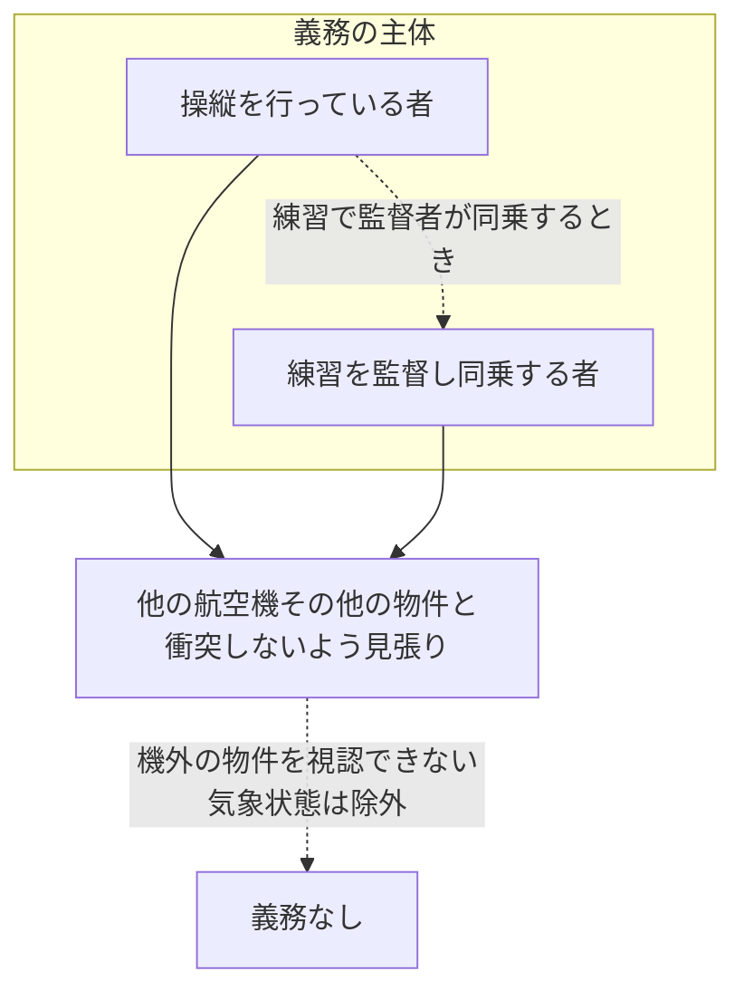

</details>


### 航空運送事業の用に供する航空機に乗り組む機長の要件
#### 第七十二条

<details>
<summary>原文</summary>

航空運送事業の用に供する国土交通省令で定める航空機には、航空機の機長として必要な国土交通省令で定める知識及び能力を有することについて国土交通大臣の認定を受けた者でなければ、機長として乗り組んではならない。
２　国土交通大臣は、前項の認定を受けた者が同項の知識及び能力を有するかどうかを定期に審査をしなければならない。
３　国土交通大臣は、必要があると認めるときは、第一項の認定を受けた者が同項の知識及び能力を有するかどうかを臨時に審査をしなければならない。
４　第一項の認定を受けた者が、第二項の審査を受けなかつたとき、前項の審査を拒否したとき、又は第二項若しくは前項の審査に合格しなかつたときは、当該認定は、その効力を失うものとする。
５　第一項の規定は、国土交通大臣の指定する範囲内の機長で、第百二条第一項の本邦航空運送事業者で国土交通大臣が申請により指定したもの（以下「指定本邦航空運送事業者」という。）の当該事業の用に供する航空機に乗り組むものが、第一項の知識及び能力を有することについて当該指定本邦航空運送事業者による認定を受けたときは、適用しない。
６　指定本邦航空運送事業者は、前項の認定を受けた者及び当該事業の用に供する航空機に乗り組む機長で第一項の認定を受けたものについて、第二項及び第三項の規定に準じて審査をしなければならない。この場合においては、第二項及び第三項の規定は、適用しない。
７　第四項の規定は、前項の審査について準用する。
８　国土交通大臣は、必要があると認めるときは、第六項の規定により指定本邦航空運送事業者が審査をすべき者についても第二項及び第三項の審査をすることができる。
この場合においては、第四項の規定の適用があるものとする。
９ 指定本邦航空運送事業者は、第五項の認定及び第六項の審査を行うときは、国土交通大臣が当該指定本邦航空運送事業者の申請により指名した国土交通省令で定める要件を備える者に実施させなければならない。
１０ 前各項の規定を実施するために必要な細目的事項については、国土交通省令で定める。
１１　国土交通大臣は、指定本邦航空運送事業者が第六項若しくは第九項の規定又は前項の国土交通省令の規定に違反したときは、当該指定本邦航空運送事業者に対し、第五項の認定若しくは第六項の審査の業務の運営の改善に必要な措置をとるべきことを命じ、六月以内において期間を定めて当該認定若しくは審査の業務の全部若しくは一部の停止を命じ、又はその第五項の規定による指定を取り消すことができる。


##### 規
</details>

<details>
<summary>図（未精査）</summary>

機長の認定・審査の枠組み

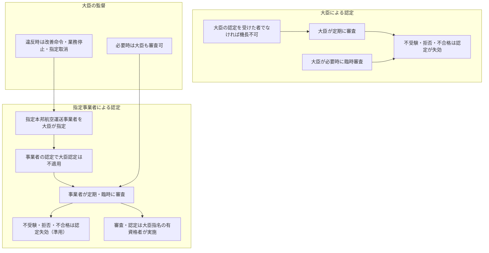

</details>


### 機長の権限
#### 第七十三条

<details>
<summary>原文</summary>

機長（機長に事故があるときは、機長に代わつてその職務を行なうべきものとされている者。以下同じ。）は、当該航空機に乗り組んでその職務を行う者を指揮監督する。


##### 規
</details>

<details>
<summary>図（未精査）</summary>

機長の指揮監督権と機長のみなし

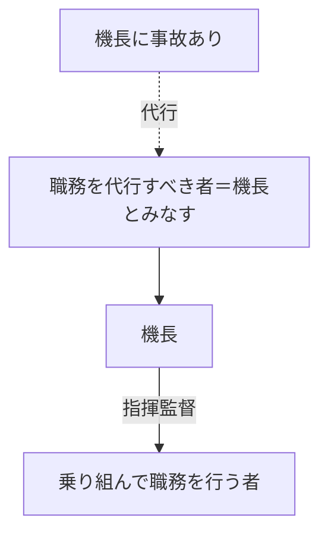

</details>


### 出発前の確認
#### ==第七十三条の二==

<details>
<summary>原文</summary>

機長は、国土交通省令で定めるところにより、航空機が航行に支障がないことその他運航に必要な準備が整つていることを確認した後でなければ、航空機を出発させてはならない。

##### 施行規則第164条の15
法第七十三条の二の規定により機長が確認しなければならない事項は、次に掲げるものとする。
一　当該航空機及びこれに装備すべきものの整備状況
二　離陸重量、着陸重量、重心位置及び重量分布
三　法第九十九条第一項の規定により国土交通大臣が提供する情報（以下「航空情報」という。）
四　当該航行に必要な気象情報
五　燃料及び滑油の搭載量並びにそれらの品質（燃料の品質にあつては、当該航空機がピストン発動機又はタービン発動機を装備している場合に限る。）
六　積載物の安全性
２　機長は、前項第一号に掲げる事項を確認する場合において、航空日誌その他の整備に関する記録の点検、航空機の外部点検及び発動機の地上試運転その他航空機の作動点検を行わなければならない。
</details>

<details>
<summary>図（未精査）</summary>

出発前の確認義務の流れ

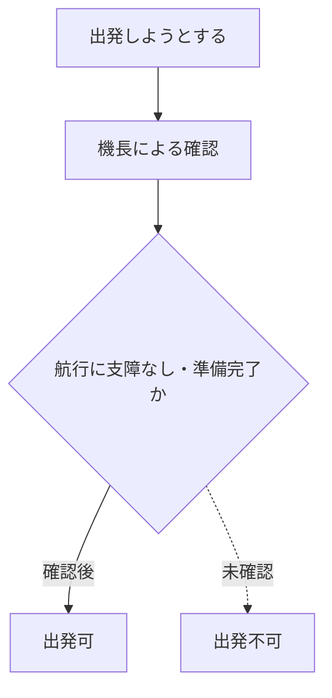

</details>

<details>
<summary>図（未精査）</summary>

機長が確認すべき事項と確認方法

| 確認事項 | 確認方法 |
|---|---|
| 整備状況 | 整備記録の点検／外部点検／地上試運転・作動点検 |
| 離着陸重量・重心位置・重量分布 | ― |
| 航空情報 | ― |
| 気象情報 | ― |
| 燃料・滑油の搭載量と品質 | ― |
| 積載物の安全性 | ― |

</details>


### 安全阻害行為等の禁止等
#### 第七十三条の三

<details>
<summary>原文</summary>

航空機内にある者は、当該航空機の安全を害し、当該航空機内にあるその者以外の者若しくは財産に危害を及ぼし、当該航空機内の秩序を乱し、又は当該航空機内の規律に違反する行為（以下「安全阻害行為等」という。）をしてはならない。


##### 規
</details>

<details>
<summary>図（未精査）</summary>

安全阻害行為等の定義

| 安全阻害行為等 |
|---|
| 航空機の安全を害する |
| 他の者・財産に危害を及ぼす |
| 機内の秩序を乱す |
| 機内の規律に違反する |

</details>


#### 第七十三条の四

<details>
<summary>原文</summary>

機長は、航空機内にある者が、離陸のため当該航空機のすべての乗降口が閉ざされた時から着陸の後降機のためこれらの乗降口のうちいずれかが開かれる時までに、安全阻害行為等をし、又はしようとしていると信ずるに足りる相当な理由があるときは、当該航空機の安全の保持、当該航空機内にあるその者以外の者若しくは財産の保護又は当該航空機内の秩序若しくは規律の維持のために必要な限度で、その者に対し拘束その他安全阻害行為等を抑止するための措置（第五項の規定による命令を除く。）をとり、又はその者を降機させることができる。
２　機長は、前項の規定に基づき拘束している場合において、航空機を着陸させたときは、拘束されている者が拘束されたまま引き続き搭乗することに同意する場合及びその者を降機させないことについてやむを得ない事由がある場合を除き、その者を引き続き拘束したまま当該航空機を離陸させてはならない。
３　航空機内にある者は、機長の要請又は承認に基づき、機長が第一項の措置をとることに対し必要な援助を行うことができる。
４　機長は、航空機を着陸させる場合において、第一項の規定に基づき拘束している者があるとき、又は同項の規定に基づき降機させようとする者があるときは、できる限り着陸前に、拘束又は降機の理由を示してその旨を着陸地の最寄りの航空交通管制機関に連絡しなければならない。
５　機長は、航空機内にある者が、安全阻害行為等のうち、乗降口又は非常口の扉の開閉装置を正当な理由なく操作する行為、便所において喫煙する行為、航空機に乗り組んでその職務を行う者の職務の執行を妨げる行為その他の行為であつて、当該航空機の安全の保持、当該航空機内にあるその者以外の者若しくは財産の保護又は当該航空機内の秩序若しくは規律の維持のために特に禁止すべき行為として国土交通省令で定めるものをしたときは、その者に対し、国土交通省令で定めるところにより、当該行為を反復し、又は継続してはならない旨の命令をすることができる。


##### 規
</details>

<details>
<summary>図（未精査）</summary>

機長の安全阻害行為等への対処権限（各項）

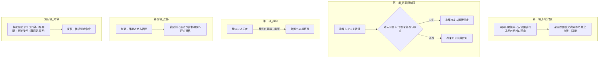

</details>


### 危難の場合の措置
#### ==第七十四条==

<details>
<summary>原文</summary>

機長は、航空機又は旅客の危難が生じた場合又は危難が生ずるおそれがあると認める場合は、航空機内にある旅客に対し、避難の方法その他安全のため必要な事項（機長が前条第一項の措置をとることに対する必要な援助を除く。）について命令をすることができる。
</details>

<details>
<summary>図（未精査）</summary>

危難の場合の機長の命令権

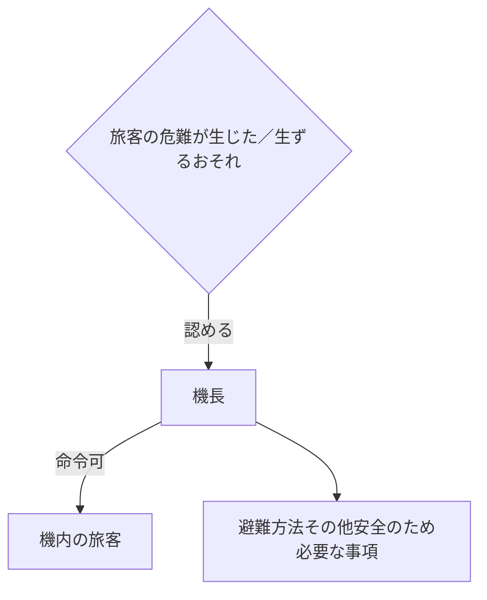

</details>


#### ==第七十五条==

<details>
<summary>原文</summary>

機長は、航空機の航行中、その航空機に急迫した危難が生じた場合には、旅客の救助及び地上又は水上の人又は物件に対する危難の防止に必要な手段を尽くさなければならない。
</details>

<details>
<summary>図（未精査）</summary>

急迫した危難における機長の救助義務

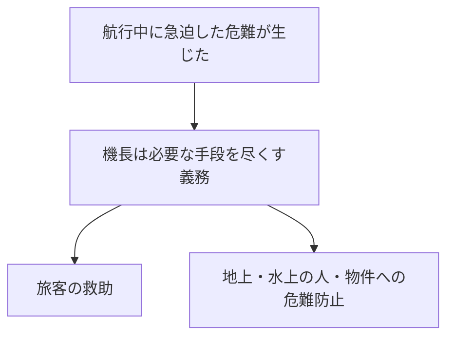

</details>


### 報告の義務
#### ==第七十六条==

<details>
<summary>原文</summary>

機長は、次に掲げる事故が発生した場合には、国土交通省令で定めるところにより国土交通大臣にその旨を報告しなければならない。ただし、機長が報告することができないときは、当該航空機の使用者が報告しなければならない。
一　航空機の墜落、衝突又は火災
二　航空機による人の死傷又は物件の損壊
三　航空機内にある者の死亡（国土交通省令で定めるものを除く。）又は行方不明四　他の航空機との接触五　その他国土交通省令で定める航空機に関する事故２　機長は、他の航空機について前項第一号の事故が発生したことを知つたときは、無線電信又は無線電話により知つたときを除いて、国土交通省令で定めるところにより国土交通大臣にその旨を報告しなければならない。
３　機長は、飛行中航空保安施設の機能の障害その他の航空機の航行の安全に影響を及ぼすおそれがあると認められる国土交通省令で定める事態が発生したことを知つたときは、他からの通報により知つたときを除いて、国土交通省令で定めるところにより国土交通大臣にその旨を報告しなければならない。


##### 施行規則第165条
法第七十六条第一項の規定により、機長又は使用者は、左に掲げる事項を国土交通大臣に報告しなければならない。
一　機長又は当該航空機の使用者の氏名若しくは名称
二　事故の発生した日時及び場所
三　航空機の国籍、登録記号、型式及び航空機の無線局の呼出符号
四　航空機の事故の概要
五　人の死傷又は物件の損壊概要
六　死亡者又は行方不明者のある場合には、その者の氏名その他参考となる事項
##### 施行規則第165条の2
法第七十六条第一項第三号の国土交通省令で定める航空機内にある者の死亡は、次のとおりとする。
一　自然死
二　自己又は他人の加害行為に起因する死亡
三　航空機乗組員、客室乗務員又は旅客が通常立ち入らない区域に隠れていた者の死亡
##### 施行規則第165条の3
法第七十六条第一項第五号の国土交通省令で定める航空機に関する事故は、航行中の航空機が損傷（発動機、発動機覆い、発動機補機、プロペラ、翼端、アンテナ、タイヤ、ブレーキ又はフェアリングのみの損傷を除く。）を受けた事態（当該航空機の修理が第五条の六の表に掲げる作業の区分のうちの大修理に該当しない場合を除く。）とする。
##### 施行規則第166条
法第七十六条第二項の規定により、機長は、左に掲げる事項を国土交通大臣に報告しなければならない。
一　機長の氏名
二　事故の発生したことを知つた日時及び事故の発生した場所
三　事故の概要及びその他参考となる事項
##### 施行規則第166条の2
法第七十六条第三項の規定により機長が報告しなければならない事態は、次のとおりとする。
一　空港等及び航空保安施設の機能の障害
二　気流の擾じよう乱その他の異常な気象状態
三　火山の爆発その他の地象又は水象の激しい変化
四　前各号に掲げるもののほか航空機の航行の安全に障害となる事態
##### 施行規則第166条の3
法第七十六条第三項の規定により、機長は、次に掲げる事項を国土交通大臣に報告しなければならない。
一　機長の氏名及び住所
二　事態の発生したことを知つた日時及び事態の発生した場所
三　事態の概要その他参考となる事項
</details>

<details>
<summary>図（未精査）</summary>

事故等の報告義務（報告者と対象事態）

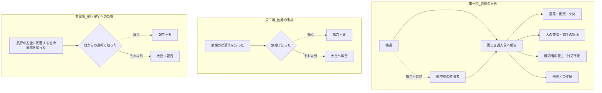

</details>


#### 第七十六条の二

<details>
<summary>原文</summary>

機長は、航行中他の航空機との衝突又は接触のおそれがあつたと認めたときその他前条第一項各号に掲げる事故が発生するおそれがあると認められる国土交通省令で定める事態が発生したと認めたときは、国土交通省令で定めるところにより国土交通大臣にその旨を報告しなければならない。


##### 規
</details>

<details>
<summary>図（未精査）</summary>

事故が発生するおそれがあった場合の報告義務

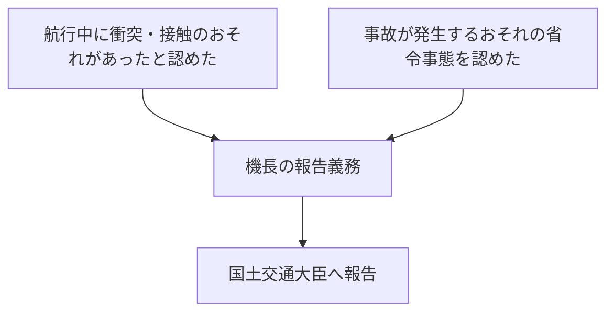

</details>


### 運航管理者
#### 第七十七条

<details>
<summary>原文</summary>

航空運送事業の用に供する国土交通省令で定める航空機は、その機長が、第百二条第一項の本邦航空運送事業者の置く運航管理者の承認を受けなければ、出発し、又はその飛行計画を変更してはならない。


##### 規
</details>

<details>
<summary>図（未精査）</summary>

運航管理者の承認を要する機長の行為

```mermaid
flowchart TD
  A["航空運送事業用の省令航空機の機長"] --> B{"運航管理者の承認"}
  B -->|承認あり| C["出発・飛行計画の変更が可能"]
  B -. 承認なし .-> D["出発・飛行計画変更不可"]
```

</details>


#### 第七十八条

<details>
<summary>原文</summary>

前条の運航管理者は、国土交通大臣の行う運航管理者技能検定に合格した者でなければならない。
２　運航管理者技能検定は、申請者が前条の業務を行うために必要な航空機、航空保安施設、無線通信及び気象に関する知識及び技能を有するかどうかを判定するために行う。
３　運航管理者技能検定は、国土交通省令で定める年齢及び航空機の運航に関する経験を有する者でなければ、受けることができない。
４　第二十七条、第二十九条及び第三十条の規定は、運航管理者技能検定に準用する。
５　運航管理者技能検定の申請手続其の他の実施細目は、国土交通省令で定める。


##### 規
</details>

<details>
<summary>図（未精査）</summary>

運航管理者技能検定の構造

| 区分 | 内容 |
|---|---|
| 運航管理者 | 技能検定に合格した者 |
| 判定対象 | 航空機・保安施設・無線通信・気象の知識技能 |
| 受検資格 | 省令の年齢と運航経験 |
| 準用 | 欠格・試験・取消の規定 |
| 実施細目 | 省令で定める |

</details>


### 離着陸の場所
#### ==第七十九条==

<details>
<summary>原文</summary>

航空機（国土交通省令で定める航空機を除く。）は、陸上にあつては飛行場以外の場所において、水上にあつては国土交通省令で定める場所において、離陸し、又は着陸してはならない。但し、国土交通大臣の許可を受けた場合は、この限りでない。

##### 施行規則第172条
法第七十九条の規定により、国土交通省令で定める航空機は、滑空機をいう。
##### 施行規則第172条の2
法第七十九条ただし書の許可を受けようとする者は、次に掲げる事項を記載した申請書を国土交通大臣に提出しなければならない。
一　氏名及び住所
二　航空機の型式並びに航空機の国籍及び登録記号
三　離陸し、又は着陸する日時及び場所（当該場所の略図を添付すること。）
四　離陸し、又は着陸する理由
五　事故を防止するための措置
六　飛行計画の概要（飛行の目的、日時及び径路を明記すること。）
七　操縦者の氏名及び資格
八　その他参考となる事項
</details>

<details>
<summary>図（未精査）</summary>

離着陸の場所の制限と許可

```mermaid
flowchart TD
  A["航空機（滑空機を除く）"] --> B{"離着陸の場所"}
  B -->|陸上| C["飛行場以外では禁止"]
  B -->|水上| D["省令で定める場所以外では禁止"]
  C -. 大臣の許可 .-> E["離着陸可"]
  D -. 大臣の許可 .-> E
```

</details>


### 飛行の禁止区域
#### ==第八十条==

<details>
<summary>原文</summary>

航空機は、国土交通省令で定める航空機の飛行に関し危険を生ずるおそれがある区域の上空を飛行してはならない。但し、国土交通大臣の許可を受けた場合は、この限りでない。

##### 施行規則第173条
法第八十条の規定により航空機の飛行を禁止する区域は、飛行禁止区域（その上空における航空機の飛行を全面的に禁止する区域）及び飛行制限区域（その上空における航空機の飛行を一定の条件の下に禁止する区域）の別に告示で定める。ただし、緊急に航空機の飛行を禁止する区域を定める必要があるため、告示により当該区域を定めるいとまがないときは、国土交通大臣は、その必要な限度において、告示をしないで、飛行禁止区域又は飛行制限区域を定めることができる。
##### 施行規則第173条の2
法第八十条ただし書の許可を受けようとする者は、次に掲げる事項を記載した申請書を国土交通大臣に提出しなければならない。
一　氏名及び住所
二　航空機の型式並びに航空機の国籍及び登録記号
三　飛行計画の概要（飛行の目的、日時、経路及び高度を明記すること。）
四　飛行禁止区域又は飛行制限区域を飛行する理由
五　操縦者の氏名及び資格
六　同乗者の氏名及び同乗の目的
七　その他参考となる事項
</details>

<details>
<summary>図（未精査）</summary>

飛行禁止区域の区分と許可

```mermaid
flowchart TD
  A["危険を生ずるおそれがある区域の上空"] --> B["飛行禁止"]
  B --> C["飛行禁止区域＝全面的に禁止"]
  B --> D["飛行制限区域＝一定条件下で禁止"]
  B -. 大臣の許可 .-> E["飛行可"]
  F["緊急で告示のいとまがない"] -. 告示なしで指定可 .-> B
```

</details>


### 最低安全高度
#### ==第八十一条==

<details>
<summary>原文</summary>

航空機は、離陸又は着陸を行う場合を除いて、地上又は水上の人又は物件の安全及び航空機の安全を考慮して国土交通省令で定める高度以下の高度で飛行してはならない。但し、国土交通大臣の許可を受けた場合は、この限りでない。

##### 施行規則第174条
法第八十一条の規定による航空機の最低安全高度は、次のとおりとする。
一　有視界飛行方式により飛行する航空機にあつては、飛行中動力装置のみが停止した場合に地上又は水上の人又は物件に危険を及ぼすことなく着陸できる高度及び次の高度のうちいずれか高いもの
イ　人又は家屋の密集している地域の上空にあつては、当該航空機を中心として水平距離六百メートルの範囲内の最も高い障害物の上端から三百メートルの高度
ロ　人又は家屋のない地域及び広い水面の上空にあつては、地上又は水上の人又は物件から百五十メートル以上の距離を保つて飛行することのできる高度
ハ　イ及びロに規定する地域以外の地域の上空にあつては、地表面又は水面から百五十メートル以上の高度
二　計器飛行方式により飛行する航空機にあつては、告示で定める高度
##### 施行規則第175条
法第八十一条但書の許可を受けようとする者は、左に掲げる事項を記載した申請書を国土交通大臣に提出しなければならない。
一　氏名及び住所
二　航空機の型式並びに航空機の国籍及び登録記号
三　飛行計画の概要（飛行の目的、日時、径路及び高度を明記すること。）
四　最低安全高度以下の高度で飛行する理由
五　操縦者の氏名及び資格
六　同乗者の氏名及び同乗の目的
七　その他参考となる事項
</details>

<details>
<summary>図（未精査）</summary>

最低安全高度の規制と例外・許可

```mermaid
flowchart TD
    start["飛行"] --> q{"離陸・着陸か"}
    q -->|該当| free["最低安全高度の適用なし"]
    q -->|それ以外| rule["最低安全高度以下で飛行禁止"]
    rule -. 大臣の許可 .-> permit["許可飛行は可能"]
```

</details>

<details>
<summary>図（未精査）</summary>

有視界飛行方式における最低安全高度の区分

| 地域区分 | 最低安全高度 |
|---|---|
| 共通 | 動力停止時に安全着陸できる高度と、地域別高度のうち高いもの |
| 密集地域 | 水平六百m内の最高障害物上端から三百m |
| 無人地域・広い水面 | 人・物件から百五十m以上 |
| その他の地域 | 地表・水面から百五十m以上 |

</details>

<details>
<summary>図（未精査）</summary>

最低安全高度以下飛行の許可申請記載事項

| 許可申請書の記載事項 |
|---|
| 氏名・住所 |
| 航空機の型式・国籍・登録記号 |
| 飛行計画の概要 |
| 最低安全高度以下で飛行する理由 |
| 操縦者の氏名・資格 |
| 同乗者の氏名・同乗の目的 |
| その他参考事項 |

</details>


### 捜索又は救助のための特例
#### 第八十一条の二

<details>
<summary>原文</summary>

前三条の規定は、国土交通省令で定める航空機が航空機の事故、海難その他の事故に際し捜索又は救助のために行なう航行については、適用しない。


##### 規
</details>

<details>
<summary>図（未精査）</summary>

捜索・救助のための航行への適用除外

```mermaid
flowchart LR
    soukyu["前三条の規制（飛行禁止区域・最低安全高度等）"]
    target["省令で定める航空機が行う捜索・救助の航行"]
    target -. 適用しない .-> soukyu
```

</details>


### 巡航高度
#### ==第八十二条==

<details>
<summary>原文</summary>

航空機は、地表又は水面から九百メートル（計器飛行方式により飛行する場合にあつては、三百メートル）以上の高度で巡航する場合には、国土交通省令で定める高度で飛行しなければならない。
２　航空機は、航空交通管制区内にある航空路の空域（第九十四条の二第一項に規定する特別管制空域を除く。）のうち国土交通大臣が告示で指定する航空交通がふくそうする空域を計器飛行方式によらないで飛行する場合は、高度を変更してはならない。
ただし、左に掲げる場合は、この限りでない。
一　離陸した後引き続き上昇飛行を行なう場合
二　着陸するため降下飛行を行なう場合
三　悪天候を避けるため必要がある場合であつて、当該空域外に出るいとまがないとき、又は航行の安全上当該空域内での飛行を維持する必要があるとき。
四　その他やむを得ない事由がある場合
３　国土交通大臣は、前項の空域（以下「高度変更禁止空域」という。）ごとに、同項の規定による規制が適用される時間を告示で指定することができる。

##### 施行規則第177条
法第八十二条第一項の規定による航空機の巡航高度は、次の表の上欄に掲げる飛行方向において同表の中欄に掲げる航空機が飛行する場合は、同表の下欄に掲げる高度（法第九十六条第一項の規定により高度について指示された場合は、当該指示に係る高度）によるものとする。
<table class="Table" style="margin-left: 1em;">
<tbody><tr class="TableRow">
<td style="border-top: black solid 1px; border-bottom: black solid 1px; border-left: black solid 1px; border-right: black solid 1px;" class="col-pad"><div><span>飛行方向</span></div></td>
<td style="border-top: black solid 1px; border-bottom: black solid 1px; border-left: black solid 1px; border-right: black solid 1px;" class="col-pad" colspan="2"><div><span>航空機</span></div></td>
<td style="border-top: black solid 1px; border-bottom: black solid 1px; border-left: black solid 1px; border-right: black solid 1px;" class="col-pad"><div><span>高度</span></div></td>
</tr>
<tr class="TableRow">
<td style="border-top: black solid 1px; border-bottom: black none 1px; border-left: black solid 1px; border-right: black solid 1px;" class="col-pad"><div><span>磁方位〇度以上一八〇度未満</span></div></td>
<td style="border-top: black solid 1px; border-bottom: black solid 1px; border-left: black solid 1px; border-right: black solid 1px;" class="col-pad" colspan="2"><div><span>有視界飛行方式により飛行する航空機</span></div></td>
<td style="border-top: black solid 1px; border-bottom: black solid 1px; border-left: black solid 1px; border-right: black solid 1px;" class="col-pad"><div><span>二九、〇〇〇フート未満の高度であつて、一、〇〇〇フートの奇数倍に五〇〇フートを加えた高度</span></div></td>
</tr>
<tr class="TableRow">
<td style="border-top: black none 1px; border-bottom: black none 1px; border-left: black solid 1px; border-right: black solid 1px;" class="col-pad"><div><span>　</span></div></td>
<td style="border-top: black solid 1px; border-bottom: black none 1px; border-left: black solid 1px; border-right: black solid 1px;" class="col-pad"><div><span>計器飛行方式により飛行する航空機</span></div></td>
<td style="border-top: black solid 1px; border-bottom: black solid 1px; border-left: black solid 1px; border-right: black solid 1px;" class="col-pad"><div><span><a href="/law/327M50000800056#Mp-At_191_2-Pr_1-It_1">第百九十一条の二第一項第一号</a>に掲げる航行を行うことについて<a href="/law/327AC0000000231#Mp-At_83_2">法第八十三条の二</a>の許可を受けた航空機及び<a href="/law/327M50000800056#Mp-At_191_2-Pr_1-It_1">第百九十一条の二第一項第一号</a>に掲げる航行を行うことについて<a href="/law/327M50000800056#Mp-At_191_2-Pr_2">同条第二項</a>の規定により認められた<a href="/law/327M50000800056#Mp-At_191_2-Pr_2">同項各号</a>に掲げる航空機</span></div></td>
<td style="border-top: black solid 1px; border-bottom: black solid 1px; border-left: black solid 1px; border-right: black solid 1px;" class="col-pad"><div>
<span>四一、〇〇〇フート以下の高度にあつては、一、〇〇〇フートの奇数倍の高度</span><br><span>四一、〇〇〇フートを超える高度にあつては、四五、〇〇〇フートに四、〇〇〇フートの倍数を加えた高度</span>
</div></td>
</tr>
<tr class="TableRow">
<td style="border-top: black none 1px; border-bottom: black solid 1px; border-left: black solid 1px; border-right: black solid 1px;" class="col-pad"><div><span>　</span></div></td>
<td style="border-top: black none 1px; border-bottom: black solid 1px; border-left: black solid 1px; border-right: black solid 1px;" class="col-pad"><div><span>　</span></div></td>
<td style="border-top: black solid 1px; border-bottom: black solid 1px; border-left: black solid 1px; border-right: black solid 1px;" class="col-pad"><div><span>その他の航空機</span></div></td>
<td style="border-top: black solid 1px; border-bottom: black solid 1px; border-left: black solid 1px; border-right: black solid 1px;" class="col-pad"><div>
<span>二九、〇〇〇フート未満の高度にあつては、一、〇〇〇フートの奇数倍の高度</span><br><span>四一、〇〇〇フートを超える高度にあつては、四五、〇〇〇フートに四、〇〇〇フートの倍数を加えた高度</span>
</div></td>
</tr>
<tr class="TableRow">
<td style="border-top: black solid 1px; border-bottom: black none 1px; border-left: black solid 1px; border-right: black solid 1px;" class="col-pad"><div><span>磁方位一八〇度以上三六〇度未満</span></div></td>
<td style="border-top: black solid 1px; border-bottom: black solid 1px; border-left: black solid 1px; border-right: black solid 1px;" class="col-pad" colspan="2"><div><span>有視界飛行方式により飛行する航空機</span></div></td>
<td style="border-top: black solid 1px; border-bottom: black solid 1px; border-left: black solid 1px; border-right: black solid 1px;" class="col-pad"><div><span>二九、〇〇〇フート未満の高度であつて、一、〇〇〇フートの偶数倍に五〇〇フートを加えた高度</span></div></td>
</tr>
<tr class="TableRow">
<td style="border-top: black none 1px; border-bottom: black none 1px; border-left: black solid 1px; border-right: black solid 1px;" class="col-pad"><div><span>　</span></div></td>
<td style="border-top: black solid 1px; border-bottom: black none 1px; border-left: black solid 1px; border-right: black solid 1px;" class="col-pad"><div><span>計器飛行方式により飛行する航空機</span></div></td>
<td style="border-top: black solid 1px; border-bottom: black solid 1px; border-left: black solid 1px; border-right: black solid 1px;" class="col-pad"><div><span><a href="/law/327M50000800056#Mp-At_191_2-Pr_1-It_1">第百九十一条の二第一項第一号</a>に掲げる航行を行うことについて<a href="/law/327AC0000000231#Mp-At_83_2">法第八十三条の二</a>の許可を受けた航空機及び<a href="/law/327M50000800056#Mp-At_191_2-Pr_1-It_1">第百九十一条の二第一項第一号</a>に掲げる航行を行うことについて<a href="/law/327M50000800056#Mp-At_191_2-Pr_2">同条第二項</a>の規定により認められた<a href="/law/327M50000800056#Mp-At_191_2-Pr_2">同項各号</a>に掲げる航空機</span></div></td>
<td style="border-top: black solid 1px; border-bottom: black solid 1px; border-left: black solid 1px; border-right: black solid 1px;" class="col-pad"><div>
<span>四一、〇〇〇フート以下の高度にあつては、一、〇〇〇フートの偶数倍の高度</span><br><span>四一、〇〇〇フートを超える高度にあつては、四三、〇〇〇フートに四、〇〇〇フートの倍数を加えた高度</span>
</div></td>
</tr>
<tr class="TableRow">
<td style="border-top: black none 1px; border-bottom: black solid 1px; border-left: black solid 1px; border-right: black solid 1px;" class="col-pad"><div><span>　</span></div></td>
<td style="border-top: black none 1px; border-bottom: black solid 1px; border-left: black solid 1px; border-right: black solid 1px;" class="col-pad"><div><span>　</span></div></td>
<td style="border-top: black solid 1px; border-bottom: black solid 1px; border-left: black solid 1px; border-right: black solid 1px;" class="col-pad"><div><span>その他の航空機</span></div></td>
<td style="border-top: black solid 1px; border-bottom: black solid 1px; border-left: black solid 1px; border-right: black solid 1px;" class="col-pad"><div>
<span>二九、〇〇〇フート未満の高度にあつては、一、〇〇〇フートの偶数倍の高度</span><br><span>四一、〇〇〇フートを超える高度にあつては、四三、〇〇〇フートに四、〇〇〇フートの倍数を加えた高度</span>
</div></td>
</tr>
</tbody></table>

</details>

<details>
<summary>図（未精査）</summary>

巡航高度規制と高度変更禁止の構造

```mermaid
flowchart TD
    subgraph 第一項_巡航高度
        cruise["地表・水面から九百m（計器は三百m）以上で巡航"] --> std["省令で定める高度で飛行"]
    end
    subgraph 第二項_高度変更禁止
        zone["告示指定の航空交通ふくそう空域を計器飛行によらず飛行"] --> nochange["高度を変更してはならない"]
        nochange -. 除外 .-> ex["上昇／降下／悪天候回避／やむを得ない事由"]
    end
    subgraph 第三項_適用時間
        time["空域ごとに規制適用時間を告示で指定可"]
    end
```

</details>

<details>
<summary>図（未精査）</summary>

巡航高度表（飛行方向・機種別）

| 飛行方向 | 機種 | 高度 |
|---|---|---|
| 磁方位0〜180度未満 | 有視界飛行 | 29,000ft未満で1,000ftの奇数倍＋500ft |
| 磁方位0〜180度未満 | 計器飛行（特定許可機） | 41,000ft以下は1,000ftの奇数倍／超は45,000ft＋4,000ftの倍数 |
| 磁方位0〜180度未満 | その他 | 29,000ft未満は奇数倍／41,000ft超は45,000ft＋4,000ftの倍数 |
| 磁方位180〜360度未満 | 有視界飛行 | 29,000ft未満で1,000ftの偶数倍＋500ft |
| 磁方位180〜360度未満 | 計器飛行（特定許可機） | 41,000ft以下は偶数倍／超は43,000ft＋4,000ftの倍数 |
| 磁方位180〜360度未満 | その他 | 29,000ft未満は偶数倍／41,000ft超は43,000ft＋4,000ftの倍数 |

</details>


### 航空交通管制圏等における速度の制限
#### 第八十二条の二

<details>
<summary>原文</summary>

航空機は、左に掲げる空域においては、国土交通省令で定める速度をこえる速度で飛行してはならない。ただし、国土交通大臣の許可を受けた場合は、この限りでない。
一　航空交通管制圏
二　第九十六条第三項第四号に規定する進入管制区のうち航空交通管制圏に接続する部分の国土交通大臣が告示で指定する空域### 衝突予防等#### 第八十三条航空機は、他の航空機又は船舶との衝突を予防し、並びに飛行場における航空機の離陸及び着陸の安全を確保するため、国土交通省令で定める進路、経路、速度その他の航行の方法に従い、航行しなければならない。但し、水上にある場合については、海上衝突予防法の定めるところによる。


##### 規
</details>

<details>
<summary>図（未精査）</summary>

速度制限空域と許可による例外

```mermaid
flowchart TD
    subgraph 対象空域
        z1["航空交通管制圏"]
        z2["進入管制区のうち管制圏に接続する告示指定空域"]
    end
    z1 --> limit["省令で定める速度を超えて飛行禁止"]
    z2 --> limit
    limit -. 大臣の許可 .-> ok["超過速度での飛行可"]
```

</details>


### 特別な方式による航行
#### ==第八十三条の二==

<details>
<summary>原文</summary>

航空機は、国土交通大臣の許可を受けなければ、他の航空機との垂直方向の間隔を縮小する方式による飛行その他の国土交通省令で定める特別な方式による航行を行つてはならない。


##### 施行規則第180条
飛行の進路が交差し、又は接近する場合における航空機相互間の進路権の順位は、次に掲げる順序とする。
一　滑空機
二　物件を曳えい航している航空機
三　飛行船
四　飛行機、回転翼航空機及び動力で推進している滑空機
##### 施行規則第181条
飛行中の同順位の航空機相互間にあつては、他の航空機を右側に見る航空機が進路を譲らなければならない。
##### 施行規則第182条
正面又はこれに近い角度で接近する飛行中の同順位の航空機相互間にあつては、互に進路を右に変えなければならない。
##### 施行規則第183条
着陸のため最終進入の経路にある航空機及び着陸操作を行つている航空機は、飛行中の航空機、地上又は水上において運航中の航空機に対して進路権を有する。
##### 施行規則第184条
着陸のため空港等に進入している航空機相互間にあつては、低い高度にある航空機が進路権を有する。ただし、最終進入の経路にある航空機の前方に割り込み、又はこれを追い越してはならない。
##### 施行規則第185条
前方に飛行中の航空機を他の航空機が追い越そうとする場合（上昇又は降下による追越を含む。）には、後者は、前者の右側を通過しなければならない。
##### 施行規則第186条
進路権を有する航空機は、その進路及び速度を維持しなければならない。
##### 施行規則第187条
航空機は、他の航空機と近接して飛行する場合は、衝突のおそれのないように、間隔を維持しなければならない。
##### 施行規則第188条
航空機は、空港等内において地上を移動する場合には、次の各号に掲げる基準に従つて移動しなければならない。
一　前方を十分に監視すること。
二　動力装置を制御すること又は制動装置を軽度に使用することにより、速かに且つ安全に停止することができる速度であること。
三　航空機その他の物件と衝突のおそれのある場合は、地上誘導員を配置すること。
##### 施行規則第189条
航空機は、空港等及びその周辺において、次に掲げる基準に従つて航行しなければならない。ただし、自衛隊の使用する航空機が自衛隊の設置する飛行場で国土交通大臣が定めるもの及びその周辺において航行する場合でその任務の遂行上これらの基準により難い特別の事情があり、かつ、自衛隊以外に危険を及ぼすおそれのないときは、この限りでない。
一　計器飛行方式による進入の方式その他当該空港等について定められた飛行の方式に従うこと。
二　計器飛行方式により離陸しようとする場合（操縦者が乗り組まないで飛行することができる装置を有する航空機が離陸しようとする場合であつて、当該航空機の離陸の安全が確保され、かつ、他の航空機の航行の安全に影響を及ぼすおそれがないと国土交通大臣が認めるときを除く。）であつて空港等における気象状態が離陸することができる最低の気象条件未満であるときは、離陸しないこと。
三　計器飛行方式により着陸しようとする場合（操縦者が乗り組まないで飛行することができる装置を有する航空機が着陸しようとする場合であつて、当該航空機の着陸の安全が確保され、かつ、他の航空機の航行の安全に影響を及ぼすおそれがないと国土交通大臣が認めるときを除く。）であつて次に掲げるときは、着陸のための進入を継続しないこと。
イ　進入限界高度よりも高い高度の特定の地点を通過する時点において空港等における気象状態が当該空港等への着陸のための進入を継続することができる最低の気象条件未満であるとき。
ロ　進入限界高度以下の高度において目視物標を引き続き視認かつ識別することによる当該航空機の位置の確認ができなくなつたとき。
四　他の航空機に続いて離陸しようとする場合には、その航空機が離陸して着陸帯の末端を通過する前に、離陸のための滑走を始めないこと。
五　他の航空機に続いて着陸しようとする場合には、その航空機が着陸して着陸帯の外に出る前に、着陸のために当該空港等の区域内に進入しないこと。
六　離陸する他の航空機に続いて着陸しようとする場合には、その航空機が離陸して着陸帯の末端を通過する前に、着陸のために当該空港等の区域内に進入しないこと。
七　着陸する他の航空機に続いて離陸しようとする場合には、その航空機が着陸して着陸帯の外に出る前に、離陸のための滑走を始めないこと。
２　航空機は、法第九十六条第一項の規定による国土交通大臣の指示であつて前項第一号及び第四号から第七号までに掲げるいずれかの基準と異なる指示があつた場合は、当該指示に従つて航行しなければならない。
３　国土交通大臣は、空港等ごとに、第一項第一号の飛行の方式、同項第二号及び第三号の規定による気象条件並びに同号の規定による進入限界高度、進入限界高度よりも高い高度の特定の地点及び目視物標を定めるものとする。
##### 施行規則第191条
航空機は、他の航空機が発動機の故障、燃料の欠乏その他緊急の状態にあることを知つたときは、第百八十条から第百八十九条までの規定にかかわらず、当該他の航空機がとる緊急措置を妨げないように航行しなければならない。
</details>

<details>
<summary>図（未精査）</summary>

特別な方式による航行の許可

```mermaid
flowchart LR
    a["特別な方式による航行（垂直間隔短縮方式 等）"] --> q{"大臣の許可あり"}
    q -->|なし| ng["行ってはならない"]
    q -->|あり| ok["航行可"]
```

</details>

<details>
<summary>図（未精査）</summary>

進路権の優先順位（施行規則）

```mermaid
flowchart LR
    A["滑空機（最優先）"] --> B["曳航中の航空機"] --> C["飛行船"] --> D["動力推進機（飛行機・回転翼・動力滑空機）"]
```

</details>

<details>
<summary>図（未精査）</summary>

同順位機・着陸機の進路ルール（施行規則）

| 区分 | ルール |
|---|---|
| 同順位機の規則 | 他機を右側に見る機が進路を譲る／正面接近時は互いに右へ変針／追越しは前者の右側を通過／進路権ある機は進路・速度を維持／近接時は間隔を維持 |
| 着陸時の進路権 | 最終進入・着陸操作中の機が優先／進入中は低高度の機が優先／前方割込み・追越し禁止 |
| 緊急時 | 他機の緊急措置を妨げない |

</details>

<details>
<summary>図（未精査）</summary>

空港等周辺の航行基準（施行規則）

| 区分 | 内容 |
|---|---|
| 航行基準 | 定められた飛行の方式に従う／気象が最低条件未満なら計器離陸しない／進入限界等で条件未満なら進入を継続しない／先行離陸機が末端通過前は滑走開始しない／先行着陸機が着陸帯外に出る前は進入しない |
| 例外（適用除外） | 自衛隊機の特別事情かつ危険なし／大臣の異なる指示があれば指示に従う |

</details>


### 編隊飛行
#### ==第八十四条==

<details>
<summary>原文</summary>

航空運送事業の用に供する航空機は、国土交通大臣の許可を受けなければ、編隊で飛行してはならない。
２　航空機は、編隊で飛行する場合には、その機長は、これを行う前に、編隊の方法、航空機相互間の合図の方法その他国土交通省令で定める事項について打合せをしなければならない。

##### 施行規則第192条
法第八十四条第一項の許可を受けようとする者は、左に掲げる事項を記載した申請書を国土交通大臣に提出しなければならない。
一　氏名及び住所
二　航空機の型式並びに航空機の国籍及び登録記号
三　飛行計画の概要（飛行の目的、日時及び径路を明記すること。）
四　編隊飛行を行う日時及び場所
五　操縦者の氏名及び資格
六　同乗者の氏名及び同乗の目的
七　その他参考となる事項
##### 施行規則第193条
法第八十四条第二項の規定により、機長が打ち合わせなければならない事項は、左の通りとする。
一　編隊飛行の実施概要
二　編隊の型
三　旋回その他行動の要領
四　合図及びその意味
五　その他必要な事項
</details>

<details>
<summary>図（未精査）</summary>

編隊飛行の許可と機長の打合せ義務

```mermaid
flowchart TD
    subgraph 第一項_許可
        a["航空運送事業用航空機"] --> q{"大臣の許可"}
        q -->|なし| ng["編隊飛行禁止"]
        q -->|あり| ok["編隊飛行可"]
    end
    subgraph 第二項_打合せ
        b["編隊で飛行する航空機"] --> mtg["機長は飛行前に打合せ（編隊方法・相互合図 等）"]
    end
```

</details>

<details>
<summary>図（未精査）</summary>

編隊飛行の許可申請事項と打合せ事項（施行規則）

| 区分 | 事項 |
|---|---|
| 許可申請書 | 氏名・住所／航空機の型式・国籍・登録記号／飛行計画の概要／編隊飛行の日時・場所／操縦者の氏名・資格／同乗者の氏名・同乗の目的／その他参考事項 |
| 打合せ事項 | 編隊飛行の実施概要／編隊の型／旋回その他行動の要領／合図及びその意味／その他必要な事項 |

</details>


### 粗暴な操縦の禁止
#### ==第八十五条==

<details>
<summary>原文</summary>

航空機は、運航上の必要がないのに低空で飛行を行い、高調音を発し、又は急降下し、その他他人に迷惑を及ぼすような方法で操縦してはならない。

</details>

### 爆発物等の輸送禁止
#### ==第八十六条==

<details>
<summary>原文</summary>

爆発性又は易燃性を有する物件その他人に危害を与え、又は他の物件を損傷するおそれのある物件で国土交通省令で定めるものは、航空機で輸送してはならない。
２　何人も、前項の物件を航空機内に持ち込んではならない。


##### 施行規則第194条
法第八十六条第一項の国土交通省令で定める物件は、次に掲げるものとする。
一　火薬類　火薬、爆薬、火工品その他の爆発性を有する物件
二　高圧ガス　摂氏五十度で絶対圧力三百キロパスカルを超える蒸気圧を持つ物質又は摂氏二十度で絶対圧力百一・三キロパスカルにおいて完全に気体となる物質であつて、次に掲げるものをいう。
イ　引火性ガス　摂氏二十度で絶対圧力百一・三キロパスカルにおいて、空気と混合した場合の爆発限界の下限が十三パーセント以下のもの又は爆発限界の上限と下限の差が十二パーセント以上のもの
ロ　毒性ガス　人が吸入した場合に強い毒作用を受けるもの
ハ　その他のガス　イ又はロ以外のガスであつて、液化ガス又は摂氏二十度でゲージ圧力二百キロパスカル以上となるもの
三　引火性液体　引火点（密閉式引火点測定法による引火点をいう。以下同じ。）が摂氏六十度以下の液体（引火点が摂氏三十五度を超える液体であつて、燃焼継続性がないと認められるものが当該引火点未満の温度で輸送される場合を除く。）又は引火点が摂氏六十度を超える液状の物質（当該引火点未満の温度で輸送される場合を除く。）
四　可燃性物質類　次に掲げるものをいう。
イ　可燃性物質　火気等により容易に点火され、かつ、火災の際これを助長するような易燃性の物質
ロ　自然発火性物質　通常の輸送状態で、摩擦、湿気の吸収、化学変化等により自然発熱又は自然発火しやすい物質
ハ　水反応可燃性物質　水と作用して引火性ガスを発生する物質
五　酸化性物質類　次に掲げるものをいう。
イ　酸化性物質　他の物質を酸化させる性質を有する物質であつて、有機過酸化物以外のもの
ロ　有機過酸化物　容易に活性酸素を放出し他の物質を酸化させる性質を有する有機物質
六　毒物類　次に掲げるものをいう。
イ　毒物　人がその物質を吸入し、皮膚に接触し、又は体内に摂取した場合に強い毒作用又は刺激を受ける物質
ロ　病毒を移しやすい物質　病原体及び病原体を含有し、又は病原体が付着していると認められる物質
七　放射性物質等　放射性物質（電離作用を有する放射線を自然に放射する物質をいう。）及びこれによつて汚染された物件（告示で定める物質及び物件を除く。）
八　腐食性物質　化学作用により皮膚に不可逆的な危害を与える物質又は漏えいの場合に航空機の機体、積荷等に物質的損害を与える物質
九　その他の有害物件　前各号に掲げる物件以外の物件であつて人に危害を与え、又は他の物件を損傷するおそれのあるもの（告示で定めるものに限る。）
十　凶器　鉄砲、刀剣その他人を殺傷するに足るべき物件
２　前項の規定にかかわらず、次の各号に掲げる物件は、法第八十六条第一項の国土交通省令で定める物件に含まれないものとする。
一　告示で定める物件（放射性物質等を除く。）であつて次に掲げるところに従つて輸送するもの
イ　告示で定める技術上の基準に従うこと。
ロ　告示で定める物件にあつては、その容器又は包装が告示で定める安全性に関する基準に適合していることについて国土交通大臣の行う検査に合格したものであること。ただし、当該容器又は包装が国土交通大臣が適当と認める外国の法令に定める基準に適合している場合にあつては、この限りでない。
二　告示で定める放射性物質等であつて次に掲げるところに従つて輸送するもの
イ　告示で定める放射性物質等にあつては、次の（１）、（２）、（３）及び（４）に掲げる放射性物質等の区分に応じ、それぞれ次の（１）、（２）、（３）若しくは（４）に掲げる種類の放射性輸送物（放射性物質等が容器に収納され、又は包装されているものをいう。以下同じ。）とし、又は告示で定めるところにより国土交通大臣の承認を受けて次の（１）、（２）、（３）及び（４）に掲げる放射性輸送物以外の放射性輸送物とすること。この場合において、（１）、（２）又は（３）に掲げる放射性物質等のうち、（４）に掲げる放射性物質等に該当するものについては、（１）、（２）又は（３）に掲げる放射性輸送物に代えて（４）に掲げる放射性輸送物とすることができる。
（１）　危険性が極めて少ない放射性物質等として告示で定めるもの　Ｌ型輸送物
（２）　告示で定める量を超えない量の放射能を有する放射性物質等（（１）に掲げるものを除く。）　Ａ型輸送物
（３）　（２）の告示で定める量を超え、かつ、告示で定める量を超えない量の放射能を有する放射性物質等（（１）に掲げるものを除く。）　ＢＭ型輸送物又はＢＵ型輸送物
（４）　低比放射性物質（放射能濃度が低い放射性物質等であつて、危険性が少ないものとして告示で定めるものをいう。）又は表面汚染物（放射性物質以外の固体であつて、表面が放射性物質によつて汚染されたもののうち、告示で定めるものをいう。）　ＩＰ―１型輸送物、ＩＰ―２型輸送物又はＩＰ―３型輸送物
ロ　告示で定める放射性輸送物に関する技術上の基準その他の基準に従うこと。
ハ　イ（３）に掲げるＢＭ型輸送物又はＢＵ型輸送物にあつては、ロの告示で定める放射性輸送物に関する技術上の基準に適合していることについて、積載前に、告示で定めるところにより国土交通大臣の確認を受けていること。ただし、本邦外から本邦内へ又は本邦外の間を輸送されるＢＵ型輸送物のうち、告示で定める外国の法令による確認を受けたものについては、この限りでない。
ニ　告示で定める六フッ化ウランが収納され、又は包装されている放射性輸送物にあつては、告示で定める技術上の基準に適合していることについて、積載前に、告示で定めるところにより国土交通大臣の確認を受けていること。
ホ　ＢＭ型輸送物若しくはＢＵ型輸送物又はニに掲げる放射性輸送物にあつては、ロの告示で定める基準（放射性輸送物に関する技術上の基準に関するものを除く。）に適合していることについて、告示で定めるところにより国土交通大臣の確認を受けていること。
ヘ　防護のための措置が特に必要な放射性物質等として告示で定めるものが収納され、又は包装されている放射性輸送物にあつては、ロの告示で定める基準に適合していることについて、告示で定めるところにより国土交通大臣の確認を受けていること。この場合において、ロの告示で定める放射性輸送物に関する技術上の基準に適合していることについての国土交通大臣の確認は、積載前に、受けるものとする。
三　航空機の運航、航空機内における人命の安全の保持その他告示で定める目的のため当該航空機で輸送する物件（告示で定めるものを除く。）
四　搭乗者が身につけ、携帯し、又は携行する物件であつて告示で定めるもの
五　航空機以外の輸送手段を用いることが不可能又は不適当である場合において、国土交通大臣の承認を受けて輸送する物件
六　国土交通大臣が適当と認める外国の法令による承認を受けて、本邦外から本邦内へ又は本邦外の間を輸送する物件
３　危険物船舶運送及び貯蔵規則（昭和三十二年運輸省令第三十号）第百十三条第一項の規定による地方運輸局長又は同項に規定する登録検査機関の検査に合格した場合は、前項第一号ロの検査に合格したものとみなす。
４　核原料物質、核燃料物質及び原子炉の規制に関する法律（昭和三十二年法律第百六十六号）第五十九条第二項の規定による原子力規制委員会の確認又は危険物船舶運送及び貯蔵規則第八十七条第一項の規定による国土交通大臣若しくは地方運輸局長の確認を受けた場合は、告示で定めるところにより第二項第二号ハ、ニ又はヘ（放射性輸送物に関する技術上の基準に係るものに限る。）の確認を受けたものとみなす。
５　放射性同位元素等の規制に関する法律（昭和三十二年法律第百六十七号）第十八条第二項の運搬物確認を受けた場合は、告示で定めるところにより第二項第二号ハの確認を受けたものとみなす。
</details>

<details>
<summary>図（未精査）</summary>

輸送禁止と持込み禁止の二項構造

```mermaid
flowchart TD
    subgraph 第一項
        a["省令で定める危険物件（爆発性・易燃性・危害物件 等）"] --> ng1["航空機で輸送してはならない"]
    end
    subgraph 第二項
        b["何人も"] --> ng2["前項の物件を機内に持ち込んではならない"]
    end
```

</details>

<details>
<summary>図（未精査）</summary>

輸送禁止物件の分類（施行規則）

| 大分類 | 細分類 |
|---|---|
| 火薬類 | ― |
| 高圧ガス | 引火性ガス／毒性ガス／その他のガス |
| 引火性液体 | ― |
| 可燃性物質類 | 可燃性物質／自然発火性物質／水反応可燃性物質 |
| 酸化性物質類 | 酸化性物質／有機過酸化物 |
| 毒物類 | 毒物／病毒を移しやすい物質 |
| 放射性物質等 | ― |
| 腐食性物質 | ― |
| その他の有害物件 | ― |
| 凶器 | ― |

</details>

<details>
<summary>図（未精査）</summary>

禁止物件から除外される物件（施行規則）

| 除外される物件 |
|---|
| 告示物件で技術基準・容器検査に適合 |
| 告示の放射性物質等で輸送物区分に適合 |
| 航空機の運航・人命安全等のための物件 |
| 搭乗者が携帯・携行する告示物件 |
| 他の輸送手段が困難で大臣承認のもの |
| 外国法令の承認による国際輸送物件 |

</details>

<details>
<summary>図（未精査）</summary>

放射性物質等の輸送物区分（施行規則）

| 放射性物質等の区分 | 輸送物の種類 |
|---|---|
| 危険性が極めて少ないもの | L型輸送物 |
| 告示量を超えない放射能 | A型輸送物 |
| A型の量を超え上限以下の放射能 | BM型・BU型輸送物 |
| 低比放射性物質・表面汚染物 | IP-1型・IP-2型・IP-3型輸送物 |

</details>


#### ==第八十六条の二==

<details>
<summary>原文</summary>

航空運送事業を経営する者は、貨物若しくは手荷物又は旅客の携行品その他航空機内に持ち込まれ若しくは持ち込まれようとしている物件について、形状、重量その他の事情により前条第一項の物件であることを疑うに足りる相当な理由がある場合は、当該物件の輸送若しくは航空機内への持ち込みを拒絶し、託送人若しくは所持人に対し当該物件の取卸しを要求し、又は自ら当該物件を取り卸すことができる。
但し、自ら物件を取り卸すことができるのは、当該物件の託送人又は所持人がその場に居合わせない場合に限る。
２　国土交通大臣は、航空の安全を確保するため特に必要があると認めるときは、航空運送事業を経営する者に対し、前項の規定による措置を講ずべきことを命ずることができる。
</details>

<details>
<summary>図（未精査）</summary>

危険物の疑いがある物件への措置と大臣の命令

```mermaid
flowchart TD
  subgraph 第一項_事業者の措置
    A["物件に危険物を疑う相当な理由"] --> B{"託送人・所持人が在席"}
    B -->|在席| C["輸送・持込の拒絶"]
    B -->|在席| Dd["取卸しを要求"]
    B -->|不在のみ| E["自ら取り卸す"]
  end
  subgraph 第二項_大臣の命令
    F["安全確保に特に必要"] -. 命令 .-> G["事業者へ措置を講ずべき命令"]
  end
```

</details>


### 無操縦者航空機
#### 第八十七条

<details>
<summary>原文</summary>

第六十五条及び第六十六条の規定にかかわらず、操縦者が乗り組まないで飛行することができる装置を有する航空機は、国土交通大臣の許可を受けた場合には、これらの規定に定める航空従事者を乗り組ませないで飛行させることができる。
２　国土交通大臣は、前項の許可を行う場合において他の航空機に及ぼす危険を予防するため必要があると認めるときは、当該航空機について飛行の方法を限定することができる。


##### 規
</details>

<details>
<summary>図（未精査）</summary>

無操縦者航空機の許可と飛行方法の限定

```mermaid
flowchart TD
  A["操縦者非搭乗で飛行可能な装置を有する航空機"] --> B{"大臣の許可"}
  B -->|許可なし| C["乗組ませ義務が原則適用"]
  B -->|許可あり| Dd["航空従事者を乗り組ませず飛行可"]
  Dd -. 危険予防に必要 .-> E["飛行の方法を限定"]
```

</details>


### 物件の曳航
#### 第八十八条

<details>
<summary>原文</summary>

航空機による物件の曳航は、国土交通省令で定める安全上の基準に従つて行わなければならない。


##### 規
</details>

### 物件の投下
#### ==第八十九条==

<details>
<summary>原文</summary>

何人も、航空機から物件を投下してはならない。但し、地上又は水上の人又は物件に危害を与え、又は損傷を及ぼすおそれのない場合であつて国土交通大臣に届け出たときは、この限りでない。


##### 施行規則第196条の2
法第八十九条ただし書の届出をしようとする者は、次に掲げる事項を記載した物件投下届出書を空港事務所長に提出しなければならない。
一　氏名及び住所
二　航空機の型式並びに航空機の国籍及び登録記号
三　飛行の目的、日時、径路及び高度
四　物件を投下する目的
五　投下しようとする物件の概要及び投下しようとする場所
六　操縦者の氏名及び資格
七　その他参考となる事項
</details>

<details>
<summary>図（未精査）</summary>

物件投下の原則禁止と例外

```mermaid
flowchart TD
  A["航空機からの物件投下"] --> B{"原則"}
  B -->|禁止| C["投下してはならない"]
  B -. 例外 .-> Dd["危害・損傷のおそれなし かつ 大臣へ届出"]
  Dd --> E["投下可"]
```

</details>


### 落下さん降下
#### ==第九十条==

<details>
<summary>原文</summary>

国土交通大臣の許可を受けた者でなければ、航空機から落下さんで降下してはならない。


##### 施行規則第196条の3
法第九十条の許可を申請しようとする者は、次に掲げる事項を記載した落下傘降下許可申請書を国土交通大臣に提出しなければならない。
一　氏名及び住所
二　航空機の型式並びに航空機の国籍及び登録記号
三　飛行計画の概要（飛行の目的、日時、径路及び高度を明記すること。）
四　落下傘で降下する目的、日時及び場所
五　操縦者の資格及び氏名
六　落下傘の型式その他当該落下傘について必要な事項
七　その他参考となる事項
</details>

<details>
<summary>図（未精査）</summary>

落下さん降下の許可制

```mermaid
flowchart LR
  A["航空機からの落下さん降下"] --> B{"大臣の許可"}
  B -->|許可を受けた者のみ| C["降下可"]
  B -->|許可なし| Dd["降下不可"]
```

</details>


### 曲技飛行等
#### ==第九十一条==

<details>
<summary>原文</summary>

航空機は、左に掲げる空域以外の空域で国土交通省令で定める高さ以上の空域において行う場合であつて、且つ、飛行視程が国土交通省令で定める距離以上ある場合でなければ、宙返り、横転その他の国土交通省令で定める曲技飛行、航空機の試験をする飛行又は国土交通省令で定める著しい高速の飛行（以下「曲技飛行等」という。）を行つてはならない。但し、国土交通大臣の許可を受けた場合は、この限りでない。
一　人又は家屋の密集している地域の上空
二　航空交通管制区
三　航空交通管制圏
２　航空機が曲技飛行等を行なおうとするときは、当該航空機の操縦を行なつている者（航空機の操縦の練習をするためその操縦を行なつている場合で、その練習を監督する者が同乗しているときは、その者）は、あらかじめ当該飛行により附近にある他の航空機の航行の安全に影響を及ぼすおそれがないことを確認しなければならない。


##### 施行規則第197条
法第九十一条第一項本文の規定により、航空機が曲技飛行等を行うことができる高度は、次の各号に掲げる高度とする。
一　第百九十七条の三に規定する曲技飛行又は航空機の試験をする飛行（次号の飛行に該当するものを除く。）にあつては、次に掲げる航空機の区分に応じ、それぞれに掲げる高度
イ　滑空機以外の航空機　当該航空機を中心として半径五百メートルの範囲内の最も高い障害物の上端から五百メートル以上の高度
ロ　滑空機　当該航空機を中心として半径三百メートルの範囲内の最も高い障害物の上端から三百メートル以上の高度
二　第百九十七条の四に規定する著しい高速の飛行にあつては、当該航空機による衝撃波が地上又は水上の人又は物件に危害を与え、又は損傷を及ぼすおそれのない高度
##### 施行規則第197条の2
法第九十一条第一項の国土交通省令で定める距離は、次の各号に掲げる距離とする。
一　次条に規定する曲技飛行又は航空機の試験をする飛行（次号の飛行に該当するものを除く。）を行う場合にあつては、次に掲げる空域の区分に応じ、それぞれに掲げる距離
イ　三千メートル以上の高さの空域　八千メートル
ロ　三千メートル未満の高さの空域　五千メートル
二　第百九十七条の四に規定する著しい高速の飛行を行う場合にあつては、一万メートル
##### 施行規則第197条の3
法第九十一条第一項の国土交通省令で定める曲技飛行は、宙返り、横転、反転、背面、きりもみ、ヒップストールその他航空機の姿勢の急激な変化、航空機の異常な姿勢又は航空機の速度の異常な変化を伴う一連の飛行とする。
##### 施行規則第197条の4
法第九十一条第一項の国土交通省令で定める著しい高速の飛行は、音速を超える速度で行う飛行とする。
##### 施行規則第198条
法第九十一条第一項ただし書の許可を受けようとする者は、次に掲げる事項を記載した申請書を国土交通大臣に提出しなければならない。
一　氏名及び住所
二　航空機の型式並びに航空機の国籍及び登録記号
三　飛行計画の概要（飛行の目的、日時及び径路を明記すること。）
四　曲技飛行等の内容並びに当該飛行を行う日時及び場所
五　曲技飛行等を行う理由
六　操縦者の氏名及び資格
七　同乗者の氏名及び同乗の目的
八　その他参考となる事項
</details>

<details>
<summary>図（未精査）</summary>

曲技飛行等の実施要件と禁止空域

```mermaid
flowchart TD
  subgraph 第一項_実施要件
    A["曲技飛行・試験飛行・著しい高速飛行"] --> B{"禁止空域外か"}
    B -->|該当| X["実施不可"]
    B -->|空域外| C{"省令の高さ以上"}
    C -->|未満| X
    C -->|以上| Dd{"飛行視程が省令の距離以上"}
    Dd -->|不足| X
    Dd -->|充足| E["実施可"]
    A -. 大臣の許可 .-> E
  end
  subgraph 禁止空域
    Z1["人家の密集地域上空"]
    Z2["航空交通管制区"]
    Z3["航空交通管制圏"]
  end
  subgraph 第二項_事前確認
    F["操縦者または監督者"] --> G["附近の他機の航行安全に影響なしを確認"]
  end
```

</details>

<details>
<summary>図（未精査）</summary>

曲技飛行等の構成要素（省令上の定義）

| 区分 | 内容 |
|---|---|
| 曲技飛行 | 宙返り・横転・反転・背面／きりもみ・ヒップストール／姿勢・速度の異常な変化を伴う一連飛行 |
| 航空機の試験飛行 | 曲技飛行等に含まれる試験飛行 |
| 著しい高速の飛行 | 音速を超える速度の飛行 |

</details>


### 操縦練習飛行等
#### ==第九十二条==

<details>
<summary>原文</summary>

航空機は、航空交通管制区又は航空交通管制圏においては、左に掲げる飛行（曲技飛行等を除く。）を行なつてはならない。ただし、国土交通大臣の許可を受けた場合は、この限りでない。
一　操縦技能証明（自衛隊法（昭和二十九年法律第百六十五号）第百七条第五項の規定に基づき定められた自衛隊の使用する航空機に乗り組んで操縦に従事する者の技能に関する基準による操縦技能証明に相当するものを含む。次号において同じ。）を受けていない者が航空機に乗り組んで操縦の練習をする飛行
二　操縦技能証明を有する者が当該操縦技能証明について限定をされた範囲の航空機以外の航空機に乗り組んで操縦の練習をする飛行三　航空機の姿勢をひんぱんに変更する飛行その他の航空交通の安全を阻害するおそれのある飛行で国土交通省令で定めるもの２　前条第二項の規定は、航空機が前項第三号に掲げる飛行（これに該当する同項第一号又は第二号に掲げる飛行を含む。）を行なおうとする場合に準用する。

##### 施行規則第198条の3
法第九十二条第一項ただし書の許可を受けようとする者は、次に掲げる事項を記載した申請書を国土交通大臣に提出しなければならない。
一　氏名及び住所
二　航空機の型式並びに航空機の国籍及び登録記号
三　飛行計画の概要（飛行の目的、日時、径路及び高度を明記すること。）
四　操縦練習飛行等（法第九十二条第一項各号に掲げる飛行をいう。以下同じ。）の内容並びに当該飛行を行う日時及び場所
五　操縦練習飛行等を行う理由
六　法第九十二条第一項第一号又は第二号に掲げる飛行にあつては、操縦の練習を行う者の氏名及び資格並びに操縦の練習の監督を行う者の氏名及び資格
七　法第九十二条第一項第三号に掲げる飛行にあつては、操縦者の氏名及び資格
八　同乗者の氏名及び同乗の目的
九　その他参考となる事項
##### 施行規則第198条の2
法第九十二条第一項第三号の国土交通省令で定める航空交通の安全を阻害するおそれのある飛行は、次の各号に掲げる飛行（航行の安全上やむを得ないと認められる事由により行われるものを除く。）とする。
一　航空機の姿勢をひんぱんに変更する飛行
二　失速を伴う飛行
三　航空機の高度を急激に変更する飛行
</details>

<details>
<summary>図（未精査）</summary>

管制区・管制圏での操縦練習飛行等の禁止と例外

```mermaid
flowchart TD
  A["航空交通管制区・管制圏"] --> B["次の飛行は禁止（曲技飛行等を除く）"]
  B --> C["技能証明なしの者の操縦練習飛行"]
  B --> Dd["限定範囲外の航空機での操縦練習飛行"]
  B --> E["安全阻害のおそれある省令の飛行"]
  A -. 大臣の許可 .-> F["実施可"]
```

</details>

<details>
<summary>図（未精査）</summary>

安全阻害のおそれのある飛行（省令の列挙）

| 安全阻害のおそれのある飛行 |
|---|
| 姿勢を頻繁に変更する飛行 |
| 失速を伴う飛行 |
| 高度を急激に変更する飛行 |

</details>


### 計器飛行及び計器航法による飛行
#### ==第九十三条==

<details>
<summary>原文</summary>

航空機は、地上物標を利用してその位置及び針路を知ることができるときは、計器飛行又は計器航法による飛行を行なつてはならない。


##### 規
</details>

<details>
<summary>図（未精査）</summary>

地上物標利用可能時の計器飛行・計器航法の禁止

```mermaid
flowchart LR
  A{"地上物標で位置・針路を知り得るか"} -->|知り得る| B["計器飛行・計器航法による飛行は不可"]
  A -->|知り得ない| C["計器飛行・計器航法が可能"]
```

</details>


### 計器気象状態における飛行
#### ==第九十四条==

<details>
<summary>原文</summary>

航空機は、計器気象状態においては、航空交通管制区、航空交通管制圏又は航空交通情報圏にあつては計器飛行方式により飛行しなければならず、その他の空域にあつては飛行してはならない。ただし、予測することができない急激な天候の悪化その他のやむを得ない事由がある場合又は国土交通大臣の許可を受けた場合は、この限りでない。


##### 施行規則第198条の4
航空機は、法第九十四条ただし書の規定による許可を受けて管制区（特別管制空域及び第百九十八条の六に規定する高さ以上の空域を除く。第四号において同じ。）、管制圏（特別管制空域を除く。第五号において同じ。）又は情報圏を飛行するときは、次の各号に掲げる基準に従つて飛行しなければならない。ただし、当該許可に際しこれらの基準と異なる条件が付されたときは、この限りでない。
一　雲から離れて飛行すること。
二　飛行視程を千五百メートル以上に維持して飛行すること。
三　地表又は水面を引き続き視認できる状態で飛行すること。
四　管制区を飛行する場合にあつては、当該管制区の管制業務を行う機関と常時連絡を保つこと。
五　情報圏を飛行する場合又は法第九十六条第六項の告示で指定する時間において管制圏を飛行する場合にあつては、当該情報圏又は当該管制圏における航空交通情報の提供に関する業務を行う機関を経由して、当該情報圏又は当該管制圏における飛行について法第九十四条ただし書の規定による許可を行う機関と常時連絡を保つこと。
</details>

<details>
<summary>図（未精査）</summary>

計器気象状態における飛行可否の空域別判断

```mermaid
flowchart TD
  A["計器気象状態"] --> B{"空域"}
  B -->|管制区・管制圏・情報圏| C["計器飛行方式で飛行"]
  B -->|その他の空域| Dd["飛行してはならない"]
  A -. やむを得ない事由／大臣の許可 .-> E["例外として飛行可"]
```

</details>

<details>
<summary>図（未精査）</summary>

許可を受けて管制区等を飛行する場合の遵守基準（省令）

| 許可飛行時の遵守基準 |
|---|
| 雲から離れて飛行 |
| 飛行視程1500m以上を維持 |
| 地表・水面を引き続き視認 |
| 管制区では管制機関と常時連絡 |
| 情報圏等では許可機関と常時連絡 |

</details>


### 計器飛行方式による飛行
#### ==第九十四条の二==

<details>
<summary>原文</summary>

航空機は、航空交通管制区若しくは航空交通管制圏のうち国土交通大臣が告示で指定する空域（以下「特別管制空域」という。）又は国土交通省令で定める高さ以上の空域においては、計器飛行方式によらなければ飛行してはならない。ただし、国土交通大臣の許可を受けた場合は、この限りでない。
２　国土交通大臣は、特別管制空域ごとに、前項の規定による規制が適用される時間を告示で指定することができる。


##### 施行規則第198条の5
国土交通大臣は、法第九十四条の二第一項の規定により特別管制空域を告示で指定するに当たつては、次の各号のいずれかに掲げる空域に区分するものとする。
一　特別管制空域Ａ　管制区又は管制圏のうち、航空交通の安全の確保のため有視界飛行方式による飛行を禁止することが最も必要と認められる空域
二　特別管制空域Ｂ　管制区又は管制圏のうち、前号の空域と認められる空域以外の航空交通がふくそうすると認められる空域であつて、管制業務（法第九十六条第一項及び第二項の規定による指示並びに同条第三項の規定による連絡に関する業務であつて国土交通大臣が行うものをいう。以下同じ。）を行う機関が当該空域内を飛行するすべての航空機との間に安全な間隔を確保するための指示を行う必要があると認められるもの
三　特別管制空域Ｃ　管制区又は管制圏のうち、前二号の空域と認められる空域以外の計器飛行方式により飛行する航空機による航空交通がふくそうすると認められる空域であつて、管制業務を行う機関が当該空域内を計器飛行方式により飛行する航空機との間に安全な間隔を確保するための指示を行う必要があると認められるもの
２　国土交通大臣は、次の各号に掲げる空域においては、それぞれ当該各号に定める場合に限り、法第九十四条の二第一項ただし書の規定による許可をするものとする。
一　前項第一号に掲げる空域　予測することができない急激な天候の悪化その他のやむを得ない事由がある場合
二　前項第二号に掲げる空域　予測することができない急激な天候の悪化その他のやむを得ない事由がある場合又は当該空域内の計器飛行方式により飛行する航空機の円滑な航行を阻害するおそれがなく、かつ、当該空域内のすべての航空機との間に安全な間隔を確保することが可能であると国土交通大臣が認める場合
三　前項第三号に掲げる空域　予測することができない急激な天候の悪化その他のやむを得ない事由がある場合又は当該空域内の計器飛行方式により飛行する航空機の円滑な航行を阻害するおそれがなく、かつ、当該空域内の計器飛行方式により飛行する航空機との間に安全な間隔を確保することが可能であると国土交通大臣が認める場合
##### 施行規則第198条の6
法第九十四条の二第一項の国土交通省令で定める高さは、二万九千フートとする。
##### 施行規則第198条の7
国土交通大臣は、前条に規定する高さ以上の空域においては、予測することができない急激な天候の悪化その他のやむを得ない事由がある場合又は当該空域内の計器飛行方式により飛行する航空機の円滑な航行を阻害するおそれがなく、かつ、当該空域内のすべての航空機との間に安全な間隔を確保することが可能であると国土交通大臣が認める場合に限り、法第九十四条の二第一項ただし書の規定による許可をするものとする。
##### 施行規則第198条の8
航空機は、法第九十四条の二第一項ただし書の規定による許可を受けたときは、有視界気象状態を維持して飛行しなければならない。ただし、附近にある他のすべての航空機の位置を把握することができる装置を用いることその他の方法により当該航空機との間に安全な間隔を確保することが可能であると国土交通大臣が認める場合は、この限りでない。
</details>

<details>
<summary>図（未精査）</summary>

特別管制空域・高高度空域での計器飛行方式義務と許可

```mermaid
flowchart TD
  A["特別管制空域 または 高さ以上の空域"] --> B{"国土交通大臣の許可"}
  B -- なし --> C["計器飛行方式でなければ飛行禁止"]
  B -. 許可あり .-> Dd["計器飛行方式によらない飛行が可能"]
  Dd --> E["有視界気象状態を維持して飛行"]
  E -. 安全間隔確保が可能と認める場合 .-> F["維持義務の免除"]
```

</details>

<details>
<summary>図（未精査）</summary>

特別管制空域の区分と許可される事由

| 区分 | 空域の性格 | 許可される事由 |
|---|---|---|
| 特別管制空域A | 有視界飛行禁止が最も必要 | 予測不能な急激な天候悪化等のやむを得ない事由 |
| 特別管制空域B | 全機との安全間隔確保が必要 | 同上、または全機と安全間隔確保が可能と認める場合 |
| 特別管制空域C | 計器機との安全間隔確保が必要 | 同上、または計器飛行機と安全間隔確保が可能と認める場合 |
| 高さ以上の空域(2万9千ft以上) | ― | やむを得ない事由、または全機と安全間隔確保が可能と認める場合 |

</details>


### 航空交通管制圏における飛行
#### ==第九十五条==

<details>
<summary>原文</summary>

航空機は、航空交通管制圏においては、左に掲げる飛行以外の飛行を行なつてはならない。ただし、国土交通大臣の許可を受けた場合は、この限りでない。
一　当該航空交通管制圏に係る飛行場からの離陸及びこれに引き続く飛行（当該航空交通管制圏外に出た後再び当該航空交通管制圏において行なう飛行を除く。）
二　当該航空交通管制圏に係る飛行場への着陸及びその着陸のための飛行

</details>

<details>
<summary>図（未精査）</summary>

航空交通管制圏で許される飛行の限定

```mermaid
flowchart TD
  A["航空交通管制圏での飛行"] --> B{"許可された飛行か"}
  B -- 該当 --> C["離陸及び引き続く飛行"]
  B -- 該当 --> Dd["着陸及び着陸のための飛行"]
  B -- それ以外 --> E["飛行禁止"]
  E -. 国土交通大臣の許可 .-> F["飛行可能"]
```

</details>


### 航空交通の管理
#### 第九十五条の二

<details>
<summary>原文</summary>

国土交通大臣は、空域の適正な利用及び安全かつ円滑な航空交通の確保を図るため、第九十六条及び第九十七条に規定するもののほか、空域における航空交通及び気象の状況を考慮した飛行経路の設定並びに交通量の監視及び調整、これらに関する情報の国土交通省令で定める国内定期航空運送事業その他の航空運送事業を経営する者（以下「国内定期航空運送事業者等」という。）への提供その他必要な措置を講ずるものとする。
２　国土交通大臣は、前項の措置を講ずるに際しては、関係行政機関の長及び国内定期航空運送事業者等と相互に緊密に連絡し、及び協力するものとする。
３　第一項の規定により国土交通大臣から情報の提供を受けた国内定期航空運送事業者等は、他の航空機の飛行計画その他の航空機の航行の安全に影響を及ぼすおそれがある国土交通省令で定める情報の内容をみだりに他人に知らせ、又は不当な目的に利用してはならない。
４　国土交通大臣は、国内定期航空運送事業者等が前項の規定に違反し、又は違反するおそれがあると認めるときは、当該国内定期航空運送事業者等に対し、第一項の規定による情報の提供を停止することができる。


##### 規
</details>

<details>
<summary>図（未精査）</summary>

航空交通の管理に関する措置・情報提供・守秘

```mermaid
flowchart TD
  subgraph 第一項
    A["国土交通大臣"] --> B["飛行経路の設定"]
    A --> C["交通量の監視・調整"]
    A --> Dd["情報提供 等の措置"]
  end
  subgraph 第二項
    A --> E["関係行政機関・事業者と緊密連絡・協力"]
  end
  Dd --> F["国内定期航空運送事業者等"]
  subgraph 第三項
    F --> G["情報のみだりな漏えい・不当利用の禁止"]
  end
  subgraph 第四項
    G -. 違反・違反のおそれ .-> H["大臣が情報提供を停止"]
  end
```

</details>


#### 第九十五条の三

<details>
<summary>原文</summary>

航空機は、国土交通省令で定める航空機が専ら曲技飛行等又は第九十二条第一項各号に掲げる飛行を行う空域として国土交通大臣が告示で指定する空域（以下「民間訓練試験空域」という。）において国土交通省令で定める飛行を行おうとするときは、国土交通省令で定めるところにより国土交通大臣に訓練試験等計画を通報し、その承認を受けなければならない。承認を受けた訓練試験等計画を変更しようとするときも同様とする。


##### 規
</details>

<details>
<summary>図（未精査）</summary>

民間訓練試験空域での訓練試験等計画の通報・承認

```mermaid
flowchart TD
  A["民間訓練試験空域で省令所定の飛行をしようとする"] --> B["訓練試験等計画を大臣に通報"]
  B --> C["承認を受ける"]
  C --> Dd["飛行可能"]
  C -. 計画を変更しようとするとき .-> B
```

</details>


### 航空交通の指示
#### 第九十六条

<details>
<summary>原文</summary>

航空機は、航空交通管制区又は航空交通管制圏においては、国土交通大臣が安全かつ円滑な航空交通の確保を考慮して、離陸若しくは着陸の順序、時機若しくは方法又は飛行の方法について与える指示に従つて航行しなければならない。
２　第二条第十二項の国土交通大臣が指定する飛行場の業務に従事する者（国土交通省令で定める飛行場の工事に関する業務に従事する者を含む。）は、その業務に関し、国土交通大臣が当該飛行場における航空交通の安全のために与える指示に従わなければならない。
３　航空機は、次に掲げる航行を行う場合は、第一項の規定による国土交通大臣の指示を受けるため、国土交通省令で定めるところにより国土交通大臣に連絡した上、これらの航行を行わなければならない。
一　航空交通管制圏に係る飛行場からの離陸及び当該航空交通管制圏におけるこれに引き続く上昇飛行二　航空交通管制圏に係る飛行場への着陸及び当該航空交通管制圏におけるその着陸のための降下飛行三　前二号に掲げる航行以外の航空交通管制圏における航行四　第一号に掲げる飛行に引き続く上昇飛行又は第二号に掲げる飛行に先行する降下飛行が行なわれる航空交通管制区のうち国土交通大臣が告示で指定する空域（以下「進入管制区」という。）における計器飛行方式による飛行五　前号に掲げる飛行以外の航空交通管制区における計器飛行方式による飛行六　航空交通管制区内の特別管制空域又は第九十四条の二第一項の国土交通省令で定める高さ以上の空域における同項ただし書の許可を受けてする計器飛行方式によらない飛行（国土交通省令で定める飛行を除く。）
４　航空機は、前項各号に掲げる航行を行つている間は、第一項の規定による指示を聴取しなければならない。
５　国土交通大臣は、航空交通管制圏ごとに、前二項の規定による規制が適用される時間を告示で指定することができる。
６　前項の規定により指定された時間以外の時間のうち国土交通大臣が告示で指定する時間において第三項第一号から第三号までに掲げる航行を行う場合については、次条第一項及び第二項（第一号に係る部分に限る。）の規定を準用する。


##### 規
</details>

<details>
<summary>図（未精査）</summary>

管制区・管制圏における指示への服従義務

```mermaid
flowchart TD
  subgraph 第一項
    A["管制区・管制圏の航空機"] --> B["離着陸の順序・時機・方法、飛行方法の指示に従う"]
  end
  subgraph 第二項
    C["指定飛行場の業務従事者"] --> Dd["飛行場の安全のための指示に従う"]
  end
  subgraph 第三四項
    E["所定の航行を行う場合"] --> F["大臣に連絡した上で航行"]
    F --> G["指示を聴取する義務"]
  end
```

</details>

<details>
<summary>図（未精査）</summary>

連絡を要する航行（第三項各号）

| 連絡を要する航行 |
|---|
| 管制圏での離陸と引き続く上昇飛行 |
| 管制圏への着陸とその降下飛行 |
| その他の管制圏における航行 |
| 進入管制区での計器飛行 |
| その他の管制区での計器飛行 |
| 特別管制空域等での許可付き計器飛行によらない飛行 |

</details>


### 航空交通情報の入手のための連絡
#### 第九十六条の二

<details>
<summary>原文</summary>

航空機は、航空交通情報圏又は民間訓練試験空域において航行を行う場合は、当該空域における他の航空機の航行に関する情報を入手するため、国土交通省令で定めるところにより国土交通大臣に連絡した上、航行を行わなければならない。
ただし、前条第一項の規定による指示に従つている場合又は連絡することが困難な場合として国土交通省令で定める場合は、この限りでない。
２　航空機は、次に掲げる航行を行つている間は、前項の規定による情報を聴取しなければならない。ただし、前条第一項の規定による指示に従つている場合又は聴取することが困難な場合として国土交通省令で定める場合は、この限りでない。
一　航空交通情報圏における計器飛行方式による航行
二　民間訓練試験空域における第九十五条の三の国土交通省令で定める飛行３　国土交通大臣は、航空交通情報圏又は民間訓練試験空域ごとに、前二項の規定による規制が適用される時間を告示で指定することができる。


##### 規
</details>

<details>
<summary>図（未精査）</summary>

情報圏・民間訓練試験空域での情報入手連絡と聴取

```mermaid
flowchart TD
  subgraph 第一項
    A["情報圏・民間訓練試験空域で航行"] --> B["他機の航行情報入手のため連絡した上で航行"]
    B -. 指示に従っている／連絡困難 .-> C["連絡義務の免除"]
  end
  subgraph 第二項
    Dd["情報圏の計器飛行／訓練試験空域の所定飛行"] --> E["情報を聴取する義務"]
    E -. 指示に従っている／聴取困難 .-> F["聴取義務の免除"]
  end
```

</details>


### 飛行計画及びその承認
#### ==第九十七条==

<details>
<summary>原文</summary>

航空機は、計器飛行方式により、航空交通管制圏若しくは航空交通情報圏に係る飛行場から出発し、又は航空交通管制区、航空交通管制圏若しくは航空交通情報圏を飛行しようとするときは、国土交通省令で定めるところにより国土交通大臣に飛行計画を通報し、その承認を受けなければならない。承認を受けた飛行計画を変更しようとするときも同様とする。
２　航空機は、前項の場合を除き、飛行しようとするとき（国土交通省令で定める場合を除く。）は、国土交通省令で定めるところにより国土交通大臣に飛行計画を通報しなければならない。ただし、あらかじめ飛行計画を通報することが困難な場合として国土交通省令で定める場合には、飛行を開始した後でも、国土交通省令で定めるところにより国土交通大臣に飛行計画を通報することができる。
３　第一項又は前項の規定により、飛行計画の承認を受け、又は飛行計画を通報した航空機は、第九十六条第一項の国土交通大臣の指示に従うほか、飛行計画に従つて航行しなければならない。ただし、通信機の故障があつた場合において国土交通省令で定める方法に従つて航行するときは、この限りでない。
４　第一項又は第二項の規定により、飛行計画の承認を受け、又は飛行計画を通報した航空機は、航空交通管制区、航空交通管制圏又は航空交通情報圏において航行している間は、国土交通大臣に当該航空機の位置、飛行状態その他国土交通省令で定める事項を通報しなければならない。


##### 規
</details>

<details>
<summary>図（未精査）</summary>

飛行計画の通報・承認と航行中の義務

```mermaid
flowchart TD
  subgraph 第一項
    A["計器飛行方式で管制区等を出発・飛行"] --> B["飛行計画を通報し承認を受ける"]
    B -. 計画変更 .-> B
  end
  subgraph 第二項
    C["第一項以外で飛行しようとする"] --> Dd["飛行計画を通報"]
    Dd -. あらかじめ通報困難 .-> E["飛行開始後の通報も可"]
  end
  subgraph 第三項
    B --> F["指示に従い かつ 飛行計画に従って航行"]
    Dd --> F
    F -. 通信機故障時は所定の方法 .-> G["飛行計画によらない航行可"]
  end
  subgraph 第四項
    B --> H["航行中は位置・飛行状態等を通報"]
    Dd --> H
  end
```

</details>


### 到着の通知
#### ==第九十八条==

<details>
<summary>原文</summary>

前条の規定により、飛行計画の承認を受け、又は飛行計画を通報した航空機の機長は、当該航空機が飛行計画で定めた飛行を終つたときは、遅滞なく国土交通大臣にその旨を通知しなければならない。


##### 規
</details>

<details>
<summary>図（未精査）</summary>

飛行終了時の到着通知義務

```mermaid
flowchart LR
  A["飛行計画の承認・通報をした機長"] --> B["飛行計画の飛行を終了"]
  B --> C["遅滞なく国土交通大臣に通知"]
```

</details>


### 情報の提供
#### 第九十九条

<details>
<summary>原文</summary>

国土交通大臣は、国土交通省令で定めるところにより、航空機乗組員に対し、航空機の運航のため必要な情報を提供しなければならない。


##### 規
</details>

### 飛行に影響を及ぼすおそれのある行為
#### 第九十九条の二

<details>
<summary>原文</summary>

何人も、航空交通管制圏、航空交通情報圏、高度変更禁止空域又は航空交通管制の特別管制空域における航空機の飛行に影響を及ぼすおそれのあるロケットの打上げその他の行為（物件の設置及び植栽を除く。）で国土交通省令で定めるものをしてはならない。ただし、国土交通大臣が、当該行為について、航空機の飛行に影響を及ぼすおそれがないものであると認め、又は公益上必要やむを得ず、かつ、一時的なものであると認めて許可をした場合は、この限りでない。
２　前項の空域以外の空域における航空機の飛行に影響を及ぼすおそれのある行為（物件の設置及び植栽を除く。）で国土交通省令で定めるものをしようとする者は、国土交通省令で定めるところにより、あらかじめ、その旨を国土交通大臣に通報しなければならない。


##### 規
</details>

<details>
<summary>図（未精査）</summary>

飛行に影響を及ぼすおそれのある行為の禁止・通報

```mermaid
flowchart TD
  subgraph 第一項
    A["管制圏・情報圏・高度変更禁止空域・特別管制空域での所定の行為"] --> B["禁止"]
    B -. 影響なし／公益上やむを得ず一時的と認め許可 .-> C["行為可能"]
  end
  subgraph 第二項
    Dd["上記以外の空域での所定の行為"] --> E["あらかじめ国土交通大臣に通報"]
  end
```

</details>


---

[前へ: 第四章](04_第四章.md)
